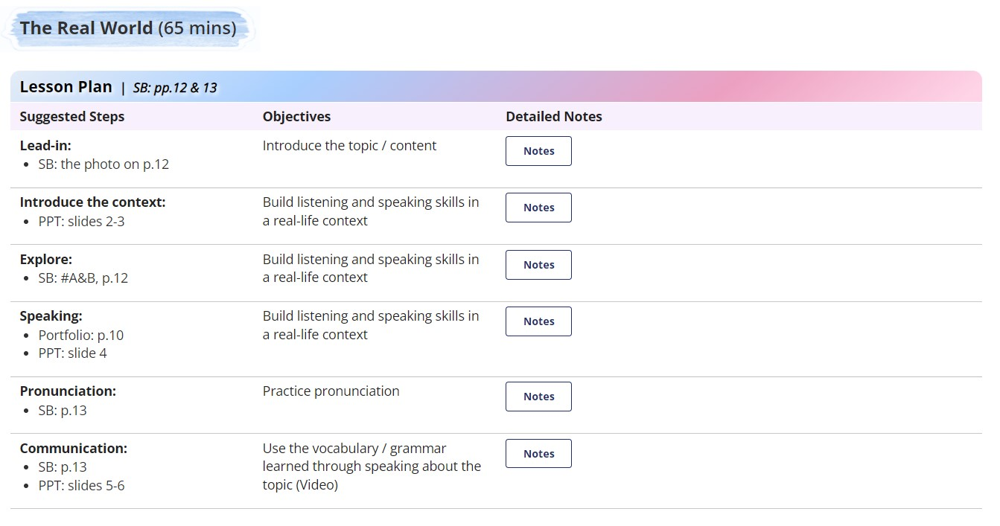
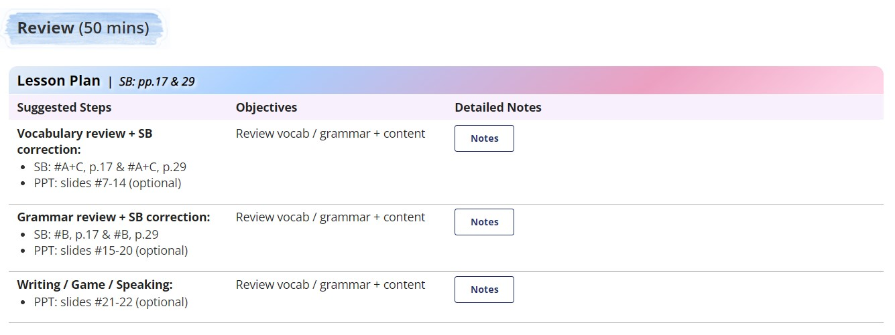
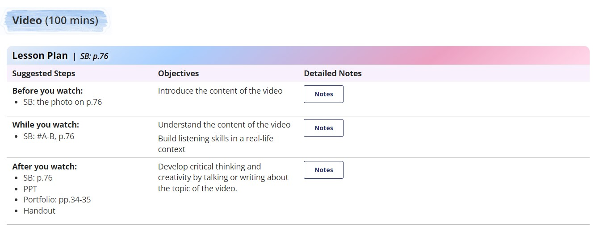
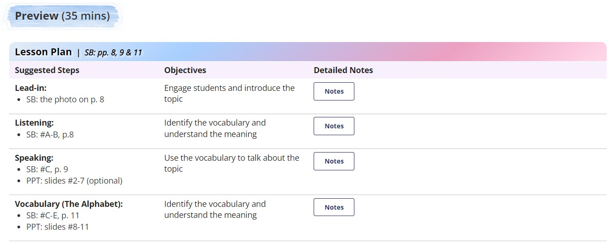
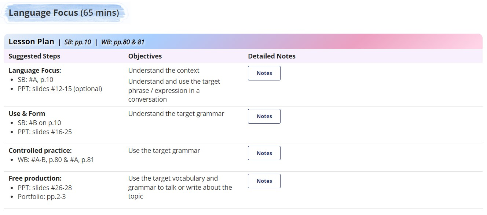
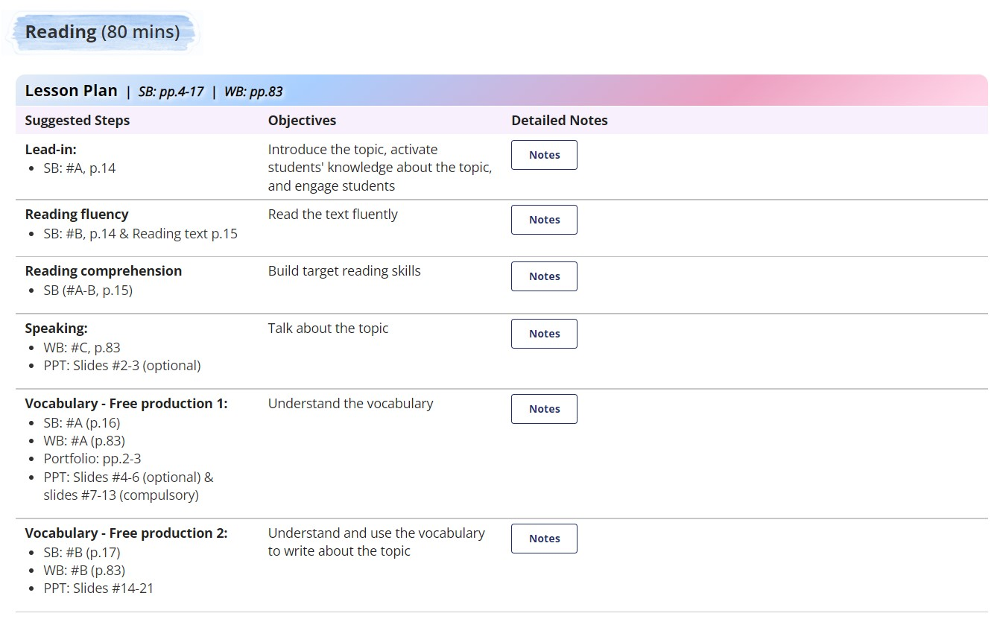

# HTML Code

## <a id="Content">**Content**</a>
| Sl.No|  Questions        |
|------|------------------ |
| 01.  |[The Real World](#The-Real-World)|
| 02.  |[Review](#Review)|
| 03.  |[Video](#Video)|
| 04.  |[Preview](#Preview)|
| 05.  |[Language Focus](#Language-Focus)|
| 06.  |[Reading](#Reading)|
## <a id="The-Real-World"></a>***1. The Real World***
<p align="center">

</p>

```
<style>
    .ol-number {
        margin-top: 11px !important;
        margin-bottom: 10px !important;
        margin-left: -1px !important;
        list-style-type: decimal !important;
    }

    .ul-disc {
        margin-top: 11px !important;
        margin-bottom: 10px !important;
        margin-left: -1px !important;
        list-style-type: disc !important;
    }

    .ul-circle {
        margin-top: 11px !important;
        margin-bottom: 10px !important;
        margin-left: -1px !important;
        list-style-type: circle !important;
    }

    .ul-square {
        margin-top: 11px !important;
        margin-bottom: 10px !important;
        margin-left: -1px !important;
        list-style-type: square !important;
    }

    .li-plan {
        margin: -10px 0px 5px 7px;
    }

    .table-plan td,
    th {
        border-left: 0px solid gray !important;
        border-right: 0px solid gray !important;
        padding: 5px 10px !important;
        width: auto !important;
    }

    .table-plan {
        border-collapse: collapse;
        margin-left: 0px !important;
        width: 96.7% !important;
    }
</style>

<div
    style="background: url('http://lms.vus.edu.vn/asset-v1:VUS+VF+2022+type@asset+block@Background_bar_8.png') no-repeat; background-size: 100% 100%; background-position: left; padding: 10px 25px 3px 25px; margin-bottom: 0px; margin-top: 0px; margin-left: -15px; display: inline-block;">

    <h3 style="vertical-align: text-bottom;"><b>The Real World</b> (65 mins)</h3>
</div>

<table class="table-plan">
    <tr>
        <th colspan="3"
            style="border: 0px solid white; border-radius: 10px 10px 0px 0px; background: rgb(255,212,231);
    background: linear-gradient(321deg, rgba(255,212,231,1) 2%, rgba(236,160,193,1) 27%, rgba(168,207,255,1) 70%, rgba(228,236,247,1) 100%);">
            <b style="color: black;
      text-shadow: 2px 2px 4px white;font-size: 17px;">Lesson Plan</b>&#160;&#160;<i style="color: black;
      text-shadow: 2px 2px 4px white; font-size: 14px;">|&#160;&#160;SB: pp.12 &amp; 13</i>
        </th>
    </tr>
    <tr>
        <td style="background-color: #f8f0fc; width: 25% !important; border: 1px solid white;"><b>Suggested Steps</b>
        </td>
        <td style="background-color: #f8f0fc; width: 25% !important; border: 1px solid white;"><b>Objectives</b></td>
        <td style="background-color: #f8f0fc; width: 50% !important; border: 1px solid white;"><b>Detailed Notes</b>
        </td>
    </tr>

    <!--Lead-in-->

    <tr>
        <td style="border-bottom: 1px solid silver;"><b>Lead-in: </b>
            <ul class="ul-disc">
                <li class="li-plan">SB: the photo on p.12</li>
            </ul>
        </td>
        <td style="border-bottom: 1px solid silver;">Introduce the topic / content</td>
        <td style="border-bottom: 1px solid silver;">
            <p style="margin-bottom: 10px;"><button
                    onclick="var x=document.getElementById(&quot;idUniquedBoxContent21&quot;);&quot;none&quot;===x.style.display?	x.style.display=&quot;block&quot;:x.style.display=&quot;none&quot;;">Notes</button>
            </p>
            <div id="idUniquedBoxContent21" style="display: none; padding-left: 5px;">
                <div>
                    <b>Lead-in</b>
                    <ol class="ol-number">
                        <li class="li-plan">Have students discuss the photo.</li>

                        <li class="li-plan">Ask: ‘Do they know each other? Are they greeting? Do they bow?’</li>
                    </ol>
                </div>
            </div>
        </td>
    </tr>

    <!--Introduce the context-->

    <tr>
        <td style="border-bottom: 1px solid silver;"><b>Introduce the context: </b>
            <ul class="ul-disc">
                <li class="li-plan">PPT: slides 2-3</li>
            </ul>
        </td>
        <td style="border-bottom: 1px solid silver;">Build listening and speaking skills in a real-life context</td>
        <td style="border-bottom: 1px solid silver;">
            <p style="margin-bottom: 10px;"><button
                    onclick="var x=document.getElementById(&quot;idUniquedBoxContent22&quot;);&quot;none&quot;===x.style.display?	x.style.display=&quot;block&quot;:x.style.display=&quot;none&quot;;">Notes</button>
            </p>
            <div id="idUniquedBoxContent22" style="display: none; padding-left: 5px;">
                <div>
                    <b>Introduce the context:</b>
                    <ol class="ol-number">
                        <li class="li-plan">Have students compare the photos (on pp.8-10 and p.12) and say what they
                            think.
                            (PPT)</li>
                        <li class="li-plan">Elicit different ways of greetings in different cultures. Ask and mime: <i>How
                          do you greet? Do you bow? Or wave? Or shake hands? etc.</i>
                        </li>

                    </ol>

                </div>
            </div>
        </td>
    </tr>
    <tr>

        <!--Explore-->

    <tr>
        <td style="border-bottom: 1px solid silver;">
            <b>Explore: </b>
            <ul class="ul-disc">
                <li class="li-plan">SB: #A&amp;B, p.12</li>
            </ul>

        </td>
        <td style="border-bottom: 1px solid silver;">Build listening and speaking skills in a real-life context</td>
        <td style="border-bottom: 1px solid silver;">
            <p style="margin-bottom: 10px;"><button
                    onclick="var x=document.getElementById(&quot;idUniquedBoxContent222&quot;);&quot;none&quot;===x.style.display?	x.style.display=&quot;block&quot;:x.style.display=&quot;none&quot;;">Notes</button>
            </p>
            <div id="idUniquedBoxContent222" style="display: none; padding-left: 5px;">
                <div>
                    <b>Explore:</b><br />
                    <b>#A</b>
                    <ol class="ol-number">
                        <li class="li-plan">Review different ways to greet people in different situations <i>(Hello, Bye,
                          Nice to meet you! ...)</i>.</li>
                        <li class="li-plan">Play the audio and go through task #A.</li>
                        <li class="li-plan"> Have students practice with a partner.</li>
                    </ol>
                    <b>#B</b>
                    <ol class="ol-number">
                        <li class="li-plan">Have students work in pairs to do task #B.</li>
                        <li class="li-plan">Play the video and go through task #B.</li>
                    </ol>
                    <b>Practice (Optional): Say and do</b>
                    <ol class="ol-number">
                        <li class="li-plan">Have students stand up.</li>
                        <li class="li-plan">Assign 1 student as the host.</li>
                        <li class="li-plan">The host says a word learnt and others need to act out.</li>
                        <li class="li-plan">Those who cannot follow the host are eliminated.</li>
                        <div style="margin: -10px 0px 10px -8px;">Note: The host can level the difficulty by
                            saying 1 word but acting differently.</div>
                    </ol>

                </div>
            </div>
        </td>
    </tr>
    <tr>

        <!--Speaking-->

    <tr>
        <td style="border-bottom: 1px solid silver;">
            <b>Speaking: </b>
            <ul class="ul-disc">
                <li class="li-plan">Portfolio: p.10</li>
                <li class="li-plan">PPT: slide 4</li>
            </ul>
        </td>
        <td style="border-bottom: 1px solid silver;">Build listening and speaking skills in a real-life context</td>
        <td style="border-bottom: 1px solid silver;">
            <p style="margin-bottom: 10px;"><button
                    onclick="var x=document.getElementById(&quot;idUniquedBoxContent223&quot;);&quot;none&quot;===x.style.display?	x.style.display=&quot;block&quot;:x.style.display=&quot;none&quot;;">Notes</button>
            </p>
            <div id="idUniquedBoxContent223" style="display: none; padding-left: 5px;">
                <div>

                    <b>Speaking:</b><br />
                    <b>Survey: How do you greet someone?</b>
                    <ol class="ol-number">
                        <li class="li-plan">Introduce the question: ‘How do you greet someone?’ and have students
                            practice
                            saying it in chorus.</li>
                        <li class="li-plan">Have students mingle and complete a survey with their friends. (PPT)
                            (Portfolio)
                        </li>
                    </ol>
                </div>
            </div>
        </td>
    </tr>
    <tr>

        <!--Pronunciation-->

        <td><b>Pronunciation:</b>
            <ul class="ul-disc">
                <li class="li-plan">SB: p.13</li>
            </ul>
        </td>
        <td>Practice pronunciation</td>
        <td>
            <p style="margin-bottom: 10px;"><button
                    onclick="var x=document.getElementById(&quot;idUniquedBoxContent25&quot;);&quot;none&quot;===x.style.display?	x.style.display=&quot;block&quot;:x.style.display=&quot;none&quot;;">Notes</button>
            </p>
            <div id="idUniquedBoxContent25" style="display: none; padding-left: 5px;">
                <div>
                    <b>Pronunciation: Contractions</b>
                    <ol class="ol-number">
                        <li class="li-plan">Have students read the sentences</li>
                        <li class="li-plan">Play the audio and go through the task. </li>
                        <li class="li-plan">Have students practice reading the sentences with contractions.</li>
                    </ol>
                </div>
            </div>
        </td>
    </tr>

    <!--Communication-->

    <tr>
        <td><b>Communication:</b>
            <ul class="ul-disc">
                <li class="li-plan">SB: p.13</li>
                <li class="li-plan">PPT: slides 5-6</li>
            </ul>
        </td>
        <td>
            Use the vocabulary / grammar learned through speaking about the topic (Video)</td>
        <td>
            <p style="margin-bottom: 10px;"><button
                    onclick="var x=document.getElementById(&quot;idUniquedBoxContent24&quot;);&quot;none&quot;===x.style.display?	x.style.display=&quot;block&quot;:x.style.display=&quot;none&quot;;">Notes</button>
            </p>
            <div id="idUniquedBoxContent24" style="display: none; padding-left: 5px;">
                <div>
                    <b>Communication</b>
                    <ol class="ol-number">
                        <li class="li-plan">Put students in pairs. Have students make a conversation with their partner.
                        </li>
                        <li class="li-plan"> Have students mingle to introduce themselves to other students and practice
                            greeting.
                            (PPT)</li>
                    </ol>
                </div>
            </div>
        </td>
    </tr>
</table>
```

<div align="right">
    <b><a href="#Content">↥ back to top</a></b>
</div>

## <a id="Review"></a>***2. Review***
<p align="center">

</p>

```
<style>
    .ol-number {
        margin-top: 11px !important;
        margin-bottom: 10px !important;
        margin-left: -1px !important;
        list-style-type: decimal !important;
    }

    .ul-disc {
        margin-top: 11px !important;
        margin-bottom: 10px !important;
        margin-left: -1px !important;
        list-style-type: disc !important;
    }

    .ul-circle {
        margin-top: 11px !important;
        margin-bottom: 10px !important;
        margin-left: -1px !important;
        list-style-type: circle !important;
    }

    .ul-square {
        margin-top: 11px !important;
        margin-bottom: 10px !important;
        margin-left: -1px !important;
        list-style-type: square !important;
    }

    .li-plan {
        margin: -10px 0px 5px 7px;
    }

    .table-plan td,
    th {
        border-left: 0px solid gray !important;
        border-right: 0px solid gray !important;
        padding: 5px 10px !important;
        width: auto !important;
    }

    .table-plan {
        border-collapse: collapse;
        margin-left: 0px !important;
        width: 96.7% !important;
    }
</style>

<div
    style="background: url('http://lms.vus.edu.vn/asset-v1:VUS+VF+2022+type@asset+block@Background_bar_8.png') no-repeat; background-size: 100% 100%; background-position: left; padding: 10px 25px 3px 25px; margin-bottom: 0px; margin-top: 0px; margin-left: -15px; display: inline-block;">

    <h3 style="vertical-align: text-bottom;"><b>
Review</b> (50 mins)</h3>
</div>

<table class="table-plan">
    <tr>
        <th colspan="3"
            style="border: 0px solid white; border-radius: 10px 10px 0px 0px; background: rgb(255,212,231);
    background: linear-gradient(321deg, rgba(255,212,231,1) 2%, rgba(236,160,193,1) 27%, rgba(168,207,255,1) 70%, rgba(228,236,247,1) 100%);">
            <b style="color: black;
      text-shadow: 2px 2px 4px white;font-size: 17px;">Lesson Plan</b>&#160;&#160;<i style="color: black;
      text-shadow: 2px 2px 4px white; font-size: 14px;">|&#160;&#160;SB: pp.17 &amp; 29</i>
        </th>
    </tr>
    <tr>
        <td style="background-color: #f8f0fc; width: 25% !important; border: 1px solid white;"><b>Suggested Steps</b>
        </td>
        <td style="background-color: #f8f0fc; width: 25% !important; border: 1px solid white;"><b>Objectives</b></td>
        <td style="background-color: #f8f0fc; width: 50% !important; border: 1px solid white;"><b>Detailed Notes</b>
        </td>
    </tr>

    <!--Vocabulary review + SB correction-->

    <tr>
        <td style="border-bottom: 1px solid silver;"><b>Vocabulary review + SB correction: </b>
            <ul class="ul-disc">
                <li class="li-plan">SB: #A+C, p.17 &amp; #A+C, p.29</li>
                <li class="li-plan">PPT: slides #7-14 (optional)</li>
            </ul>
        </td>
        <td style="border-bottom: 1px solid silver;">Review vocab / grammar + content</td>
        <td style="border-bottom: 1px solid silver;">
            <p style="margin-bottom: 10px;"><button
                    onclick="var x=document.getElementById(&quot;idUniquedBoxContent21&quot;);&quot;none&quot;===x.style.display?	x.style.display=&quot;block&quot;:x.style.display=&quot;none&quot;;">Notes</button>
            </p>
            <div id="idUniquedBoxContent21" style="display: none; padding-left: 5px;">
                <div>
                    <b>Vocabulary review 1: </b>
                    <ol class="ol-number">
                        <li class="li-plan">Review the vocabulary learnt in the unit. (PPT)</li>

                        <li class="li-plan">Review the use of different parts of speech. (PPT)</li>
                    </ol>
                    <b>#A&amp;C</b>
                    <ol class="ol-number">
                        <li class="li-plan">Have students complete the task. </li>
                        <li class="li-plan">Go through the answers as a class.</li>
                    </ol>
                    <b>Vocabulary review 2: </b>
                    <ol class="ol-number">
                        <li class="li-plan">Review the vocabulary learnt in the unit.</li>
                        <li class="li-plan">Review the use of ‘and – but’.</li>
                    </ol>
                    <b>#A&amp;C </b>
                    <ol class="ol-number">
                        <li class="li-plan">Have students complete the task. </li>
                        <li class="li-plan">Go through the answers as a class.
                        </li>
                    </ol>
                </div>
            </div>
        </td>
    </tr>

    <!--Grammar review+ SB correction-->

    <tr>
        <td style="border-bottom: 1px solid silver;"><b>Grammar review + SB correction: </b>
            <ul class="ul-disc">
                <li class="li-plan">SB: #B, p.17 &amp; #B, p.29</li>
                <li class="li-plan">PPT: slides #15-20 (optional)</li>
            </ul>
        </td>
        <td style="border-bottom: 1px solid silver;">
            Review vocab / grammar + content</td>
        <td style="border-bottom: 1px solid silver;">
            <p style="margin-bottom: 10px;"><button
                    onclick="var x=document.getElementById(&quot;idUniquedBoxContent22&quot;);&quot;none&quot;===x.style.display?	x.style.display=&quot;block&quot;:x.style.display=&quot;none&quot;;">Notes</button>
            </p>
            <div id="idUniquedBoxContent22" style="display: none; padding-left: 5px;">
                <div>
                    <b>Grammar review 1: Talking about favorites </b>
                    <ol class="ol-number">
                        <li class="li-plan">Go through the slides for grammar review. (PPT) </li>
                        <div style="margin: -10px 0px 10px -8px;"><b>#B</b></div>
                        <li class="li-plan">Have students go through the tasks.</li>
                    </ol>
                    <b>Grammar review 2: Describing places</b>
                    <ol class="ol-number">
                        <li class="li-plan">Review the use of ‘to be’ and adjectives.</li>
                        <div style="margin: -10px 0px 10px -8px;"><b>#B</b></div>
                        <li class="li-plan">Have students complete the task and give corrections.</li>
                    </ol>
                </div>
            </div>
        </td>
    </tr>
    <tr>

        <!--Writing / Game / Speaking-->

    <tr>
        <td style="border-bottom: 1px solid silver;">
            <b>Writing / Game / Speaking: </b>
            <ul class="ul-disc">
                <li class="li-plan">PPT: slides #21-22 (optional)</li>
            </ul>

        </td>
        <td style="border-bottom: 1px solid silver;">Review vocab / grammar + content</td>
        <td style="border-bottom: 1px solid silver;">
            <p style="margin-bottom: 10px;"><button
                    onclick="var x=document.getElementById(&quot;idUniquedBoxContent222&quot;);&quot;none&quot;===x.style.display?	x.style.display=&quot;block&quot;:x.style.display=&quot;none&quot;;">Notes</button>
            </p>
            <div id="idUniquedBoxContent222" style="display: none; padding-left: 5px;">
                <div>
                    <b>Speaking:</b>
                    <ol class="ol-number">
                        <li class="li-plan">Have students complete their card. (Portfolio)</li>
                        <li class="li-plan">Put students in pairs to ask and answer questions about the information in the card. (PPT)</li>
                    </ol>
                </div>
            </div>
        </td>
    </tr>
    <tr>
</table>
```

<div align="right">
<b><a href="#Content">↥ back to top</a></b>
</div>

## <a id="Video"></a>***3. Video***

<p align="center">

</p>

```
<style>
    .ol-number {
        margin-top: 11px !important;
        margin-bottom: 10px !important;
        margin-left: -1px !important;
        list-style-type: decimal !important;
    }

    .ul-disc {
        margin-top: 11px !important;
        margin-bottom: 10px !important;
        margin-left: -1px !important;
        list-style-type: disc !important;
    }

    .ul-circle {
        margin-top: 11px !important;
        margin-bottom: 10px !important;
        margin-left: -1px !important;
        list-style-type: circle !important;
    }

    .ul-square {
        margin-top: 11px !important;
        margin-bottom: 10px !important;
        margin-left: -1px !important;
        list-style-type: square !important;
    }

    .li-plan {
        margin: -10px 0px 5px 7px;
    }

    .table-plan td,
    th {
        border-left: 0px solid gray !important;
        border-right: 0px solid gray !important;
        padding: 5px 10px !important;
        width: auto !important;
    }

    .table-plan {
        border-collapse: collapse;
        margin-left: 0px !important;
        width: 96.7% !important;
    }
</style>

<div
    style="background: url('http://lms.vus.edu.vn/asset-v1:VUS+VF+2022+type@asset+block@Background_bar_8.png') no-repeat; background-size: 100% 100%; background-position: left; padding: 10px 25px 3px 25px; margin-bottom: 0px; margin-top: 0px; margin-left: -15px; display: inline-block;">

    <h3 style="vertical-align: text-bottom;"><b>
            Video</b> (100 mins)</h3>
</div>

<table class="table-plan">
    <tr>
        <th colspan="3"
            style="border: 0px solid white; border-radius: 10px 10px 0px 0px; background: rgb(255,212,231);
    background: linear-gradient(321deg, rgba(255,212,231,1) 2%, rgba(236,160,193,1) 27%, rgba(168,207,255,1) 70%, rgba(228,236,247,1) 100%);">
            <b style="color: black;
      text-shadow: 2px 2px 4px white;font-size: 17px;">Lesson Plan</b>&#160;&#160;<i style="color: black;
      text-shadow: 2px 2px 4px white; font-size: 14px;">|&#160;&#160;SB: p.76</i>
        </th>
    </tr>
    <tr>
        <td style="background-color: #f8f0fc; width: 25% !important; border: 1px solid white;"><b>Suggested Steps</b>
        </td>
        <td style="background-color: #f8f0fc; width: 25% !important; border: 1px solid white;"><b>Objectives</b></td>
        <td style="background-color: #f8f0fc; width: 50% !important; border: 1px solid white;"><b>Detailed Notes</b>
        </td>
    </tr>

    <!--Before you watch-->

    <tr>
        <td style="border-bottom: 1px solid silver;"><b>Before you watch: </b>
            <ul class="ul-disc">
                <li class="li-plan">SB: the photo on p.76</li>

            </ul>
        </td>
        <td style="border-bottom: 1px solid silver;">Introduce the content of the video</td>
        <td style="border-bottom: 1px solid silver;">
            <p style="margin-bottom: 10px;"><button
                    onclick="var x=document.getElementById(&quot;idUniquedBoxContent21&quot;);&quot;none&quot;===x.style.display?	x.style.display=&quot;block&quot;:x.style.display=&quot;none&quot;;">Notes</button>
            </p>
            <div id="idUniquedBoxContent21" style="display: none; padding-left: 5px;">
                <div>
                    <b>Before you watch:</b>
                    <ol class="ol-number">
                        <li class="li-plan">Have students look at the photo and ask: ‘Who are they? Where is their
                          school?’</li>
                        <li class="li-plan">Remind students about the reading ‘Kakenya’s dream’ in the previous lesson.
                        </li>
                        <li class="li-plan">Have students circle the answers for the questions in the SB.</li>
                        <li class="li-plan">Introduce that the video is about Kakenya’s school.</li>
                    </ol>

                </div>
            </div>
        </td>
    </tr>

    <!--While you watch-->

    <tr>
        <td style="border-bottom: 1px solid silver;"><b>While you watch: </b>
            <ul class="ul-disc">
                <li class="li-plan">SB: #A-B, p.76
                </li>

            </ul>
        </td>
        <td style="border-bottom: 1px solid silver;">
            Understand the content of the video
            <div style="margin-top: 5px;">Build listening skills in a real-life context</div>
        </td>
        <td style="border-bottom: 1px solid silver;">
            <p style="margin-bottom: 10px;"><button
                    onclick="var x=document.getElementById(&quot;idUniquedBoxContent22&quot;);&quot;none&quot;===x.style.display?	x.style.display=&quot;block&quot;:x.style.display=&quot;none&quot;;">Notes</button>
            </p>
            <div id="idUniquedBoxContent22" style="display: none; padding-left: 5px;">
                <div>
                    <b>While you watch:</b><br />
                    <b>#A-B</b>
                    <ol class="ol-number">
                        <li class="li-plan">Have students read the task and give explanations if any of the bold words
                            are new to them.</li>
                        <li class="li-plan">Remind students that with task #A, they can choose more than one option.</li>
                        <li class="li-plan">Have students watch the video and complete the tasks.</li>
                        <li class="li-plan">Go through the answers as a class.
                        </li>
                    </ol>

                </div>
            </div>
        </td>
    </tr>
    <tr>

        <!--After you watch-->

    <tr>
        <td style="border-bottom: 1px solid silver;">
            <b>After you watch: </b>
            <ul class="ul-disc">
                <li class="li-plan">SB: p.76</li>
                <li class="li-plan">PPT</li>
                <li class="li-plan">Portfolio: pp.34-35</li>
                <li class="li-plan">Handout</li>
            </ul>

        </td>
        <td style="border-bottom: 1px solid silver;">Develop critical thinking and creativity by talking or writing
            about the topic of the video.</td>
        <td style="border-bottom: 1px solid silver;">
            <p style="margin-bottom: 10px;"><button
                    onclick="var x=document.getElementById(&quot;idUniquedBoxContent222&quot;);&quot;none&quot;===x.style.display?	x.style.display=&quot;block&quot;:x.style.display=&quot;none&quot;;">Notes</button>
            </p>
            <div id="idUniquedBoxContent222" style="display: none; padding-left: 5px;">
                <div>
                    <b>After you watch:</b>
                    <ol class="ol-number">
                        <li class="li-plan">Have students work in groups and discuss the statement: ‘Help a girl, help a
                            family.’</li>
                        <li class="li-plan">Give students suggestions by asking them what they know about countries in
                            Africa, especially Kenya; why a girl can help a family, etc. </li>
                        <li class="li-plan">Have students share their ideas with the class.</li>
                    </ol>
                    <b>Free production:</b>
                    <ol class="ol-number">
                        <li class="li-plan">Have students interview their friends and share their ideas with the class,
                          answering the question: <i>Are you a helpful person?</i> (PPT) (Portfolio)</li>
                        <li class="li-plan">Have students note down three things that they often do for their family or
                            friends. (PPT) (Portfolio)</li>
                        <li class="li-plan">Game: Trivia game
                            <ul class="ul-circle">
                                <li class="li-plan">Have students work in teams.</li>
                                <li class="li-plan">Give each team an answer sheet (handout) and have them fill in the
                                    required information.</li>
                                <li class="li-plan">Go through the game rules and play the game: (PPT)
                                  <ul class="ul-square">
                                    <li class="li-plan">The Trivia game has 3 parts (with 25 questions in total): Vocabulary, Grammar,
                                    Topics</li>
                                    <li class="li-plan">Students have 10s to write the answer for each question before moving to the next
                                    one.</li>
                                    <li class="li-plan">After each round, students need to submit their answer sheets to the
                                    teacher.</li>
                                <li class="li-plan">The teacher can swap the answer sheets between teams before showing
                                    the correction so students can do peer check.</li>
                                <li class="li-plan">Students earn 10 points for each correct answer.</li>
                                <li class="li-plan">After 3 rounds, which team gets more points is the winner.</li>
                                  </ul>
                                    </li>
                            </ul>
                        </li>
                    </ol>
                </div>
            </div>
        </td>
    </tr>
    <tr>
</table>
```

<div align="right">
<b><a href="#Content">↥ back to top</a></b>
</div>

## <a id="Preview"></a>***4. Preview***

<p align="center">

</p>

```
<style>
    .ol-number {margin-top: 11px !important;margin-bottom: 10px !important;margin-left: -1px !important; list-style-type: decimal!important;}
    .ul-disc {margin-top: 11px !important;margin-bottom: 10px !important;margin-left: -1px !important; list-style-type: disc !important;}  
    .ul-circle {margin-top: 11px !important; margin-bottom: 10px !important; margin-left: -1px !important; list-style-type: circle !important;}
    .ul-square {margin-top: 11px !important; margin-bottom: 10px !important; margin-left: -1px !important; list-style-type: square !important;} 
    
    .li-plan {margin: -10px 0px 5px 7px;}
    .table-plan td, th {border-left: 0px solid gray !important; border-right: 0px solid gray !important; padding: 5px 10px !important; width: auto !important;}
    .table-plan {border-collapse: collapse; margin-left: 0px !important; width: 96.7% !important;}
    </style>
    
    <div style="background: url('http://lms.vus.edu.vn/asset-v1:VUS+VF+2022+type@asset+block@Background_bar_8.png') no-repeat; background-size: 100% 100%; background-position: left; padding: 10px 25px 3px 25px; margin-bottom: 0px; margin-top: 0px; margin-left: -15px; display: inline-block;">
      
    <h3 style="vertical-align: text-bottom;"><b>Preview</b> (35 mins)</h3></div>
    
    <table class="table-plan">
        <tr>
          <th colspan="3" style = "border: 0px solid white; border-radius: 10px 10px 0px 0px; background: rgb(255,212,231);
    background: linear-gradient(321deg, rgba(255,212,231,1) 2%, rgba(236,160,193,1) 27%, rgba(168,207,255,1) 70%, rgba(228,236,247,1) 100%);">
            
    <!-- TABLE HEADER --> 
            
            <b style ="color: black;
      text-shadow: 2px 2px 4px white;font-size: 17px;">Lesson Plan</b>&#160;&#160;<i style ="color: black;
      text-shadow: 2px 2px 4px white; font-size: 14px;">|&#160;&#160;SB: pp. 8, 9 &amp; 11</i></th>
        </tr>
        <tr>
           <td style="background-color: #f8f0fc; width: 25% !important; border: 1px solid white;"><b>Suggested Steps</b></td>
           <td style="background-color: #f8f0fc; width: 25% !important; border: 1px solid white;"><b>Objectives</b></td>
           <td style="background-color: #f8f0fc; width: 50% !important; border: 1px solid white;"><b>Detailed Notes</b></td>
        </tr>
      
    <!-- LEAD-IN -->  
      
        <tr>  
           <td style="border-bottom: 1px solid silver;"><b>Lead-in: </b>
                 <ul class="ul-disc">
                   <li class="li-plan">SB: the photo on p. 8</li>
                   </ul>
          </td>
          <td style="border-bottom: 1px solid silver;">Engage students and introduce the topic</td>
          <td style="border-bottom: 1px solid silver;">
    <p style="margin-bottom: 10px;"><button onclick="var x=document.getElementById(&quot;idUniquedBoxContent21&quot;);&quot;none&quot;===x.style.display?	x.style.display=&quot;block&quot;:x.style.display=&quot;none&quot;;">Notes</button></p>
             <div id="idUniquedBoxContent21" style="display: none; padding-left: 5px;">
             <div>
               
    <!-- LEAD-IN - NOTE --> 
               <b>Lead-in</b>
                 <ol class="ol-number">
                  <li class="li-plan">Have students look at the photo. Ask: <i>‘How many people? Where are they? What are they doing?’</i></li>           
                  <li class="li-plan">Elicit the scene: A Japanese woman is greeting guests with a bow, a common way of greeting in Japan.</li>
                  <li class="li-plan">Explain the words ‘Hello’ and ‘bow’.</li>
                  </ol>
                </div></div>
          </td>
       </tr>
      
    <!-- LISTENING --> 
      
       <tr>
          <td style="border-bottom: 1px solid silver;"><b>Listening:</b>
            <ul class="ul-disc">
                <li class="li-plan">SB: #A-B, p.8</li>
              </ul>
          </td>
          <td style="border-bottom: 1px solid silver;">Identify the vocabulary and understand the meaning</td>
          <td style="border-bottom: 1px solid silver;">
    <p style="margin-bottom: 10px;"><button onclick="var x=document.getElementById(&quot;idUniquedBoxContent22&quot;);&quot;none&quot;===x.style.display?	x.style.display=&quot;block&quot;:x.style.display=&quot;none&quot;;">Notes</button></p>
             <div id="idUniquedBoxContent22" style="display: none; padding-left: 5px;">
             <div>
               
    <!-- LISTENING - NOTE -->  
               
               <b>Listening:<BR/>
               #A-B</b>  
                <ol class="ol-number">
                    <li class="li-plan">Have students read the sentences in #A. Explain the word ‘Mrs.’.</li>
                    <li class="li-plan">Ask students to guess how to pronounce the bold words.</li>
                    <li class="li-plan">Explain how to do the task (listen to names only), then play the audio.</li>
                    <li class="li-plan">Go through the answers as a class.</li>
                    <li class="li-plan">Go through #B.</li>
               </ol>
            </div></div>
        </td>
       </tr>
       <tr>
         
    <!-- SPEAKING -->  
         
          <td><b>Speaking: </b>
            <ul class="ul-disc">
                <li class="li-plan">SB: #C, p. 9</li>
                  <li class="li-plan">PPT: slides #2-7 (optional)</li>
            </ul>
          </td>
           <td>Use the vocabulary to talk about the topic<br/>
          </td>
          <td>
    <p style="margin-bottom: 10px;"><button onclick="var x=document.getElementById(&quot;idUniquedBoxContent23&quot;);&quot;none&quot;===x.style.display?	x.style.display=&quot;block&quot;:x.style.display=&quot;none&quot;;">Notes</button></p>
             <div id="idUniquedBoxContent23" style="display: none; padding-left: 5px;">
             <div>
               
    <!-- SPEAKING - NOTE --> 
               <b>Speaking:<br/>
                #C
               </b>
                <ol class="ol-number">
                  <li class="li-plan">Introduce different ways to say ‘Hello’ (<i>Hi, Hey</i>), and how to ask and answer about names (<i>What’s your name? / My name’s… / I’m… / Nice to meet you.</i>). (PPT)</li>
                    <li class="li-plan">Show the example in the PPT and have students practice reading the conversation. Correct their pronunciation. (PPT)</li>
                    <li class="li-plan">Show students the photos on PPT, have them practice greeting using those names. (PPT)</li>
             </ol>
            </div></div>
            </td>
        </tr>
        <tr>
          
    <!-- VOCABULARY -->       
          
           <td><b>Vocabulary (The Alphabet): </b>
            <ul class="ul-disc">
                <li class="li-plan">SB: #C-E, p. 11</li>
                <li class="li-plan">PPT: slides #8-11</li>
             </ul>
           </td>
           <td>Identify the vocabulary and understand the meaning</td>
           <td>
    <p style="margin-bottom: 10px;"><button onclick="var x=document.getElementById(&quot;idUniquedBoxContent24&quot;);&quot;none&quot;===x.style.display?	x.style.display=&quot;block&quot;:x.style.display=&quot;none&quot;;">Notes</button></p>
         <div id="idUniquedBoxContent24" style="display: none; padding-left: 5px;">
             <div>
               
    <!-- VOCABULARY - NOTE --> 
               
               <b>Vocabulary:<br/>
                The Alphabet<br/>
                #C
                </b>
                        <ol class="ol-number">
                        <li class="li-plan">Have students read aloud the Alphabet, then listen to the audio.</li>
                        <li class="li-plan">Have students read aloud again, try to correct themselves. Correct their pronunciation if needed.</li>
               </ol>
               
            <b>How do you spell your name?</b>
                    <ol class="ol-number">
                        <li class="li-plan">Lead students from the alphabet to the structure. </li>
                        <li class="li-plan">Introduce the use of the structure. (PPT)</li>
                        <li class="li-plan">Speaking practice: Have students practice in pairs. Ask and answer using the name list (PPT). </li>
                    </ol>  
               
            <b>Capital letters:</b>
                        <ol class="ol-number">
                        <li class="li-plan">Draw students’ attention to the capital letter box and the example on PPT, elicit when letters should be capitalized (the first letter of a name or a new sentence).</li>
                        <li class="li-plan">Show some examples on PPT, then ask students to correct the letters when needed.</li>
                        </ol>   
               
            <b>#D</b>
                        <ol class="ol-number">
                            <li class="li-plan">Play the audio and go through the task.</li>
                            <li class="li-plan">Go through answers as a class.</li>
                        </ol>            
           </div></div>
           </td>
          </tr>
     </table>
```

<div align="right">
<b><a href="#Content">↥ back to top</a></b>
</div>

## <a id="Language Focus"></a>***5. Language Focus***

<p align="center">

</p>

```
<style>
    .ol-number {margin-top: 11px !important;margin-bottom: 10px !important;margin-left: -1px !important; list-style-type: decimal!important;}
    .ul-disc {margin-top: 11px !important;margin-bottom: 10px !important;margin-left: -1px !important; list-style-type: disc !important;}  
    .ul-circle {margin-top: 11px !important; margin-bottom: 10px !important; margin-left: -1px !important; list-style-type: circle !important;}
    .ul-square {margin-top: 11px !important; margin-bottom: 10px !important; margin-left: -1px !important; list-style-type: square !important;} 
    .li-plan {margin: -10px 0px 5px 7px;}
    .table-plan td, th {border-left: 0px solid gray !important; border-right: 0px solid gray !important; padding: 5px 10px !important; width: auto !important;}
    .table-plan {border-collapse: collapse; margin-left: 0px !important; width: 96.7% !important;}
</style>
    
    <div style="background: url('http://lms.vus.edu.vn/asset-v1:VUS+VF+2022+type@asset+block@Background_bar_8.png') no-repeat; background-size: 100% 100%; background-position: left; padding: 10px 25px 3px 25px; margin-bottom: 0px; margin-top: 0px; margin-left: -15px; display: inline-block;">
      
    <h3 style="vertical-align: text-bottom;"><b>Language Focus</b> (65 mins)</h3></div>
    
    <table class="table-plan">
        <tr>
          <th colspan="3" style = "border: 0px solid white; border-radius: 10px 10px 0px 0px; background: rgb(255,212,231);
    background: linear-gradient(321deg, rgba(255,212,231,1) 2%, rgba(236,160,193,1) 27%, rgba(168,207,255,1) 70%, rgba(228,236,247,1) 100%);">
            
<!-- TABLE HEADER -->  
            
    <b style ="color: black; text-shadow: 2px 2px 4px white;font-size: 17px;">Lesson Plan</b>&#160;&#160;<i style ="color: black; text-shadow: 2px 2px 4px white; font-size: 14px;">|&#160;&#160;SB: pp.10&#160;&#160;|&#160;&#160;WB: pp.80 &amp; 81</i></th>
        </tr>
        <tr>
           <td style="background-color: #f8f0fc; width: 25% !important; border: 1px solid white;"><b>Suggested Steps</b></td>
           <td style="background-color: #f8f0fc; width: 25% !important; border: 1px solid white;"><b>Objectives</b></td>
           <td style="background-color: #f8f0fc; width: 50% !important; border: 1px solid white;"><b>Detailed Notes</b></td>
        </tr>
    
<!-- LANGUAGE FOCUS -->   
      
        <tr>  
           <td style="border-bottom: 1px solid silver;"><b>Language Focus:</b>
                 <ul class="ul-disc">
                        <li class="li-plan">SB: #A, p.10
                        <li class="li-plan">PPT: slides #12-15 (optional)
                 </ul>
          </td>
          <td style="border-bottom: 1px solid silver;">
                Understand the context<p style="margin-bottom: 5px;"></p>
                Understand and use the target phrase / expression in a conversation
          </td>
          <td style="border-bottom: 1px solid silver;">
    <p style="margin-bottom: 10px;"><button onclick="var x=document.getElementById(&quot;idUniquedBoxContent21&quot;);&quot;none&quot;===x.style.display?	x.style.display=&quot;block&quot;:x.style.display=&quot;none&quot;;">Notes</button></p>
             <div id="idUniquedBoxContent21" style="display: none; padding-left: 5px;">
             <div>
               
<!-- LANGUAGE IN CONTEXT - NOTE -->
               
               <b>Language in context: <br/>
                Listening: Conversation<br/>
                #A
                    </b>  
                    <ol class="ol-number">
                          <li class="li-plan">Have students read the 1st part of the conversation once and underline the names. (PPT)</li>
                          <li class="li-plan">Play the audio and have students read the conversation aloud.</li>
                          <li class="li-plan">Have students practice the conversation in pairs.</li>
                      </ol>
               
                <b>Real English: See you later!</b>  
                     <ol class="ol-number">
                          <li class="li-plan">Draw students' attention to the Real English box.</li>
                         <li class="li-plan">Have students locate the expression in the conversation.</li>
                          <li class="li-plan">Have students look at the photo (PPT) again. Ask: <i>Who are they? Where are they? Do they know each other?</i></li>
                          <li class="li-plan">Elicit the meaning of Maya’s expression: another way to say <i>Bye. / Goodbye.</i> (PPT)</li>
                         <li class="li-plan">Have students practice the phrase in different speeds and tones (<i>happy, excited, sad, tired</i> etc.).</li>
                  </ol>
               
                 <b>Speaking: Role-play</b>  
                     <ol class="ol-number">
                          <li class="li-plan">Have students read the name list again and choose one as their favorite name.</li>
                         <li class="li-plan">Have students practice in pairs, make a conversation as in #A using that name as their ‘new’ English name.</li>
                  </ol>
               
                </div></div>
          </td>
       </tr>
    
<!-- USE & FORM -->   
      
       <tr>
          <td style="border-bottom: 1px solid silver;"><b>Use &amp; Form</b>
            <ul class="ul-disc">
                <li class="li-plan">SB: #B on p.10</li>
                <li class="li-plan">PPT: slides #16-25</li>
              </ul>
          </td>
          <td style="border-bottom: 1px solid silver;">Understand the target grammar</td>
          <td style="border-bottom: 1px solid silver;">
    <p style="margin-bottom: 10px;"><button onclick="var x=document.getElementById(&quot;idUniquedBoxContent22&quot;);&quot;none&quot;===x.style.display?	x.style.display=&quot;block&quot;:x.style.display=&quot;none&quot;;">Notes</button></p>
             <div id="idUniquedBoxContent22" style="display: none; padding-left: 5px;">
             <div>
               
<!-- USE & FORM - NOTE -->  
               
               <b>Use and form 1: “to be” singular<br/>
                #B
                </b>  
                <ol class="ol-number">
                    <li class="li-plan">Go through the slides, eliciting the usage of to be (singular) and the pronouns <i>I, you, he, she, it</i>. (PPT)</li>
                    <li class="li-plan">Explain the normal forms and the contractions. Note with the students that contractions are common in spoken language.</li>
                    <li class="li-plan">Have students underline the forms of to be in #A. (PPT)</li>
               </ol>
               
              <b>Use and form 2: Possessive adjectives and Possessive ‘s’<br/>
                #B
                </b>  
                <ol class="ol-number">
                    <li class="li-plan">Show the examples on the PPT. Elicit the meaning and usage of Possessive adjectives and Possessive ‘s’ (PPT)</li>
                    <li class="li-plan">Have students make more examples by asking and answering about their friends’ names. Note that students need to change the role of ‘my-your’ in their answers.</li>
                    <li class="li-plan">Explain the possessive ‘s. Note that students need to be careful with the contraction of ‘is’ and possessive ‘s’ (They might look the same but have different meanings.). (PPT)</li>
               </ol>
            </div></div>
        </td>
       </tr>
     
<!-- CONTROLLED PRACTICE -->   
      
       <tr>
          <td><b>Controlled practice:</b>
            <ul class="ul-disc">
                <li class="li-plan">WB: #A-B, p.80 &amp; #A, p.81</li>
            </ul>
          </td>
           <td>Use the target grammar<br/>
          </td>
          <td>
    <p style="margin-bottom: 10px;"><button onclick="var x=document.getElementById(&quot;idUniquedBoxContent23&quot;);&quot;none&quot;===x.style.display?	x.style.display=&quot;block&quot;:x.style.display=&quot;none&quot;;">Notes</button></p>
             <div id="idUniquedBoxContent23" style="display: none; padding-left: 5px;">
             <div>
               
<!-- CONTROLLED PRACTICE - NOTE -->  
               
               <b>Controlled practice 1 ('to be' singular):<br/>
                WB<br/>
                #A-B
                </b> 
                <ol class="ol-number">
                    <li class="li-plan">Have students work in pairs.</li>
                    <li class="li-plan">Ask students to roleplay and read aloud the answers and give corrections in class.</li>
                 </ol>
               <br/>
                <b>Controlled practice 2 (Possessive adjectives &amp; Possessive 's'):<br/>
                WB<br/>
                #A
                </b> 
                       <ol class="ol-number">
                    <li class="li-plan">Have students do the task.</li>
                    <li class="li-plan">Ask each pair of students to read each part aloud.</li>
                 </ol>
            </div></div>
            </td>
        </tr>
      
<!-- FREE PRODUCTION --> 
      
        <tr>
           <td><b>Free production:</b>
            <ul class="ul-disc">
              <li class="li-plan">PPT: slides #26-28</li>
                <li class="li-plan">Portfolio: pp.2-3</li>
             </ul>
           </td>
           <td>Use the target vocabulary and grammar to talk or write about the topic </td>
           <td>
    <p style="margin-bottom: 10px;"><button onclick="var x=document.getElementById(&quot;idUniquedBoxContent24&quot;);&quot;none&quot;===x.style.display?	x.style.display=&quot;block&quot;:x.style.display=&quot;none&quot;;">Notes</button></p>
         <div id="idUniquedBoxContent24" style="display: none; padding-left: 5px;">
             <div>
               
<!-- FREE PRODUCTION - NOTE -->                
               
               <b>Free production: <br/>
                #Speaking: My new friends list
                </b>
                        <ol class="ol-number">
                        <li class="li-plan">Have students stand up and mingle.</li>
                        <li class="li-plan">Have students use both parts of the conversation in #A to make a complete conversation to get to know their friends.</li>
                        <li class="li-plan">Have students write down their new friends’ names on the list in their portfolio.</li>
                        <li class="li-plan">Have students report to the class how many new friends that they have asked.</li>
               </ol>
               
            <b>#Free writing: Write a conversation</b>
                    <ol class="ol-number">
                        <li class="li-plan">Have students write in the portfolio the conversation they have just had with their friends.</li>
                    </ol>            
           </div></div>
           </td>
          </tr>
     </table>
```

<div align="right">
<b><a href="#Content">↥ back to top</a></b>
</div>

## <a id="Reading"></a>***6. Reading***

<p align="center">

</p>

```
<style>
    .ol-number {margin-top: 11px !important;margin-bottom: 10px !important;margin-left: -1px !important; list-style-type: decimal!important;}
    .ul-disc {margin-top: 11px !important;margin-bottom: 10px !important;margin-left: -1px !important; list-style-type: disc !important;}  
    .ul-circle {margin-top: 11px !important; margin-bottom: 10px !important; margin-left: -1px !important; list-style-type: circle !important;}
    .ul-square {margin-top: 11px !important; margin-bottom: 10px !important; margin-left: -1px !important; list-style-type: square !important;} 
    .li-plan {margin: -10px 0px 5px 7px;}
    .table-plan td, th {border-left: 0px solid gray !important; border-right: 0px solid gray !important; padding: 5px 10px !important; width: auto !important;}
    .table-plan {border-collapse: collapse; margin-left: 0px !important; width: 96.7% !important;}
</style>
    
    <div style="background: url('http://lms.vus.edu.vn/asset-v1:VUS+VF+2022+type@asset+block@Background_bar_8.png') no-repeat; background-size: 100% 100%; background-position: left; padding: 10px 25px 3px 25px; margin-bottom: 0px; margin-top: 0px; margin-left: -15px; display: inline-block;">
      
    <h3 style="vertical-align: text-bottom;"><b>Reading</b> (80 mins)</h3></div>
    
    <table class="table-plan">
        <tr>
          <th colspan="3" style = "border: 0px solid white; border-radius: 10px 10px 0px 0px; background: rgb(255,212,231);
    background: linear-gr00000000000000000adient(321deg, rgba(255,212,231,1) 2%, rgba(236,160,193,1) 27%, rgba(168,207,255,1) 70%, rgba(228,236,247,1) 100%);">
            
    <!-- TABLE HEADER -->  
            
    <b style ="color: black; text-shadow: 2px 2px 4px white;font-size: 17px;">Lesson Plan</b>&#160;&#160;<i style ="color: black; text-shadow: 2px 2px 4px white; font-size: 14px;">|&#160;&#160;SB: pp.4-17&#160;&#160;|&#160;&#160;WB: pp.83</i></th>
        </tr>
        <tr>
           <td style="background-color: #f8f0fc; width: 25% !important; border: 1px solid white;"><b>Suggested Steps</b></td>
           <td style="background-color: #f8f0fc; width: 25% !important; border: 1px solid white;"><b>Objectives</b></td>
           <td style="background-color: #f8f0fc; width: 50% !important; border: 1px solid white;"><b>Detailed Notes</b></td>
        </tr>
    
<!-- LEAD-IN -->   
      
        <tr>  
           <td style="border-bottom: 1px solid silver;"><b>Lead-in:</b>
                 <ul class="ul-disc">
                        <li class="li-plan">SB: #A, p.14
                 </ul>
          </td>
          <td style="border-bottom: 1px solid silver;">
                Introduce the topic, activate students' knowledge about the topic, and engage students
          </td>
          <td style="border-bottom: 1px solid silver;">
    <p style="margin-bottom: 10px;"><button onclick="var x=document.getElementById(&quot;idUniquedBoxContent21&quot;);&quot;none&quot;===x.style.display?	x.style.display=&quot;block&quot;:x.style.display=&quot;none&quot;;">Notes</button></p>
             <div id="idUniquedBoxContent21" style="display: none; padding-left: 5px;">
             <div>
               
<!-- LEAD-IN - NOTES-->
               
               <b>Lead-in:<br/>
                #A
                    </b>  
                    <ol class="ol-number">
                         <li class="li-plan">Have students talk about the photo.</li>
                          <li class="li-plan">Elicit the topic (about family). Ask: ‘What can you see?’, ‘How many people are there?’, ‘Who are they?’</li>
                      </ol>
                </div></div>
          </td>
       </tr>
    
<!-- READING FLUENCY -->   
      
        <tr>  
           <td style="border-bottom: 1px solid silver;"><b>Reading fluency</b>
                 <ul class="ul-disc">
                        <li class="li-plan">SB: #B, p.14 &amp; Reading text p.15
                 </ul>
          </td>
          <td style="border-bottom: 1px solid silver;">
                Read the text fluently
          </td>
          <td style="border-bottom: 1px solid silver;">
    <p style="margin-bottom: 10px;"><button onclick="var x=document.getElementById(&quot;idUniquedBoxContent211&quot;);&quot;none&quot;===x.style.display?	x.style.display=&quot;block&quot;:x.style.display=&quot;none&quot;;">Notes</button></p>
             <div id="idUniquedBoxContent211" style="display: none; padding-left: 5px;">
             <div>
               
    <!-- READING FLUENCY - NOTES -->
               
               <b>Reading fluency:<br/>
                #B
                    </b>  
                    <ol class="ol-number">
                         <li class="li-plan">[Books closed] Play the audio. Ask: ‘Who tells the story?’, ‘What is it about?’.</li>
                          <li class="li-plan">Have students now open their books, then read and underline the names.</li>
                          <li class="li-plan">Play the audio again and ask students to pay attention to how to pronounce the names as they listen.</li>
                          <li class="li-plan">Have students practice reading the text aloud.</li>
                      </ol>
                </div></div>
          </td>
       </tr>  
      
    <!-- READING COMPREHENSION -->   
      
       <tr>
          <td style="border-bottom: 1px solid silver;"><b>Reading comprehension</b>
            <ul class="ul-disc">
                <li class="li-plan">SB (#A-B, p.15)</li>
              </ul>
          </td>
          <td style="border-bottom: 1px solid silver;">Build target reading skills</td>
          <td style="border-bottom: 1px solid silver;">
    <p style="margin-bottom: 10px;"><button onclick="var x=document.getElementById(&quot;idUniquedBoxContent22&quot;);&quot;none&quot;===x.style.display?	x.style.display=&quot;block&quot;:x.style.display=&quot;none&quot;;">Notes</button></p>
             <div id="idUniquedBoxContent22" style="display: none; padding-left: 5px;">
             <div>
               
    <!-- READING COMPREHENSION - NOTES -->  
               
               <b>Reading Comprehension:<br/>
                #A
                </b>  
                <ol class="ol-number">
                    <li class="li-plan">Ask students to complete the chart in #A, then compare their answers with a partner. </li>
                    <li class="li-plan">Go through the task as a class.</li>
               </ol>
            </div></div>
        </td>
       </tr>
     
    <!-- SPEAKING -->   
      
       <tr>
          <td><b>Speaking:</b>
            <ul class="ul-disc">
                <li class="li-plan">WB: #C, p.83</li>
                  <li class="li-plan">PPT: Slides #2-3 (optional)</li>
            </ul>
          </td>
           <td>Talk about the topic<br/>
          </td>
          <td>
    <p style="margin-bottom: 10px;"><button onclick="var x=document.getElementById(&quot;idUniquedBoxContent23&quot;);&quot;none&quot;===x.style.display?	x.style.display=&quot;block&quot;:x.style.display=&quot;none&quot;;">Notes</button></p>
             <div id="idUniquedBoxContent23" style="display: none; padding-left: 5px;">
             <div>
               
    <!-- SPEAKING - NOTES --> 
               
               <b>Speaking:<br/>
                #B
                </b> 
                <ol class="ol-number">
                    <li class="li-plan">Review the Possessive adjectives, Possessive ‘s’ and structure: ‘What’s your name? What’s his/her name?’ (PPT)</li>
                    <li class="li-plan">Have students work in pairs, then ask and answer about the people in the photo.</li>
                 </ol>
            </div></div>
            </td>
        </tr>
      
    <!-- VOCABULARY - FREE PRODUCTION 1 --> 
      
        <tr>
           <td><b>Vocabulary - Free production 1:</b>
            <ul class="ul-disc">
              <li class="li-plan">SB: #A (p.16)</li>
              <li class="li-plan">WB: #A (p.83)</li>
              <li class="li-plan">Portfolio: pp.2-3</li>
              <li class="li-plan">PPT: Slides #4-6 (optional) &amp; slides #7-13 (compulsory)</li>
             </ul>
           </td>
           <td>Understand the vocabulary</td>
           <td>
    <p style="margin-bottom: 10px;"><button onclick="var x=document.getElementById(&quot;idUniquedBoxContent24&quot;);&quot;none&quot;===x.style.display?	x.style.display=&quot;block&quot;:x.style.display=&quot;none&quot;;">Notes</button></p>
         <div id="idUniquedBoxContent24" style="display: none; padding-left: 5px;">
             <div>
               
    <!-- VOCABULARY FREE PRODUCTION 1 - NOTES -->           
               
               <b>Vocabulary 1: My family<br/>
                #A
                </b>
                        <ol class="ol-number">
                        <li class="li-plan">Elicit the meaning of the new words. (PPT) Ask students to read the text (p.15) again to guess the meaning if necessary.</li>
                        <li class="li-plan">Go through task #A.</li>
                        <li class="li-plan">Say each word aloud and have the students repeat. Correct their pronunciation if needed.</li>
                           </ol>
               
                <b>#Content note</b>
                    <ol class="ol-number">
                        <li class="li-plan">Show students the photo of a nuclear family and an extended family. (PPT)</li>
                          <li class="li-plan">Have students point out the differences between the two families.</li>
                        <li class="li-plan">Introduce the 2 terms and have students refer to their families. Ask some students about the kind of family they are in.</li>
                    </ol>    
               
                 <b>WB<br/>
                    #A
                    </b>
                        <ol class="ol-number">
                        <li class="li-plan">Go through the task. </li>
                        <li class="li-plan">Correct and have some students read aloud. </li>
                           </ol>
               
                <b>Free production 1: Draw and write about your family.</b>
                    <ol class="ol-number">
                        <li class="li-plan">Show students the sample in the PPT.</li>
                          <li class="li-plan">Have students think of their families. Have students draw and write about their families in the portfolio.</li>
                          <div style="margin: -10px 0px 10px -8px;">Note: If students find it hard to draw a complete picture, suggest they use stick figures instead.</div>
                          <li class="li-plan">Go through the checklist and common mistakes in class. (PPT)</li>
                    </ol>  
           </div></div>
           </td>
          </tr>
      
    <!-- VOCABULARY - FREE PRODUCTION 2 --> 
      
        <tr>
           <td><b>Vocabulary - Free production 2:</b>
            <ul class="ul-disc">
              <li class="li-plan">SB: #B (p.17)</li>
              <li class="li-plan">WB: #B (p.83)</li>
              <li class="li-plan">PPT: Slides #14-21 </li>
             </ul>
           </td>
           <td>Understand and use the vocabulary to write about the topic</td>
           <td>
    <p style="margin-bottom: 10px;"><button onclick="var x=document.getElementById(&quot;idUniquedBoxContent241&quot;);&quot;none&quot;===x.style.display?	x.style.display=&quot;block&quot;:x.style.display=&quot;none&quot;;">Notes</button></p>
         <div id="idUniquedBoxContent241" style="display: none; padding-left: 5px;">
             <div>
               
    <!-- VOCABULARY FREE PRODUCTION 2 - NOTES --> 
               
               <b>Vocabulary 2: Common objects<br/>
                #B
                </b>
                        <ol class="ol-number">
                        <li class="li-plan">Show students the picture and elicit the words. (PPT)</li>
                        <li class="li-plan">Have students match the words with the silhouettes of the objects. (PPT)</li>
                        <li class="li-plan">Ask students to complete task #B in the book and cross check in pairs.</li>
                        <li class="li-plan">Have students practice saying the words. Correct their pronunciation if needed.</li>
                           </ol>
       
                 <b>WB<br/>
                    #B
                    </b>
                        <ol class="ol-number">
                        <li class="li-plan">Go through task #B.</li>
                           </ol>
               
                <b>#Articles: a/an</b>
                    <ol class="ol-number">
                        <li class="li-plan">Have students look at the example (PPT) and ask students to find the difference.</li>
                          <li class="li-plan">Elicit the differences between vowels and consonants.</li>
                        <li class="li-plan">Show students the Alphabet (PPT) and introduce all the vowels.</li>
                          <li class="li-plan">Introduce the use of ‘a/an’ when we mention singular nouns (1 object only).</li>
                          <li class="li-plan">Check Ss’ understanding by saying the objects again and have students choose which word goes with a/an.</li>
                          <div style="margin: -10px 0px 10px -8px;">Note: Articles will be introduced in Unit 3 so T doesn’t need to go into details here.</div>
                    </ol>  
               
                   <b>Free production 2:<br/>
                    WB<br/>
                      #C
                    </b>
                    <ol class="ol-number">
                        <li class="li-plan">Review the lesson about Possessive adjectives and Possessive ‘s’</li>
                          <li class="li-plan">Go through task #C and correct.</li>
                        <li class="li-plan">Have students write the Ss’ names from the PPT into their workbooks.</li>
                          <li class="li-plan">Have students work in pairs, then practice point and say, using the structure: ‘It’s ____.’</li>
                    </ol> 
               
                   <b>Practice: Articles</b>
                    <ol class="ol-number">
                        <li class="li-plan">Have students work in groups of 5.</li>
                          <li class="li-plan">Have students take out their objects and put it on the table.</li>
                        <li class="li-plan">Have students take turns to talk about the objects on the table using both Possessive adjectives and articles (ex: “It’s a pen.”, “It’s her book.”, “It’s Sarah’s eraser.” etc.).</li>
                    </ol> 
           </div></div>
           </td>
          </tr>  
     </table>
```

<div align="right">
<b><a href="#Content">↥ back to top</a></b>
</div>
