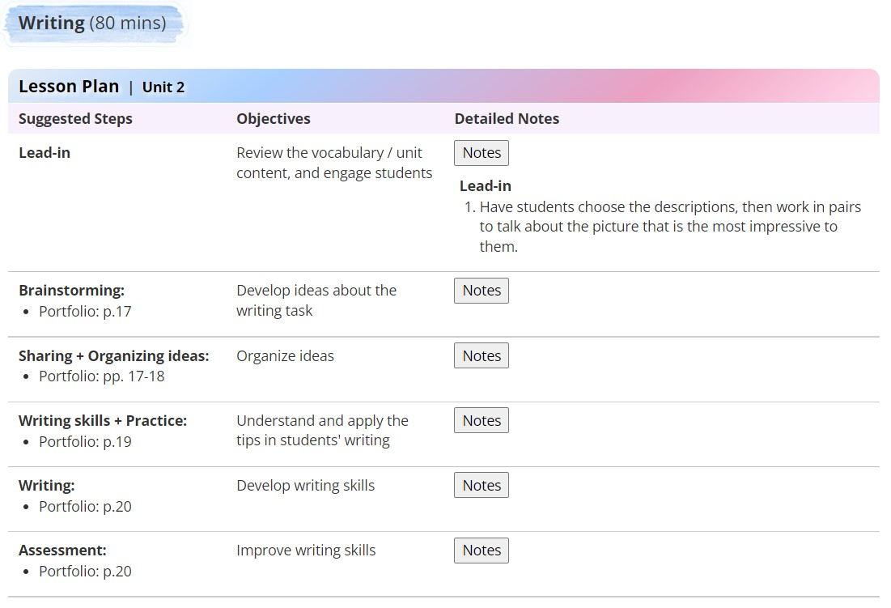
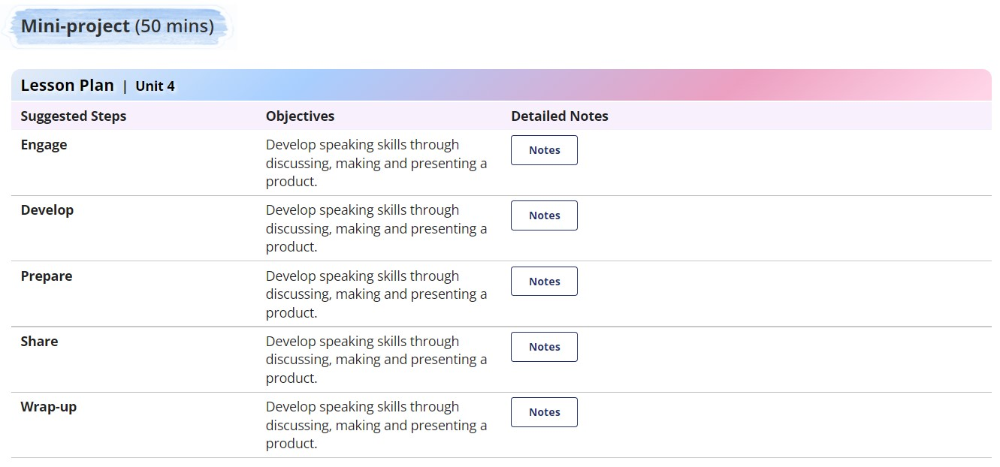
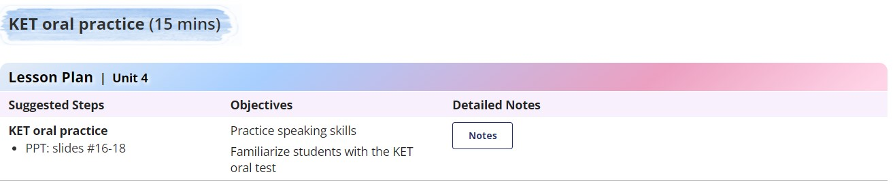
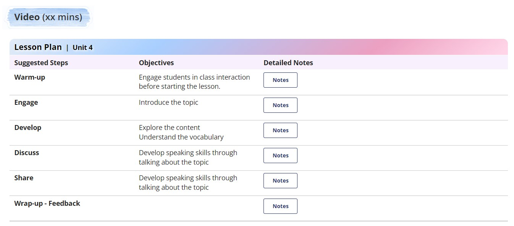

# HTML Code

## <a id="Content">**Content**</a>
| No.|  Lesson plan        |
|------|------------------ |
| 01.  |[The Real World](#The-Real-World)|
| 02.  |[Review](#Review)|
| 03.  |[Video](#Video)|
| 04.  |[Preview](#Preview)|
| 05.  |[Language Focus](#Language-Focus)|
| 06.  |[Reading](#Reading)|
| 07.  |[Writing](#Writing)|
| 08.  |[Mini project](#Mini-project)|
| 09.  |[KET oral practice](#KET-oral-practice)|
| 010.  |[Video for YC](#Video-YC)|
| 011.  |[YS - Lesson lead in](#YS-Lesson-lead-in)|
| 012.  |[YS - Reading-to-learn](#YS-Reading-to-learn)|
| 013.  |[YS - Unit opener](#YS-Unit-opener)|
| 014.  |[YS - Language in use](#YS-Language-in-use)|
| 015.  |[YS - Life skills](#YS-Life-skills)|
| 016.  |[YS - Unit reflect](#YS-Unit-reflect)|
| 017.  |[YS - Writing](#YS-Writing)|
| 018.  |[YS - Project](#YS-Project)|
| 019.  |[YS - PET oral practice](#YS-PET-oral-practice)|
| 020.  |[Warm-up & Review](#Warm-up-&-review)|
| 021.  |[Home assignment - yes](#Home-assignment-yes)|
| 022.  |[Home assignment - no](#Home-assignment-no)|
| 023.  |[Homework correction](#Homework-correction)|
## <a id="The-Real-World"></a>***1. The Real World***
<p align="center">

</p>

```
<style>
    .ol-number {margin-top: 11px !important; margin-bottom: 10px !important; margin-left: -1px !important; list-style-type: decimal !important;}
    .ul-disc {margin-top: 11px !important; margin-bottom: 10px !important; margin-left: -1px !important; list-style-type: disc !important;}
    .ul-circle {margin-top: 11px !important; margin-bottom: 10px !important; margin-left: -1px !important; list-style-type: circle !important;}
    .ul-square { margin-top: 11px !important; margin-bottom: 10px !important; margin-left: -1px !important; list-style-type: square !important;}
    .li-plan {margin: -10px 0px 5px 7px;}
    .table-plan td, th {border-left: 0px solid gray !important; border-right: 0px solid gray !important; padding: 5px 10px !important; width: auto !important;}
    .table-plan { border-collapse: collapse; margin-left: 0px !important; width: 96.7% !important;}
</style>

<div style="background: url('http://lms.vus.edu.vn/asset-v1:VUS+VF+2022+type@asset+block@Background_bar_8.png') no-repeat; background-size: 100% 100%; background-position: left; padding: 10px 25px 3px 25px; margin-bottom: 0px; margin-top: 0px; margin-left: -15px; display: inline-block;">
    <h3 style="vertical-align: text-bottom;"><b>The Real World</b> (100 mins)</h3>
</div>

<table class="table-plan">
    <tr>
        <th colspan="3" style="border: 0px solid white; border-radius: 10px 10px 0px 0px; background: rgb(255,212,231); background: linear-gradient(321deg, rgba(255,212,231,1) 2%, rgba(236,160,193,1) 27%, rgba(168,207,255,1) 70%, rgba(228,236,247,1) 100%);">
          
<!-- TABLE HEADER -->
          
<b style="color: black; text-shadow: 2px 2px 4px white;font-size: 17px;">Lesson Plan</b>&#160;&#160;|&#160;&#160;<span style="color: black; text-shadow: 2px 2px 4px white; font-size: 14px;"><b>Unit 1</b>&#160;<i>(SB: pp. 10-11)</i></span></th>
    </tr>
    <tr>
        <td style="background-color: #f8f0fc; width: 25% !important; border: 1px solid white;"><b>Teaching Steps</b></td>
        <td style="background-color: #f8f0fc; width: 25% !important; border: 1px solid white;"><b>Objectives</b></td>
        <td style="background-color: #f8f0fc; width: 50% !important; border: 1px solid white;"><b>Detailed Notes</b></td>
    </tr>

    <!--Before you watch-->

    <tr>
        <td style="border-bottom: 1px solid silver;"><b>Before you watch: </b>
            <ul class="ul-disc">
              <li class="li-plan">SB: the photo on p. 10</li>
              <li class="li-plan">PPT</li>
            </ul>
        </td>
        <td style="border-bottom: 1px solid silver;">Introduce the topic / content</td>
        <td style="border-bottom: 1px solid silver;">
            <p style="margin-bottom: 10px;"><button onclick="var x=document.getElementById(&quot;idUniquedBoxContent2157&quot;);&quot;none&quot;===x.style.display?	x.style.display=&quot;block&quot;:x.style.display=&quot;none&quot;;">Notes</button></p>
            <div id="idUniquedBoxContent2157" style="display: none; padding-left: 5px;">
                <div>
                  
<!-- Before you watch - Note -->                  
                  
                    <b>Lead-in</b>
                    <ol class="ol-number">
                      <li class="li-plan">Have students look at the photo and the tile, then discuss the following questions: <i>What activities does she like to do? What do you think BIRDGIRL mean? Are there lots of birds in your city/town? Do you think watching birds is a fun activity? Why (not)?</i></li>
                    </ol>
                  
                    <b>Vocabulary</b>
                    <ol class="ol-number">
                      <li class="li-plan">Have students look at the photos and match them with the correct words. (PPT)<br/>
                        <i><u>Vocabulary:</u> hiking, diving, travelling around the world, visiting places of nature, climbing, canoeing</i>
</li>
                      <li class="li-plan">Have students play a game to review the vocabulary that they have just learned.</li>
                    </ol>
                </div>
            </div>
        </td>
    </tr>

    <!--While you watch-->

    <tr>
        <td style="border-bottom: 1px solid silver;"><b>While you watch: </b>
            <ul class="ul-disc">
              <li class="li-plan">SB: #A-B, p. 10</li>
              <li class="li-plan">PPT</li>
            </ul>
        </td>
        <td style="border-bottom: 1px solid silver;">Understand the content (Video)<p style="margin-bottom: 5px"></p>
Build listening skills in a real-life context
</td>
        <td style="border-bottom: 1px solid silver;">
            <p style="margin-bottom: 10px;"><button onclick="var x=document.getElementById(&quot;idUniquedBoxContent2278&quot;);&quot;none&quot;===x.style.display?	x.style.display=&quot;block&quot;:x.style.display=&quot;none&quot;;">Notes</button>
            </p>
            <div id="idUniquedBoxContent2278" style="display: none; padding-left: 5px;">
                <div>
                  
<!-- While you watch - Note -->                  
                  
            <b>#A</b>
		    <ol class="ol-number">
              <li class="li-plan">Have students read the sentences in #A, highlight the keywords, and guess the answers.</li>
              <li class="li-plan">Play the video and have students complete the task. </li>
              <li class="li-plan">Go through the answers as a class.</li>
            </ol>
                  
            <b>#B</b>
		    <ol class="ol-number">
              <li class="li-plan">Have students read the passage and guess what kind of information to fill in the blanks. (PPT)</li>
              <li class="li-plan">Have students watch the video again and go through the answers as a class.</li>
            </ol>
                </div>
            </div>
        </td>
    </tr>
    <tr>

        <!-- After you watch -->

    <tr>
        <td style="border-bottom: 1px solid silver;">
            <b>After you watch: </b>
            <ul class="ul-disc">
                <li class="li-plan">PPT</li>
                <li class="li-plan">Handout</li>
            </ul>

        </td>
        <td style="border-bottom: 1px solid silver;">Talk about the content (Video)</td>
        <td style="border-bottom: 1px solid silver;">
            <p style="margin-bottom: 10px;"><button onclick="var x=document.getElementById(&quot;idUniquedBoxContent2229&quot;);&quot;none&quot;===x.style.display?	x.style.display=&quot;block&quot;:x.style.display=&quot;none&quot;;">Notes</button></p>
            <div id="idUniquedBoxContent2229" style="display: none; padding-left: 5px;">
                <div>
                  
<!-- After you watch - Note -->                  
                  
                    <p style="margin-bottom: 20px;"></p>
                    <ol class="ol-number">
                      <li class="li-plan">Have students work in pairs to ask and answer the questions to complete their notes. (Handouts)</li>
                      <li class="li-plan">Have some pairs report their notes and go through the answers. (PPT)</li>
                    </ol>
                </div>
            </div>
        </td>
    </tr>
    <tr>
      
<!--Pronunciation & Communication-->

    <tr>
        <td style="border-bottom: 1px solid silver;"><b>Pronunciation &amp; Communication: </b>
            <ul class="ul-disc">
              <li class="li-plan">SB: p. 11</li>
              <li class="li-plan">PPT</li>
            </ul>
        </td>
        <td style="border-bottom: 1px solid silver;">Practice pronunciation<p style="margin-bottom: 5px"></p>
Use the vocabulary / grammar learned through speaking about the topic
</td>
        <td style="border-bottom: 1px solid silver;">
            <p style="margin-bottom: 10px;"><button onclick="var x=document.getElementById(&quot;idUniquedBoxContent22781&quot;);&quot;none&quot;===x.style.display?	x.style.display=&quot;block&quot;:x.style.display=&quot;none&quot;;">Notes</button>
            </p>
            <div id="idUniquedBoxContent22781" style="display: none; padding-left: 5px;">
                <div>
                  
<!-- Pronunciation & Communication - Note -->                  
                  
            <b>Pronunciation</b>
		    <ol class="ol-number">
              <li class="li-plan">Have students listen to the audio. Draw their attention on how to pronounce the <i>reduction of ‘to’</i>.</li>
              <li class="li-plan">Have students work in pairs to practice reading the sentences. </li>
            </ol>
                  
            <b>Communication </b>
		    <ol class="ol-number">
              <li class="li-plan">Have students work in pairs and complete the task.</li>
              <li class="li-plan">Let them mingle to share their findings or report their findings in class.</li>
            </ol>
                </div>
            </div>
        </td>
    </tr>
    <tr>

</table>
```

<div align="right">
    <b><a href="#Content">↥ back to top</a></b>
</div>

## <a id="Review"></a>***2. Review***
<p align="center">

</p>

```
<style>
    .ol-number {margin-top: 11px !important; margin-bottom: 10px !important; margin-left: -1px !important; list-style-type: decimal !important;}
    .ul-disc {margin-top: 11px !important; margin-bottom: 10px !important; margin-left: -1px !important; list-style-type: disc !important;}
    .ul-circle {margin-top: 11px !important; margin-bottom: 10px !important; margin-left: -1px !important; list-style-type: circle !important;}
    .ul-square {margin-top: 11px !important; margin-bottom: 10px !important; margin-left: -1px !important; list-style-type: square !important;}
    .li-plan {margin: -10px 0px 5px 7px;}
    .table-plan td, th {border-left: 0px solid gray !important; border-right: 0px solid gray !important; padding: 5px 10px !important; width: auto !important;}
    .table-plan {border-collapse: collapse; margin-left: 0px !important; width: 96.7% !important;}
</style>

<div style="background: url('http://lms.vus.edu.vn/asset-v1:VUS+VF+2022+type@asset+block@Background_bar_8.png') no-repeat; background-size: 100% 100%; background-position: left; padding: 10px 25px 3px 25px; margin-bottom: 0px; margin-top: 0px; margin-left: -15px; display: inline-block;">
    <h3 style="vertical-align: text-bottom;"><b>Review</b> (50 mins)</h3>
</div>

<table class="table-plan">
    <tr>
        <th colspan="3" style="border: 0px solid white; border-radius: 10px 10px 0px 0px; background: rgb(255,212,231);
    background: linear-gradient(321deg, rgba(255,212,231,1) 2%, rgba(236,160,193,1) 27%, rgba(168,207,255,1) 70%, rgba(228,236,247,1) 100%);">
          
<!-- TABLE HEADER -->
          
<b style="color: black; text-shadow: 2px 2px 4px white;font-size: 17px;">Lesson Plan</b>&#160;&#160;|&#160;&#160;<span style="color: black; text-shadow: 2px 2px 4px white; font-size: 14px;"><b>Unit 1</b>&#160;<i>(SB: pp.54-55, WB: pp.80-81)</i></span>
        </th>
    </tr>
    <tr>
        <td style="background-color: #f8f0fc; width: 25% !important; border: 1px solid white;"><b>Teaching Steps</b></td>
        <td style="background-color: #f8f0fc; width: 25% !important; border: 1px solid white;"><b>Objectives</b></td>
        <td style="background-color: #f8f0fc; width: 50% !important; border: 1px solid white;"><b>Detailed Notes</b></td>
    </tr>

    <!--Vocabulary review + SB correction-->

    <tr>
        <td style="border-bottom: 1px solid silver;"><b>Vocabulary review + SB correction: </b>
            <ul class="ul-disc">
                <li class="li-plan">SB: #A+C, p.17 &amp; #A+C, p.29</li>
                <li class="li-plan">PPT: slides #7-14 (optional)</li>
            </ul>
        </td>
        <td style="border-bottom: 1px solid silver;">Review vocab / grammar + content</td>
        <td style="border-bottom: 1px solid silver;">
            <p style="margin-bottom: 10px;"><button onclick="var x=document.getElementById(&quot;idUniquedBoxContent2167&quot;);&quot;none&quot;===x.style.display?	x.style.display=&quot;block&quot;:x.style.display=&quot;none&quot;;">Notes</button></p>
            <div id="idUniquedBoxContent2167" style="display: none; padding-left: 5px;">
                <div>
                  
<!-- Vocabulary review + SB correction - Note -->
                  
                    <p style="margin-bottom: 20px;"></p>
                    <ol class="ol-number">
                        <li class="li-plan"></li>
                    </ol>
                </div>
            </div>
        </td>
    </tr>

    <!-- Grammar review+ SB correction -->

    <tr>
        <td style="border-bottom: 1px solid silver;"><b>Grammar review + SB correction: </b>
            <ul class="ul-disc">
                <li class="li-plan">SB: #B, p.17 &amp; #B, p.29</li>
                <li class="li-plan">PPT: slides #15-20 (optional)</li>
            </ul>
        </td>
        <td style="border-bottom: 1px solid silver;">Review vocab / grammar + content</td>
        <td style="border-bottom: 1px solid silver;">
            <p style="margin-bottom: 10px;"><button onclick="var x=document.getElementById(&quot;idUniquedBoxContent2245&quot;);&quot;none&quot;===x.style.display?	x.style.display=&quot;block&quot;:x.style.display=&quot;none&quot;;">Notes</button>
            </p>
            <div id="idUniquedBoxContent2245" style="display: none; padding-left: 5px;">
                <div>
                  
<!-- Grammar review+ SB correction - Note -->
                  
                    <p style="margin-bottom: 20px;"></p>
                    <ol class="ol-number">
                        <li class="li-plan"></li>
                    </ol>
                </div>
            </div>
        </td>
    </tr>
    <tr>

        <!-- Writing / Game / Speaking -->

    <tr>
        <td style="border-bottom: 1px solid silver;">
            <b>Writing / Game / Speaking: </b>
            <ul class="ul-disc">
                <li class="li-plan">PPT: slides #21-22 (optional)</li>
            </ul>
        </td>
        <td style="border-bottom: 1px solid silver;">Review vocab / grammar + content</td>
        <td style="border-bottom: 1px solid silver;">
            <p style="margin-bottom: 10px;"><button onclick="var x=document.getElementById(&quot;idUniquedBoxContent4678&quot;);&quot;none&quot;===x.style.display?	x.style.display=&quot;block&quot;:x.style.display=&quot;none&quot;;">Notes</button></p>
            <div id="idUniquedBoxContent4678" style="display: none; padding-left: 5px;">
                <div>
                  
<!-- Writing / Game / Speaking - Note -->                  
                  
                    <p style="margin-bottom: 20px;"></p>
                    <ol class="ol-number">
                        <li class="li-plan"></li>
                    </ol>
                </div>
            </div>
        </td>
    </tr>
    <tr>
</table>
```

<div align="right">
<b><a href="#Content">↥ back to top</a></b>
</div>

## <a id="Video"></a>***3. Video***

<p align="center">

</p>

```
<style>
    .ol-number {margin-top: 11px !important; margin-bottom: 10px !important; margin-left: -1px !important; list-style-type: decimal !important;}
    .ul-disc {margin-top: 11px !important; margin-bottom: 10px !important; margin-left: -1px !important; list-style-type: disc !important;}
    .ul-circle {margin-top: 11px !important; margin-bottom: 10px !important; margin-left: -1px !important; list-style-type: circle !important;}
    .ul-square { margin-top: 11px !important; margin-bottom: 10px !important; margin-left: -1px !important; list-style-type: square !important;}
    .li-plan {margin: -10px 0px 5px 7px;}
    .table-plan td, th {border-left: 0px solid gray !important; border-right: 0px solid gray !important; padding: 5px 10px !important; width: auto !important;}
    .table-plan { border-collapse: collapse; margin-left: 0px !important; width: 96.7% !important;}
</style>

<div style="background: url('http://lms.vus.edu.vn/asset-v1:VUS+VF+2022+type@asset+block@Background_bar_8.png') no-repeat; background-size: 100% 100%; background-position: left; padding: 10px 25px 3px 25px; margin-bottom: 0px; margin-top: 0px; margin-left: -15px; display: inline-block;">
    <h3 style="vertical-align: text-bottom;"><b>Video</b> (100 mins)</h3>
</div>

<table class="table-plan">
    <tr>
        <th colspan="3" style="border: 0px solid white; border-radius: 10px 10px 0px 0px; background: rgb(255,212,231); background: linear-gradient(321deg, rgba(255,212,231,1) 2%, rgba(236,160,193,1) 27%, rgba(168,207,255,1) 70%, rgba(228,236,247,1) 100%);">
          
<!-- TABLE HEADER -->
          
<b style="color: black; text-shadow: 2px 2px 4px white;font-size: 17px;">Lesson Plan</b>&#160;&#160;|&#160;&#160;<span style="color: black; text-shadow: 2px 2px 4px white; font-size: 14px;"><b>Unit 1</b>&#160;<i>(SB: pp.54-55, WB: pp.80-81)</i></span></th>
    </tr>
    <tr>
        <td style="background-color: #f8f0fc; width: 25% !important; border: 1px solid white;"><b>Teaching Steps</b></td>
        <td style="background-color: #f8f0fc; width: 25% !important; border: 1px solid white;"><b>Objectives</b></td>
        <td style="background-color: #f8f0fc; width: 50% !important; border: 1px solid white;"><b>Detailed Notes</b></td>
    </tr>

    <!--Before you watch-->

    <tr>
        <td style="border-bottom: 1px solid silver;"><b>Before you watch: </b>
            <ul class="ul-disc">
                <li class="li-plan">SB: the photo on p.76</li>
            </ul>
        </td>
        <td style="border-bottom: 1px solid silver;">Introduce the content of the video</td>
        <td style="border-bottom: 1px solid silver;">
            <p style="margin-bottom: 10px;"><button onclick="var x=document.getElementById(&quot;idUniquedBoxContent2157&quot;);&quot;none&quot;===x.style.display?	x.style.display=&quot;block&quot;:x.style.display=&quot;none&quot;;">Notes</button></p>
            <div id="idUniquedBoxContent2157" style="display: none; padding-left: 5px;">
                <div>
                  
<!-- Before you watch - Note -->                  
                  
                    <p style="margin-bottom: 20px;"></p>
                    <ol class="ol-number">
                        <li class="li-plan"></li>
                    </ol>
                </div>
            </div>
        </td>
    </tr>

    <!--While you watch-->

    <tr>
        <td style="border-bottom: 1px solid silver;"><b>While you watch: </b>
            <ul class="ul-disc">
                <li class="li-plan">SB: #A-B, p.76
                </li>
            </ul>
        </td>
        <td style="border-bottom: 1px solid silver;">
            Understand the content of the video
            <div style="margin-top: 5px;">Build listening skills in a real-life context</div>
        </td>
        <td style="border-bottom: 1px solid silver;">
            <p style="margin-bottom: 10px;"><button onclick="var x=document.getElementById(&quot;idUniquedBoxContent2278&quot;);&quot;none&quot;===x.style.display?	x.style.display=&quot;block&quot;:x.style.display=&quot;none&quot;;">Notes</button>
            </p>
            <div id="idUniquedBoxContent2278" style="display: none; padding-left: 5px;">
                <div>
                  
<!-- While you watch - Note -->                  
                  
                    <p style="margin-bottom: 20px;"></p>
		    <ol class="ol-number">
                        <li class="li-plan"></li>
                    </ol>
                </div>
            </div>
        </td>
    </tr>
    <tr>

        <!-- After you watch -->

    <tr>
        <td style="border-bottom: 1px solid silver;">
            <b>After you watch: </b>
            <ul class="ul-disc">
                <li class="li-plan">SB: p.76</li>
                <li class="li-plan">PPT</li>
                <li class="li-plan">Portfolio: pp.34-35</li>
                <li class="li-plan">Handout</li>
            </ul>

        </td>
        <td style="border-bottom: 1px solid silver;">Develop critical thinking and creativity by talking or writing
            about the topic of the video.</td>
        <td style="border-bottom: 1px solid silver;">
            <p style="margin-bottom: 10px;"><button onclick="var x=document.getElementById(&quot;idUniquedBoxContent2229&quot;);&quot;none&quot;===x.style.display?	x.style.display=&quot;block&quot;:x.style.display=&quot;none&quot;;">Notes</button></p>
            <div id="idUniquedBoxContent2229" style="display: none; padding-left: 5px;">
                <div>
                  
<!-- After you watch - Note -->                  
                  
                    <p style="margin-bottom: 20px;"></p>
                    <ol class="ol-number">
                        <li class="li-plan"></li>
                    </ol>
                </div>
            </div>
        </td>
    </tr>
    <tr>
</table>
```

<div align="right">
<b><a href="#Content">↥ back to top</a></b>
</div>

## <a id="Preview"></a>***4. Preview***

<p align="center">

</p>

```
<style>
    .ol-number {margin-top: 11px !important;margin-bottom: 10px !important;margin-left: -1px !important; list-style-type: decimal!important;}
    .ul-disc {margin-top: 11px !important;margin-bottom: 10px !important;margin-left: -1px !important; list-style-type: disc !important;}  
    .ul-circle {margin-top: 11px !important; margin-bottom: 10px !important; margin-left: -1px !important; list-style-type: circle !important;}
    .ul-square {margin-top: 11px !important; margin-bottom: 10px !important; margin-left: -1px !important; list-style-type: square !important;} 
    .li-plan {margin: -10px 0px 5px 7px;}
    .table-plan td, th {border-left: 0px solid gray !important; border-right: 0px solid gray !important; padding: 5px 10px !important; width: auto !important;}
    .table-plan {border-collapse: collapse; margin-left: 0px !important; width: 96.7% !important;}
</style>
    
<div style="background: url('http://lms.vus.edu.vn/asset-v1:VUS+VF+2022+type@asset+block@Background_bar_8.png') no-repeat; background-size: 100% 100%; background-position: left; padding: 10px 25px 3px 25px; margin-bottom: 0px; margin-top: 0px; margin-left: -15px; display: inline-block;"><h3 style="vertical-align: text-bottom;"><b>Preview</b> (35 mins)</h3></div>
    
<table class="table-plan">
<tr>
 <th colspan="3" style = "border: 0px solid white; border-radius: 10px 10px 0px 0px; background: rgb(255,212,231); background: linear-gradient(321deg, rgba(255,212,231,1) 2%, rgba(236,160,193,1) 27%, rgba(168,207,255,1) 70%, rgba(228,236,247,1) 100%);">

<!-- TABLE HEADER --> 
            
<b style="color: black; text-shadow: 2px 2px 4px white;font-size: 17px;">Lesson Plan</b>&#160;&#160;|&#160;&#160;<span style="color: black; text-shadow: 2px 2px 4px white; font-size: 14px;"><b>Unit 1</b>&#160;<i>(SB: pp.54-55, WB: pp.80-81)</i></span></th>
</tr>
<tr>
 <td style="background-color: #f8f0fc; width: 25% !important; border: 1px solid white;"><b>Teaching Steps</b></td>
 <td style="background-color: #f8f0fc; width: 25% !important; border: 1px solid white;"><b>Objectives</b></td>
 <td style="background-color: #f8f0fc; width: 50% !important; border: 1px solid white;"><b>Detailed Notes</b></td>
</tr>
      
<!-- LEAD-IN -->  
      
<tr>  
 <td style="border-bottom: 1px solid silver;"><b>Lead-in: </b>
   <ul class="ul-disc">
     <li class="li-plan">SB: the photo on p. 8</li>
   </ul>
 </td>
 <td style="border-bottom: 1px solid silver;">Engage students and introduce the topic</td>
 <td style="border-bottom: 1px solid silver;">
   <p style="margin-bottom: 10px;"><button onclick="var x=document.getElementById(&quot;idUniquedBoxContentprelead&quot;);&quot;none&quot;===x.style.display?	x.style.display=&quot;block&quot;:x.style.display=&quot;none&quot;;">Notes</button></p>
   <div id="idUniquedBoxContentprelead" style="display: none; padding-left: 5px;">
   <div>
               
    <!-- LEAD-IN - NOTE --> 
     <p style="margin-bottom: 20px;"></p>
     <ol class="ol-number">
       <li class="li-plan"></li>
     </ol>
   </div></div>
 </td>
</tr>
      
<!-- LISTENING --> 
      
<tr>
  <td style="border-bottom: 1px solid silver;"><b>Listening:</b>
    <ul class="ul-disc">
      <li class="li-plan">SB: #A-B, p.8</li>
    </ul>
  </td>
  <td style="border-bottom: 1px solid silver;">Identify the vocabulary and understand the meaning</td>
  <td style="border-bottom: 1px solid silver;">
    <p style="margin-bottom: 10px;"><button onclick="var x=document.getElementById(&quot;idUniquedBoxContentprelis&quot;);&quot;none&quot;===x.style.display?	x.style.display=&quot;block&quot;:x.style.display=&quot;none&quot;;">Notes</button></p>
             <div id="idUniquedBoxContentprelis" style="display: none; padding-left: 5px;">
             <div>
               
    <!-- LISTENING - NOTE -->  
               
    <p style="margin-bottom: 20px;"></p>  
    <ol class="ol-number">
      <li class="li-plan"></li>
    </ol>
  </div></div>
 </td>
</tr>
<tr>
         
<!-- SPEAKING -->  
         
 <td><b>Speaking: </b>
   <ul class="ul-disc">
     <li class="li-plan">SB: #C, p. 9</li>
     <li class="li-plan">PPT: slides #2-7 (optional)</li>
   </ul>
 </td>
 <td>Use the vocabulary to talk about the topic<br/></td>
 <td>
    <p style="margin-bottom: 10px;"><button onclick="var x=document.getElementById(&quot;idUniquedBoxContentprespeak&quot;);&quot;none&quot;===x.style.display?	x.style.display=&quot;block&quot;:x.style.display=&quot;none&quot;;">Notes</button></p>
    <div id="idUniquedBoxContentprespeak" style="display: none; padding-left: 5px;">
    <div>
               
    <!-- SPEAKING - NOTE --> 
    <p style="margin-bottom: 20px;"></p>
    <ol class="ol-number">
      <li class="li-plan"></li>
    </ol>
  </div></div>
 </td>
</tr>
<tr>
          
<!-- VOCABULARY -->       
          
 <td><b>Vocabulary (The Alphabet): </b>
   <ul class="ul-disc">
     <li class="li-plan">SB: #C-E, p. 11</li>
     <li class="li-plan">PPT: slides #8-11</li>
   </ul>
 </td>
 <td>Identify the vocabulary and understand the meaning</td>
 <td><p style="margin-bottom: 10px;"><button onclick="var x=document.getElementById(&quot;idUniquedBoxContentprevoc&quot;);&quot;none&quot;===x.style.display?	x.style.display=&quot;block&quot;:x.style.display=&quot;none&quot;;">Notes</button></p>
     <div id="idUniquedBoxContentprevoc" style="display: none; padding-left: 5px;">
     <div>
               
     <!-- VOCABULARY - NOTE --> 
               
     <p style="margin-bottom: 20px;"></p>
      <ol class="ol-number">
        <li class="li-plan"></li>
      </ol>            
  </div></div>
 </td>
</tr>
</table>
```

<div align="right">
<b><a href="#Content">↥ back to top</a></b>
</div>

## <a id="Language-Focus"></a>***5. Language Focus***

<p align="center">

</p>

```
<style>
    .ol-number {margin-top: 11px !important;margin-bottom: 10px !important;margin-left: -1px !important; list-style-type: decimal!important;}
    .ul-disc {margin-top: 11px !important;margin-bottom: 10px !important;margin-left: -1px !important; list-style-type: disc !important;}  
    .ul-circle {margin-top: 11px !important; margin-bottom: 10px !important; margin-left: -1px !important; list-style-type: circle !important;}
    .ul-square {margin-top: 11px !important; margin-bottom: 10px !important; margin-left: -1px !important; list-style-type: square !important;} 
    .li-plan {margin: -10px 0px 5px 7px;}
    .table-plan td, th {border-left: 0px solid gray !important; border-right: 0px solid gray !important; padding: 5px 10px !important; width: auto !important;}
    .table-plan {border-collapse: collapse; margin-left: 0px !important; width: 96.7% !important;}
</style>
    
<div style="background: url('http://lms.vus.edu.vn/asset-v1:VUS+VF+2022+type@asset+block@Background_bar_8.png') no-repeat; background-size: 100% 100%; background-position: left; padding: 10px 25px 3px 25px; margin-bottom: 0px; margin-top: 0px; margin-left: -15px; display: inline-block;"><h3 style="vertical-align: text-bottom;"><b>Language focus</b> (65 mins)</h3></div>
<table class="table-plan">
 <tr>
  <th colspan="3" style = "border: 0px solid white; border-radius: 10px 10px 0px 0px; background: rgb(255,212,231); background: linear-gradient(321deg, rgba(255,212,231,1) 2%, rgba(236,160,193,1) 27%, rgba(168,207,255,1) 70%, rgba(228,236,247,1) 100%);">
            
<!-- TABLE HEADER -->  
            
<b style="color: black; text-shadow: 2px 2px 4px white;font-size: 17px;">Lesson Plan</b>&#160;&#160;|&#160;&#160;<span style="color: black; text-shadow: 2px 2px 4px white; font-size: 14px;"><b>Unit 1</b>&#160;<i>(SB: pp.54-55, WB: pp.80-81)</i></span></th>
 </tr>
 <tr>
  <td style="background-color: #f8f0fc; width: 25% !important; border: 1px solid white;"><b>Teaching Steps</b></td>
  <td style="background-color: #f8f0fc; width: 25% !important; border: 1px solid white;"><b>Objectives</b></td>
  <td style="background-color: #f8f0fc; width: 50% !important; border: 1px solid white;"><b>Detailed Notes</b></td>
 </tr>
    
<!-- LANGUAGE IN CONTEXT -->   
      
 <tr>  
  <td style="border-bottom: 1px solid silver;"><b>Language in context:</b>
    <ul class="ul-disc">
      <li class="li-plan">SB: #A, p.10
      <li class="li-plan">PPT: slides #12-15 (optional)
    </ul>
  </td>
  <td style="border-bottom: 1px solid silver;">
   Understand the context <p style="margin-bottom: 5px;"></p>
   Understand and use the target phrase / expression in a conversation
  </td>
  <td style="border-bottom: 1px solid silver;"><p style="margin-bottom: 10px;"><button onclick="var x=document.getElementById(&quot;idUniquedBoxContentlangfo&quot;);&quot;none&quot;===x.style.display?	x.style.display=&quot;block&quot;:x.style.display=&quot;none&quot;;">Notes</button></p>
    <div id="idUniquedBoxContentlangfo" style="display: none; padding-left: 5px;">
    <div>
               
<!-- LANGUAGE IN CONTEXT - NOTE -->
               
    <p style="margin-bottom: 20px;"></p>  
    <ol class="ol-number">
      <li class="li-plan"></li>
    </ol>
  </div></div>
 </td>
</tr>
    
<!-- USE & FORM -->   
      
<tr>
  <td style="border-bottom: 1px solid silver;"><b>Use &amp; form</b>
    <ul class="ul-disc">
      <li class="li-plan">SB: #B on p.10</li>
      <li class="li-plan">PPT: slides #16-25</li>
    </ul>
  </td>
  <td style="border-bottom: 1px solid silver;">Understand the target grammar</td>
  <td style="border-bottom: 1px solid silver;"><p style="margin-bottom: 10px;"><button onclick="var x=document.getElementById(&quot;idUniquedBoxContentuseform&quot;);&quot;none&quot;===x.style.display?	x.style.display=&quot;block&quot;:x.style.display=&quot;none&quot;;">Notes</button></p>
     <div id="idUniquedBoxContentuseform" style="display: none; padding-left: 5px;">
     <div>
               
<!-- USE & FORM - NOTE -->  
               
     <p style="margin-bottom: 20px;"></p>  
     <ol class="ol-number">
       <li class="li-plan"></li>
     </ol>
    </div></div>
  </td>
</tr>
     
<!-- CONTROLLED PRACTICE -->   
      
<tr>
  <td><b>Controlled practice:</b>
    <ul class="ul-disc">
      <li class="li-plan">WB: #A-B, p.80 &amp; #A, p.81</li>
    </ul>
  </td>
  <td>Use the target grammar<br/></td>
  <td><p style="margin-bottom: 10px;"><button onclick="var x=document.getElementById(&quot;idUniquedBoxContentconprac&quot;);&quot;none&quot;===x.style.display?	x.style.display=&quot;block&quot;:x.style.display=&quot;none&quot;;">Notes</button></p>
     <div id="idUniquedBoxContentconprac" style="display: none; padding-left: 5px;">
     <div>
               
<!-- CONTROLLED PRACTICE - NOTE -->  
               
     <p style="margin-bottom: 20px;"></p>
     <ol class="ol-number">
       <li class="li-plan"></li>
     </ol>
    </div></div>
  </td>
</tr>
      
<!-- FREE PRODUCTION --> 
      
<tr>
  <td><b>Free production:</b>
     <ul class="ul-disc">
       <li class="li-plan">PPT: slides #26-28</li>
       <li class="li-plan">Portfolio: pp.2-3</li>
     </ul>
  </td>
  <td>Use the target vocabulary and grammar to talk or write about the topic </td>
  <td><p style="margin-bottom: 10px;"><button onclick="var x=document.getElementById(&quot;idUniquedBoxContentfreepro&quot;);&quot;none&quot;===x.style.display?	x.style.display=&quot;block&quot;:x.style.display=&quot;none&quot;;">Notes</button></p>
      <div id="idUniquedBoxContentfreepro" style="display: none; padding-left: 5px;">
      <div>
               
<!-- FREE PRODUCTION - NOTE -->                
               
     <p style="margin-bottom: 20px;"></p>
     <ol class="ol-number">
       <li class="li-plan"></li>
     </ol>            
    </div></div>
  </td>
</tr>
</table>
```

<div align="right">
<b><a href="#Content">↥ back to top</a></b>
</div>

## <a id="Reading"></a>***6. Reading***

<p align="center">

</p>

```
<style>
    .ol-number {margin-top: 11px !important;margin-bottom: 10px !important;margin-left: -1px !important; list-style-type: decimal!important;}
    .ul-disc {margin-top: 11px !important;margin-bottom: 10px !important;margin-left: -1px !important; list-style-type: disc !important;}  
    .ul-circle {margin-top: 11px !important; margin-bottom: 10px !important; margin-left: -1px !important; list-style-type: circle !important;}
    .ul-square {margin-top: 11px !important; margin-bottom: 10px !important; margin-left: -1px !important; list-style-type: square !important;} 
    .li-plan {margin: -10px 0px 5px 7px;}
    .table-plan td, th {border-left: 0px solid gray !important; border-right: 0px solid gray !important; padding: 5px 10px !important; width: auto !important;}
    .table-plan {border-collapse: collapse; margin-left: 0px !important; width: 96.7% !important;}
</style>
    
<div style="background: url('http://lms.vus.edu.vn/asset-v1:VUS+VF+2022+type@asset+block@Background_bar_8.png') no-repeat; background-size: 100% 100%; background-position: left; padding: 10px 25px 3px 25px; margin-bottom: 0px; margin-top: 0px; margin-left: -15px; display: inline-block;"><h3 style="vertical-align: text-bottom;"><b>Reading</b> (80 mins)</h3></div>
<table class="table-plan">
 <tr>
  <th colspan="3" style = "border: 0px solid white; border-radius: 10px 10px 0px 0px; background: rgb(255,212,231); background: linear-gradient(321deg, rgba(255,212,231,1) 2%, rgba(236,160,193,1) 27%, rgba(168,207,255,1) 70%, rgba(228,236,247,1) 100%);">
            
<!-- TABLE HEADER -->  
<b style="color: black; text-shadow: 2px 2px 4px white;font-size: 17px;">Lesson Plan</b>&#160;&#160;|&#160;&#160;<span style="color: black; text-shadow: 2px 2px 4px white; font-size: 14px;"><b>Unit 1</b>&#160;<i>(SB: pp.54-55, WB: pp.80-81)</i></span></th>
 </tr>
 <tr>
   <td style="background-color: #f8f0fc; width: 25% !important; border: 1px solid white;"><b>Teaching Steps</b></td>
   <td style="background-color: #f8f0fc; width: 25% !important; border: 1px solid white;"><b>Objectives</b></td>
   <td style="background-color: #f8f0fc; width: 50% !important; border: 1px solid white;"><b>Detailed Notes</b></td>
 </tr>
    
<!-- LEAD-IN -->   
      
 <tr>  
   <td style="border-bottom: 1px solid silver;"><b>Lead-in:</b>
     <ul class="ul-disc">
       <li class="li-plan">SB: #A, p.14
     </ul>
   </td>
   <td style="border-bottom: 1px solid silver;">Introduce the topic, activate students' knowledge about the topic, and engage students</td>
   <td style="border-bottom: 1px solid silver;"><p style="margin-bottom: 10px;"><button onclick="var x=document.getElementById(&quot;idUniquedBoxContentreadlead&quot;);&quot;none&quot;===x.style.display?	x.style.display=&quot;block&quot;:x.style.display=&quot;none&quot;;">Notes</button></p>
     <div id="idUniquedBoxContentreadlead" style="display: none; padding-left: 5px;">
     <div>
               
<!-- LEAD-IN - NOTES-->
               
     <p style="margin-bottom: 20px;"></p>
     <ol class="ol-number">
       <li class="li-plan"></li>
     </ol>
   </div></div>
  </td>
 </tr>
    
<!-- READING FLUENCY -->   
      
  <tr>  
   <td style="border-bottom: 1px solid silver;"><b>Reading fluency:</b>
     <ul class="ul-disc">
       <li class="li-plan">SB: #B, p.14 &amp; Reading text p.15</li>
     </ul>
   </td>
   <td style="border-bottom: 1px solid silver;">Read the text fluently</td>
   <td style="border-bottom: 1px solid silver;"><p style="margin-bottom: 10px;"><button onclick="var x=document.getElementById(&quot;idUniquedBoxContentreadflu&quot;);&quot;none&quot;===x.style.display?	x.style.display=&quot;block&quot;:x.style.display=&quot;none&quot;;">Notes</button></p>
       <div id="idUniquedBoxContentreadflu" style="display: none; padding-left: 5px;">
       <div>

<!-- READING FLUENCY - NOTES -->
               
       <p style="margin-bottom: 20px;"></p> 
       <ol class="ol-number">
         <li class="li-plan"></li>
       </ol>
     </div></div>
   </td>
 </tr>  
      
<!-- READING COMPREHENSION -->   
      
 <tr>
   <td style="border-bottom: 1px solid silver;"><b>Reading comprehension:</b>
     <ul class="ul-disc">
       <li class="li-plan">SB (#A-B, p.15)</li>
     </ul>
   </td>
   <td style="border-bottom: 1px solid silver;">Build target reading skills</td>
   <td style="border-bottom: 1px solid silver;"><p style="margin-bottom: 10px;"><button onclick="var x=document.getElementById(&quot;idUniquedBoxContentreadcompre&quot;);&quot;none&quot;===x.style.display?	x.style.display=&quot;block&quot;:x.style.display=&quot;none&quot;;">Notes</button></p>
     <div id="idUniquedBoxContentreadcompre" style="display: none; padding-left: 5px;">
     <div>
               
<!-- READING COMPREHENSION - NOTES -->  
               
     <p style="margin-bottom: 20px;"></p>  
     <ol class="ol-number">
       <li class="li-plan"></li>
     </ol>
    </div></div>
   </td>
  </tr>
     
<!-- SPEAKING -->   
      
  <tr>
    <td><b>Speaking:</b>
      <ul class="ul-disc">
        <li class="li-plan">WB: #C, p.83</li>
        <li class="li-plan">PPT: Slides #2-3 (optional)</li>
      </ul>
    </td>
    <td>Talk about the topic<br/></td>
    <td><p style="margin-bottom: 10px;"><button onclick="var x=document.getElementById(&quot;idUniquedBoxContentreadspeak&quot;);&quot;none&quot;===x.style.display?	x.style.display=&quot;block&quot;:x.style.display=&quot;none&quot;;">Notes</button></p>
        <div id="idUniquedBoxContentreadspeak" style="display: none; padding-left: 5px;">
        <div>
               
<!-- SPEAKING - NOTES --> 
               
    <p style="margin-bottom: 20px;"></p> 
    <ol class="ol-number">
      <li class="li-plan"></li>
    </ol>
   </div></div>
  </td>
 </tr>
      
<!-- VOCABULARY - FREE PRODUCTION 1 --> 
      
 <tr>
   <td><b>Vocabulary - Free production 1:</b>
     <ul class="ul-disc">
       <li class="li-plan">SB: #A (p.16)</li>
       <li class="li-plan">WB: #A (p.83)</li>
       <li class="li-plan">Portfolio: pp.2-3</li>
       <li class="li-plan">PPT: Slides #4-6 (optional) &amp; slides #7-13 (compulsory)</li>
     </ul>
   </td>
   <td>Understand the vocabulary</td>
   <td><p style="margin-bottom: 10px;"><button onclick="var x=document.getElementById(&quot;idUniquedBoxContentreadfree&quot;);&quot;none&quot;===x.style.display?	x.style.display=&quot;block&quot;:x.style.display=&quot;none&quot;;">Notes</button></p>
       <div id="idUniquedBoxContentreadfree" style="display: none; padding-left: 5px;">
       <div>
               
<!-- VOCABULARY FREE PRODUCTION 1 - NOTES -->           
               
       <p style="margin-bottom: 20px;"></p>
       <ol class="ol-number">
         <li class="li-plan"></li>
       </ol>  
     </div></div>
   </td>
 </tr>
      
<!-- VOCABULARY - FREE PRODUCTION 2 --> 
      
 <tr>
 <td><b>Vocabulary - Free production 2:</b>
   <ul class="ul-disc">
     <li class="li-plan">SB: #B (p.17)</li>
     <li class="li-plan">WB: #B (p.83)</li>
     <li class="li-plan">PPT: Slides #14-21 </li>
   </ul>
 </td>
 <td>Understand and use the vocabulary to write about the topic</td>
 <td><p style="margin-bottom: 10px;"><button onclick="var x=document.getElementById(&quot;idUniquedBoxContentreadfree2&quot;);&quot;none&quot;===x.style.display?	x.style.display=&quot;block&quot;:x.style.display=&quot;none&quot;;">Notes</button></p>
     <div id="idUniquedBoxContentreadfree2" style="display: none; padding-left: 5px;">
     <div>
               
<!-- VOCABULARY FREE PRODUCTION 2 - NOTES --> 
               
     <p style="margin-bottom: 20px;"></p>
     <ol class="ol-number">
       <li class="li-plan"></li>
     </ol> 
    </div></div>
   </td>
  </tr>  
</table>
```

<div align="right">
<b><a href="#Content">↥ back to top</a></b>
</div>


## <a id="Writing"></a>***7. Writing***

<p align="center">

</p>

```
<style>
    .ol-number {
        margin-top: 11px !important;
        margin-bottom: 10px !important;
        margin-left: -1px !important;
        list-style-type: decimal !important;
    }

    .ul-disc {
        margin-top: 11px !important;
        margin-bottom: 10px !important;
        margin-left: -1px !important;
        list-style-type: disc !important;
    }

    .ul-circle {
        margin-top: 11px !important;
        margin-bottom: 10px !important;
        margin-left: -1px !important;
        list-style-type: circle !important;
    }

    .ul-square {
        margin-top: 11px !important;
        margin-bottom: 10px !important;
        margin-left: -1px !important;
        list-style-type: square !important;
    }

    .li-plan {
        margin: -10px 0px 5px 7px;
    }

    .table-plan td,
    th {
        border-left: 0px solid gray !important;
        border-right: 0px solid gray !important;
        padding: 5px 10px !important;
        width: auto !important;
    }

    .table-plan {
        border-collapse: collapse;
        margin-left: 0px !important;
        width: 96.7% !important;
    }
</style>

<div
    style="background: url('http://lms.vus.edu.vn/asset-v1:VUS+VF+2022+type@asset+block@Background_bar_8.png') no-repeat; background-size: 100% 100%; background-position: left; padding: 10px 25px 3px 25px; margin-bottom: 0px; margin-top: 0px; margin-left: -15px; display: inline-block;">
<h3 style="vertical-align: text-bottom;"><b>Writing </b> (80 mins)</h3>
</div>

<table class="table-plan">
    <tr>
        <th colspan="3"
            style="border: 0px solid white; border-radius: 10px 10px 0px 0px; background: rgb(255,212,231); background: linear-gradient(321deg, rgba(255,212,231,1) 2%, rgba(236,160,193,1) 27%, rgba(168,207,255,1) 70%, rgba(228,236,247,1) 100%);">

            <!-- TABLE HEADER -->

            <b style="color: black; text-shadow: 2px 2px 4px white;font-size: 17px;">Lesson Plan</b>&#160;&#160;|&#160;&#160;<span style="color: black; text-shadow: 2px 2px 4px white; font-size: 14px;"><b>Unit 2</b></span>
        </th>
    </tr>
    <tr>
        <td style="background-color: #f8f0fc; width: 25% !important; border: 1px solid white;"><b>Teaching Steps</b></td>
        <td style="background-color: #f8f0fc; width: 25% !important; border: 1px solid white;"><b>Objectives</b></td>
        <td style="background-color: #f8f0fc; width: 50% !important; border: 1px solid white;"><b>Detailed Notes</b></td>
    </tr>

    <!-- Lead-in -->

    <tr>
        <td style="border-bottom: 1px solid silver;"><b>Lead-in </b>

        </td>
        <td style="border-bottom: 1px solid silver;">Review the vocabulary / unit content, and engage students

        </td>
        <td style="border-bottom: 1px solid silver;">
            <p style="margin-bottom: 10px;"><button
                    onclick="var x=document.getElementById(&quot;idUniquedBoxContentwrilead&quot;);&quot;none&quot;===x.style.display?	x.style.display=&quot;block&quot;:x.style.display=&quot;none&quot;;">Notes</button></p>
            <div id="idUniquedBoxContentwrilead" style="display: none; padding-left: 5px;">
                <div>

                    <!-- Lead-in - Note -->

                    <p style="margin-bottom: 20px;"></p>
                    <ol class="ol-number">
                        <li class="li-plan"></li>
                    </ol>
                </div>
            </div>
        </td>
    </tr>

    <!--Brainstorming-->

    <tr>
        <td style="border-bottom: 1px solid silver;"><b>Brainstorming: </b>
            <ul class="ul-disc">
                <li class="li-plan">Portfolio: p.17</li>
            </ul>
        </td>
        <td style="border-bottom: 1px solid silver;">Develop ideas about the writing task</td>
        <td style="border-bottom: 1px solid silver;">
            <p style="margin-bottom: 10px;"><button
                    onclick="var x=document.getElementById(&quot;idUniquedBoxContentwribrain&quot;);&quot;none&quot;===x.style.display?	x.style.display=&quot;block&quot;:x.style.display=&quot;none&quot;;">Notes</button>
            </p>
            <div id="idUniquedBoxContentwribrain" style="display: none; padding-left: 5px;">
                <div>

                    <!-- Brainstorming - Note -->

                    <p style="margin-bottom: 20px;"></p>
                    <ol class="ol-number">
                        <li class="li-plan"></li>
                    </ol>
                </div>
            </div>
        </td>
    </tr>
    <tr>

        <!-- Sharing + Organizing ideas -->

    <tr>
        <td style="border-bottom: 1px solid silver;">
            <b>Sharing + Organizing ideas: </b>
            <ul class="ul-disc">
                <li class="li-plan">Portfolio: pp. 17-18 </li>
            </ul>
        </td>
        <td style="border-bottom: 1px solid silver;">Organize ideas</td>
        <td style="border-bottom: 1px solid silver;">
            <p style="margin-bottom: 10px;"><button onclick="var x=document.getElementById(&quot;idUniquedBoxContentwrishare&quot;);&quot;none&quot;===x.style.display?	x.style.display=&quot;block&quot;:x.style.display=&quot;none&quot;;">Notes</button></p>
            <div id="idUniquedBoxContentwrishare" style="display: none; padding-left: 5px;">
                <div>

                    <!-- Sharing + Organizing ideas - Note -->

                    <p style="margin-bottom: 20px;"></p>
                    <ol class="ol-number">
                        <li class="li-plan"></li>
                    </ol>
                </div>
            </div>
        </td>
    </tr>
    <tr>

        <!--Writing skills + Practice-->

    <tr>
        <td style="border-bottom: 1px solid silver;">
            <b>Writing skills + Practice: </b>
            <ul class="ul-disc">
                <li class="li-plan">Portfolio: p.19</li>
            </ul>
        </td>
        <td style="border-bottom: 1px solid silver;">Understand and apply the tips in students' writing</td>
        <td style="border-bottom: 1px solid silver;">
            <p style="margin-bottom: 10px;"><button onclick="var x=document.getElementById(&quot;idUniquedBoxContentwriprac&quot;);&quot;none&quot;===x.style.display?	x.style.display=&quot;block&quot;:x.style.display=&quot;none&quot;;">Notes</button></p>
            <div id="idUniquedBoxContentwriprac" style="display: none; padding-left: 5px;">
                <div>

                    <!-- Writing skills + Practice- Note -->

                    <p style="margin-bottom: 20px;"></p>
                    <ol class="ol-number">
                        <li class="li-plan"></li>
                    </ol>
                </div>
            </div>
        </td>
    </tr>
    <tr>

        <!-- Writing -->

        <td><b>Writing:</b>
            <ul class="ul-disc">
                <li class="li-plan">Portfolio: p.20</li>
            </ul>
        </td>
        <td>Develop writing skills</td>
        <td>
            <p style="margin-bottom: 10px;"><button onclick="var x=document.getElementById(&quot;idUniquedBoxContentwritedi&quot;);&quot;none&quot;===x.style.display?	x.style.display=&quot;block&quot;:x.style.display=&quot;none&quot;;">Notes</button></p>
            <div id="idUniquedBoxContentwritedi" style="display: none; padding-left: 5px;">
                <div>

                    <!-- Writing - Note -->

                    <p style="margin-bottom: 20px;"></p>
                    <ol class="ol-number">
                        <li class="li-plan"></li>
                    </ol>
                </div>
            </div>
        </td>
    </tr>

    <!--Assessment-->

    <tr>
        <td><b>Assessment:</b>
            <ul class="ul-disc">
                <li class="li-plan">Portfolio: p.20</li>
            </ul>
        </td>
        <td>Improve writing skills</td>
        <td>
            <p style="margin-bottom: 10px;"><button  onclick="var x=document.getElementById(&quot;idUniquedBoxContentwritassessment&quot;);&quot;none&quot;===x.style.display?	x.style.display=&quot;block&quot;:x.style.display=&quot;none&quot;;">Notes</button></p>
            <div id="idUniquedBoxContentwritassessment" style="display: none; padding-left: 5px;">
                <div>

                    <!-- Assessment - Note -->

                    <p style="margin-bottom: 20px;"></p>
                    <ol class="ol-number">
                        <li class="li-plan"></li>
                    </ol>
                </div>
            </div>
        </td>
    </tr>
</table>
```

<div align="right">
<b><a href="#Content">↥ back to top</a></b>
</div>


## <a id="Mini-project"></a>***8. Mini project***

<p align="center">

</p>

```
<style>
    .ol-number {margin-top: 11px !important; margin-bottom: 10px !important; margin-left: -1px !important; list-style-type: decimal !important;}
    .ul-disc {margin-top: 11px !important; margin-bottom: 10px !important; margin-left: -1px !important; list-style-type: disc !important;}
    .ul-circle {margin-top: 11px !important; margin-bottom: 10px !important; margin-left: -1px !important; list-style-type: circle !important;}
    .ul-square { margin-top: 11px !important; margin-bottom: 10px !important; margin-left: -1px !important; list-style-type: square !important;}
    .li-plan {margin: -10px 0px 5px 7px;}
    .table-plan td, th {border-left: 0px solid gray !important; border-right: 0px solid gray !important; padding: 5px 10px !important; width: auto !important;}
    .table-plan {border-collapse: collapse; margin-left: 0px !important; width: 96.7% !important;}
</style>

<div style="background: url('http://lms.vus.edu.vn/asset-v1:VUS+VF+2022+type@asset+block@Background_bar_8.png') no-repeat; background-size: 100% 100%; background-position: left; padding: 10px 25px 3px 25px; margin-bottom: 0px; margin-top: 0px; margin-left: -15px; display: inline-block;">

    <h3 style="vertical-align: text-bottom;"><b>Mini-project</b> (50 mins)</h3>
</div>

<table class="table-plan">
    <tr>
        <th colspan="3" style="border: 0px solid white; border-radius: 10px 10px 0px 0px; background: rgb(255,212,231);
    background: linear-gradient(321deg, rgba(255,212,231,1) 2%, rgba(236,160,193,1) 27%, rgba(168,207,255,1) 70%, rgba(228,236,247,1) 100%);">
          
<!-- TABLE HEADER -->
          
<b style="color: black; text-shadow: 2px 2px 4px white;font-size: 17px;">Lesson Plan</b>&#160;&#160;|&#160;&#160;<span style="color: black; text-shadow: 2px 2px 4px white; font-size: 14px;"><b>Unit 4</b></span>
        </th>
    </tr>
    <tr>
        <td style="background-color: #f8f0fc; width: 25% !important; border: 1px solid white;"><b>Teaching Steps</b></td>
        <td style="background-color: #f8f0fc; width: 25% !important; border: 1px solid white;"><b>Objectives</b></td>
        <td style="background-color: #f8f0fc; width: 50% !important; border: 1px solid white;"><b>Detailed Notes</b></td>
    </tr>

    <!-- Engage -->

    <tr>
        <td style="border-bottom: 1px solid silver;"><b>Engage </b>
        </td>
        <td style="border-bottom: 1px solid silver;">Develop speaking skills through discussing, making and presenting a product.</td>
        <td style="border-bottom: 1px solid silver;">
            <p style="margin-bottom: 10px;"><button
                    onclick="var x=document.getElementById(&quot;idUniquedBoxContent7234&quot;);&quot;none&quot;===x.style.display?	x.style.display=&quot;block&quot;:x.style.display=&quot;none&quot;;">Notes</button>
            </p>
            <div id="idUniquedBoxContent7234" style="display: none; padding-left: 5px;">
                <div>
                  
<!-- Lead-in - Note -->                  
                  
                    <p style="margin-bottom: 20px;"></p>
                    <ol class="ol-number">
                      <li class="li-plan"></li>
                    </ol>
                </div>
            </div>
        </td>
    </tr>

    <!-- Develop -->

    <tr>
        <td style="border-bottom: 1px solid silver;"><b>Develop</b>
        </td>
        <td style="border-bottom: 1px solid silver;">Develop speaking skills through discussing, making and presenting a product.</td>
        <td style="border-bottom: 1px solid silver;">
            <p style="margin-bottom: 10px;"><button onclick="var x=document.getElementById(&quot;idUniquedBoxContent2012&quot;);&quot;none&quot;===x.style.display?	x.style.display=&quot;block&quot;:x.style.display=&quot;none&quot;;">Notes</button></p>
            <div id="idUniquedBoxContent2012" style="display: none; padding-left: 5px;">
                <div>
                  
<!-- Develop - Note -->                  
                  
                    <p style="margin-bottom: 20px;"></p>
                    <ol class="ol-number">
                        <li class="li-plan"></li>
                    </ol>
                </div>
            </div>
        </td>
    </tr>
    <tr>

        <!-- Prepare -->

    <tr>
        <td style="border-bottom: 1px solid silver;">
            <b>Prepare</b>
        </td>
        <td style="border-bottom: 1px solid silver;">Develop speaking skills through discussing, making and presenting a product.</td>
        <td style="border-bottom: 1px solid silver;">
            <p style="margin-bottom: 10px;"><button onclick="var x=document.getElementById(&quot;idUniquedBoxContent2921&quot;);&quot;none&quot;===x.style.display?	x.style.display=&quot;block&quot;:x.style.display=&quot;none&quot;;">Notes</button>
            </p>
            <div id="idUniquedBoxContent2921" style="display: none; padding-left: 5px;">
                <div>
                  
<!-- Prepare - Note -->                  
                  
                    <p style="margin-bottom: 20px;"></p>
                    <ol class="ol-number">
                        <li class="li-plan"></li>
                    </ol>
                </div>
            </div>
        </td>
    </tr>
    <tr>

        <!-- Share -->

    <tr>
        <td style="border-bottom: 1px solid silver;">
            <b>Share</b>
        </td>
        <td style="border-bottom: 1px solid silver;">Develop speaking skills through discussing, making and presenting a product.</td>
        <td style="border-bottom: 1px solid silver;">
            <p style="margin-bottom: 10px;"><button onclick="var x=document.getElementById(&quot;idUniquedBoxContent3231&quot;);&quot;none&quot;===x.style.display?	x.style.display=&quot;block&quot;:x.style.display=&quot;none&quot;;">Notes</button></p>
            <div id="idUniquedBoxContent3231" style="display: none; padding-left: 5px;">
                <div>

<!-- Share - Note -->                  
                  
                    <p style="margin-bottom: 20px;"></p>
                    <ol class="ol-number">
                      <li class="li-plan"></li>
                    </ol>
                </div>
            </div>
        </td>
    </tr>
    <tr>

        <!-- Wrap-up -->

        <td><b>Wrap-up</b>
        </td>
        <td>Develop speaking skills through discussing, making and presenting a product.</td>
        <td>
            <p style="margin-bottom: 10px;"><button onclick="var x=document.getElementById(&quot;idUniquedBoxContent2612&quot;);&quot;none&quot;===x.style.display?	x.style.display=&quot;block&quot;:x.style.display=&quot;none&quot;;">Notes</button></p>
            <div id="idUniquedBoxContent2612" style="display: none; padding-left: 5px;">
                <div>
                  
<!-- Wrap-up - Note -->                  
                  
                    <p style="margin-bottom: 20px;"></p>
                    <ol class="ol-number">
                        <li class="li-plan"></li>
                    </ol>
                </div>
            </div>
        </td>
    </tr>
</table>
```

<div align="right">
<b><a href="#Content">↥ back to top</a></b>
</div>


## <a id="KET-oral-practice"></a>***9. KET oral practice***

<p align="center">

</p>

```
<style>
    .ol-number {margin-top: 11px !important; margin-bottom: 10px !important; margin-left: -1px !important; list-style-type: decimal !important;}
    .ul-disc {margin-top: 11px !important; margin-bottom: 10px !important; margin-left: -1px !important; list-style-type: disc !important;}
    .ul-circle {margin-top: 11px !important; margin-bottom: 10px !important; margin-left: -1px !important; list-style-type: circle !important;}
    .ul-square { margin-top: 11px !important; margin-bottom: 10px !important; margin-left: -1px !important; list-style-type: square !important;}
    .li-plan {margin: -10px 0px 5px 7px;}
    .table-plan td, th {border-left: 0px solid gray !important; border-right: 0px solid gray !important; padding: 5px 10px !important; width: auto !important;}
    .table-plan { border-collapse: collapse; margin-left: 0px !important; width: 96.7% !important;}
</style>

<div style="background: url('http://lms.vus.edu.vn/asset-v1:VUS+VF+2022+type@asset+block@Background_bar_8.png') no-repeat; background-size: 100% 100%; background-position: left; padding: 10px 25px 3px 25px; margin-bottom: 0px; margin-top: 0px; margin-left: -15px; display: inline-block;">
    <h3 style="vertical-align: text-bottom;"><b>KET Oral Practice</b> (15 mins)</h3>
</div>

<table class="table-plan">
    <tr>
        <th colspan="3" style="border: 0px solid white; border-radius: 10px 10px 0px 0px; background: rgb(255,212,231); background: linear-gradient(321deg, rgba(255,212,231,1) 2%, rgba(236,160,193,1) 27%, rgba(168,207,255,1) 70%, rgba(228,236,247,1) 100%);">
          
<!-- TABLE HEADER -->
          
<b style="color: black; text-shadow: 2px 2px 4px white;font-size: 17px;">Lesson Plan</b>&#160;&#160;|&#160;&#160;<span style="color: black; text-shadow: 2px 2px 4px white; font-size: 14px;"><b>Unit 4</b></span>
        </th>
    </tr>
    <tr>
        <td style="background-color: #f8f0fc; width: 25% !important; border: 1px solid white;"><b>Teaching Steps</b></td>
        <td style="background-color: #f8f0fc; width: 25% !important; border: 1px solid white;"><b>Objectives</b></td>
        <td style="background-color: #f8f0fc; width: 50% !important; border: 1px solid white;"><b>Detailed Notes</b></td>
    </tr>

    <!-- KET oral practice -->

    <tr>
        <td style="border-bottom: 1px solid silver;"><b>KET Oral Practice:</b>
            <ul class="ul-disc">
                <li class="li-plan">PPT: slides #16-18</li>
            </ul>
        </td>
        <td style="border-bottom: 1px solid silver;">Practice speaking skills
          <p style="margin-bottom: 5px;"></p>
			Familiarize students with the KET Oral Test</td>
        <td style="border-bottom: 1px solid silver;">
            <p style="margin-bottom: 10px;"><button onclick="var x=document.getElementById(&quot;idUniquedBoxContent2657&quot;);&quot;none&quot;===x.style.display?	x.style.display=&quot;block&quot;:x.style.display=&quot;none&quot;;">Notes</button></p>
            <div id="idUniquedBoxContent2657" style="display: none; padding-left: 5px;">
                <div>
                  
<!-- KET oral practice - Note -->                  

                  <p style="margin-bottom: 20px;"></p>
                      <ol class="ol-number">
                        <li class="li-plan"></li>
                    </ol>
                </div>
            </div>
        </td>
    </tr>
</table>
```

<div align="right">
<b><a href="#Content">↥ back to top</a></b>
</div>


## <a id="Video-YC"></a>***10. Video for YC***

<p align="center">

</p>

```
<style>
    .ol-number {margin-top: 11px !important; margin-bottom: 10px !important; margin-left: -1px !important; list-style-type: decimal !important;}
    .ul-disc {margin-top: 11px !important; margin-bottom: 10px !important; margin-left: -1px !important; list-style-type: disc !important;}
    .ul-circle {margin-top: 11px !important; margin-bottom: 10px !important; margin-left: -1px !important; list-style-type: circle !important;}
    .ul-square { margin-top: 11px !important; margin-bottom: 10px !important; margin-left: -1px !important; list-style-type: square !important;}
    .li-plan {margin: -10px 0px 5px 7px;}
    .table-plan td, th {border-left: 0px solid gray !important; border-right: 0px solid gray !important; padding: 5px 10px !important; width: auto !important;}
    .table-plan {border-collapse: collapse; margin-left: 0px !important; width: 96.7% !important;}
</style>

<div style="background: url('http://lms.vus.edu.vn/asset-v1:VUS+VF+2022+type@asset+block@Background_bar_8.png') no-repeat; background-size: 100% 100%; background-position: left; padding: 10px 25px 3px 25px; margin-bottom: 0px; margin-top: 0px; margin-left: -15px; display: inline-block;">

    <h3 style="vertical-align: text-bottom;"><b>Video</b> (xx mins)</h3>
</div>

<table class="table-plan">
    <tr>
        <th colspan="3" style="border: 0px solid white; border-radius: 10px 10px 0px 0px; background: rgb(255,212,231);
    background: linear-gradient(321deg, rgba(255,212,231,1) 2%, rgba(236,160,193,1) 27%, rgba(168,207,255,1) 70%, rgba(228,236,247,1) 100%);">
          
<!-- TABLE HEADER -->
          
<b style="color: black; text-shadow: 2px 2px 4px white;font-size: 17px;">Lesson Plan</b>&#160;&#160;|&#160;&#160;<span style="color: black; text-shadow: 2px 2px 4px white; font-size: 14px;"><b>Unit 4</b></span></th>
    </tr>
    <tr>
        <td style="background-color: #f8f0fc; width: 25% !important; border: 1px solid white;"><b>Teaching Steps</b></td>
        <td style="background-color: #f8f0fc; width: 25% !important; border: 1px solid white;"><b>Objectives</b></td>
        <td style="background-color: #f8f0fc; width: 50% !important; border: 1px solid white;"><b>Detailed Notes</b></td>
    </tr>
  
  <!-- Warm up -->

    <tr>
        <td style="border-bottom: 1px solid silver;"><b>Warm-up</b>
        </td>
        <td style="border-bottom: 1px solid silver;">Engage students in class interaction before starting the lesson.</td>
        <td style="border-bottom: 1px solid silver;">
            <p style="margin-bottom: 10px;"><button onclick="var x=document.getElementById(&quot;idUniquedBoxContentvideowarm&quot;);&quot;none&quot;===x.style.display?	x.style.display=&quot;block&quot;:x.style.display=&quot;none&quot;;">Notes</button></p>
            <div id="idUniquedBoxContentvideowarm" style="display: none; padding-left: 5px;">
                <div>
                  
<!-- Warm up - Note -->                  
                  
                    <p style="margin-bottom: 20px;"></p>
                    <ol class="ol-number">
                      <li class="li-plan"></li>
                    </ol>
                </div>
            </div>
        </td>
    </tr>

    <!-- Engage -->

    <tr>
        <td style="border-bottom: 1px solid silver;"><b>Engage </b>
        </td>
        <td style="border-bottom: 1px solid silver;">Introduce the topic</td>
        <td style="border-bottom: 1px solid silver;">
            <p style="margin-bottom: 10px;"><buttononclick="var x=document.getElementById(&quot;idUniquedBoxContentvideoengage&quot;);&quot;none&quot;===x.style.display?	x.style.display=&quot;block&quot;:x.style.display=&quot;none&quot;;">Notes</button></p>
            <div id="idUniquedBoxContentvideoengage" style="display: none; padding-left: 5px;">
                <div>
                  
<!-- Engage - Note -->                  
                  
                    <p style="margin-bottom: 20px;"></p>
                    <ol class="ol-number">
                      <li class="li-plan"></li>
                    </ol>
                </div>
            </div>
        </td>
    </tr>

    <!-- Develop -->

    <tr>
        <td style="border-bottom: 1px solid silver;"><b>Develop</b>
        </td>
      <td style="border-bottom: 1px solid silver;">Explore the content<br/>
Understand the vocabulary</td>
        <td style="border-bottom: 1px solid silver;">
            <p style="margin-bottom: 10px;"><buttononclick="var x=document.getElementById(&quot;idUniquedBoxContentvideodev&quot;);&quot;none&quot;===x.style.display?	x.style.display=&quot;block&quot;:x.style.display=&quot;none&quot;;">Notes</button></p>
            <div id="idUniquedBoxContentvideodev" style="display: none; padding-left: 5px;">
                <div>
                  
<!-- Develop - Note -->                  
                  
                   <p style="margin-bottom: 20px;"></p>
                    <ol class="ol-number">
                        <li class="li-plan"></li>
                    </ol>
                </div>
            </div>
        </td>
    </tr>
    <tr>

        <!-- Discuss -->

    <tr>
        <td style="border-bottom: 1px solid silver;">
            <b>Discuss</b>
        </td>
        <td style="border-bottom: 1px solid silver;">Develop speaking skills through talking about the topic</td>
        <td style="border-bottom: 1px solid silver;">
            <p style="margin-bottom: 10px;"><buttononclick="var x=document.getElementById(&quot;idUniquedBoxContentvideodis&quot;);&quot;none&quot;===x.style.display?	x.style.display=&quot;block&quot;:x.style.display=&quot;none&quot;;">Notes</button></p>
            <div id="idUniquedBoxContentvideodis" style="display: none; padding-left: 5px;">
                <div>
                  
<!-- Discuss - Note -->                  
                  
                    <p style="margin-bottom: 20px;"></p>
                    <ol class="ol-number">
                        <li class="li-plan"><p style="margin-bottom: 20px;"></p></li>
                    </ol>
                </div>
            </div>
        </td>
    </tr>
    <tr>

        <!-- Share -->

    <tr>
        <td style="border-bottom: 1px solid silver;">
            <b>Share</b>
        </td>
        <td style="border-bottom: 1px solid silver;">Develop speaking skills through talking about the topic</td>
        <td style="border-bottom: 1px solid silver;">
            <p style="margin-bottom: 10px;"><buttononclick="var x=document.getElementById(&quot;idUniquedBoxContentvideoshare&quot;);&quot;none&quot;===x.style.display?	x.style.display=&quot;block&quot;:x.style.display=&quot;none&quot;;">Notes</button></p>
            <div id="idUniquedBoxContentvideoshare" style="display: none; padding-left: 5px;">
                <div>

<!-- Share - Note -->                  
                  
                  <p style="margin-bottom: 20px;"></p>
                    <ol class="ol-number">
                      <li class="li-plan"></li>
                    </ol>
                </div>
            </div>
        </td>
    </tr>
    <tr>

        <!-- Wrap-up -->

        <td><b>Wrap-up - Feedback</b>
        </td>
        <td> </td>
        <td>
            <p style="margin-bottom: 10px;"><button onclick="var x=document.getElementById(&quot;idUniquedBoxContentvideofeed&quot;);&quot;none&quot;===x.style.display?	x.style.display=&quot;block&quot;:x.style.display=&quot;none&quot;;">Notes</button></p>
            <div id="idUniquedBoxContentvideofeed" style="display: none; padding-left: 5px;">
                <div>
                  
<!-- Wrap-up - Note -->                  
                  
                    <p style="margin-bottom: 20px;"></p>
                    <ol class="ol-number">
                        <li class="li-plan"></li>
                    </ol>
                </div>
            </div>
        </td>
    </tr>
</table>
```

<div align="right">
<b><a href="#Content">↥ back to top</a></b>
</div>


## <a id="YS-Lesson-lead-in"></a>***11. YS Lesson lead in***


```
<style>
    .ol-number {margin-top: 11px !important; margin-bottom: 10px !important; margin-left: -1px !important; list-style-type: decimal !important;}
    .ul-disc {margin-top: 11px !important; margin-bottom: 10px !important; margin-left: -1px !important; list-style-type: disc !important;}
    .ul-circle {margin-top: 11px !important; margin-bottom: 10px !important; margin-left: -1px !important; list-style-type: circle !important;}
    .ul-square { margin-top: 11px !important; margin-bottom: 10px !important; margin-left: -1px !important; list-style-type: square !important;}
    .li-plan {margin: -10px 0px 5px 7px;}
    .table-plan td, th {border-left: 0px solid gray !important; border-right: 0px solid gray !important; padding: 5px 10px !important; width: auto !important;}
    .table-plan { border-collapse: collapse; margin-left: 0px !important; width: 96.7% !important;}
</style>

<div
    style="background: url('http://lms.vus.edu.vn/asset-v1:VUS+VF+2022+type@asset+block@Background_bar_8.png') no-repeat; background-size: 100% 100%; background-position: left; padding: 10px 25px 3px 25px; margin-bottom: 0px; margin-top: 0px; margin-left: -15px; display: inline-block;">
    <h3 style="vertical-align: text-bottom;"><b>Lesson lead-in</b> (xx mins)</h3>
</div>

<table class="table-plan">
    <tr>
        <th colspan="3" style="border: 0px solid white; border-radius: 10px 10px 0px 0px; background: rgb(255,212,231); background: linear-gradient(321deg, rgba(255,212,231,1) 2%, rgba(236,160,193,1) 27%, rgba(168,207,255,1) 70%, rgba(228,236,247,1) 100%);">

            <!-- TABLE HEADER -->

            <b style="color: black; text-shadow: 2px 2px 4px white;font-size: 17px;">Lesson Plan</b>&#160;&#160;|&#160;&#160;<span style="color: black; text-shadow: 2px 2px 4px white; font-size: 14px;">Unit x</span>
        </th>
    </tr>
    <tr>
        <td style="background-color: #f8f0fc; width: 25% !important; border: 1px solid white;"><b>Teaching Steps</b></td>
        <td style="background-color: #f8f0fc; width: 25% !important; border: 1px solid white;"><b>Objectives</b></td>
        <td style="background-color: #f8f0fc; width: 50% !important; border: 1px solid white;"><b>Detailed Notes</b></td>
    </tr>

    <!-- LESSON LEAD-IN -->

    <tr>
        <td style="border-bottom: 1px solid silver;"><b>Lesson lead-in</b>

        </td>
        <td style="border-bottom: 1px solid silver;">Introduce the topic and engage students</td>
        <td style="border-bottom: 1px solid silver;">
            <p style="margin-bottom: 10px;"><button
                    onclick="var x=document.getElementById(&quot;idUniquedBoxContent265788&quot;);&quot;none&quot;===x.style.display?	x.style.display=&quot;block&quot;:x.style.display=&quot;none&quot;;">Notes</button>
            </p>
            <div id="idUniquedBoxContent265788" style="display: none; padding-left: 0px;">
                <div>

                    <!-- LESSON LEAD-IN - Note -->

                    <p style="margin-bottom: 20px;"></p>
                    <ol class="ol-number">
                        <li class="li-plan"></li>
                    </ol>
                </div>
            </div>
        </td>
    </tr>
</table>
```

<div align="right">
<b><a href="#Content">↥ back to top</a></b>
</div>


## <a id="YS-Reading-to-learn"></a>***12. YS - Reading to learn***


```
<style>
    .ol-number {
        margin-top: 11px !important;
        margin-bottom: 10px !important;
        margin-left: -1px !important;
        list-style-type: decimal !important;
    }

    .ul-disc {
        margin-top: 11px !important;
        margin-bottom: 10px !important;
        margin-left: -1px !important;
        list-style-type: disc !important;
    }

    .ul-circle {
        margin-top: 11px !important;
        margin-bottom: 10px !important;
        margin-left: -1px !important;
        list-style-type: circle !important;
    }

    .ul-square {
        margin-top: 11px !important;
        margin-bottom: 10px !important;
        margin-left: -1px !important;
        list-style-type: square !important;
    }

    .li-plan {
        margin: -10px 0px 5px 7px;
    }

    .table-plan td,
    th {
        border-left: 0px solid gray !important;
        border-right: 0px solid gray !important;
        padding: 5px 10px !important;
        width: auto !important;
    }

    .table-plan {
        border-collapse: collapse;
        margin-left: 0px !important;
        width: 96.7% !important;
    }
</style>

<div
    style="background: url('http://lms.vus.edu.vn/asset-v1:VUS+VF+2022+type@asset+block@Background_bar_8.png') no-repeat; background-size: 100% 100%; background-position: left; padding: 10px 25px 3px 25px; margin-bottom: 0px; margin-top: 0px; margin-left: -15px; display: inline-block;">
    <h3 style="vertical-align: text-bottom;"><b>Reading to learn</b> (xx mins)</h3>
</div>

<table class="table-plan">
    <tr>
        <th colspan="3" style="border: 0px solid white; border-radius: 10px 10px 0px 0px; background: rgb(255,212,231); background: linear-gradient(321deg, rgba(255,212,231,1) 2%, rgba(236,160,193,1) 27%, rgba(168,207,255,1) 70%, rgba(228,236,247,1) 100%);">

            <!-- TABLE HEADER -->

            <b style="color: black; text-shadow: 2px 2px 4px white;font-size: 17px;">Lesson Plan</b>&#160;&#160;|&#160;&#160;<span
                style="color: black; text-shadow: 2px 2px 4px white; font-size: 14px;"><b>Unit x</b>&#160;<i>(SB: pp.6-7 &amp; p.112, WB: p.6)</i></span>
        </th>
    </tr>
    <tr>
        <td style="background-color: #f8f0fc; width: 25% !important; border: 1px solid white;"><b>Teaching Steps</b></td>
        <td style="background-color: #f8f0fc; width: 25% !important; border: 1px solid white;"><b>Objectives</b></td>
        <td style="background-color: #f8f0fc; width: 50% !important; border: 1px solid white;"><b>Detailed Notes</b></td>
    </tr>

    <!-- LEAD-IN -->

    <tr>
        <td style="border-bottom: 1px solid silver;"><b>Lead-in: </b>
            <ul class="ul-disc">
                <li class="li-plan">SB: #1 &AMP; reading text, pp.6-7</li>
            </ul>
        </td>
        <td style="border-bottom: 1px solid silver;">Introduce the topic</td>
        <td style="border-bottom: 1px solid silver;">
            <p style="margin-bottom: 10px;"><button
                    onclick="var x=document.getElementById(&quot;idUniquedBoxContentprelead11&quot;);&quot;none&quot;===x.style.display?	x.style.display=&quot;block&quot;:x.style.display=&quot;none&quot;;">Notes</button>
            </p>
            <div id="idUniquedBoxContentprelead11" style="display: none; padding-left: 5px;">
                <div>

                    <!-- LEAD-IN - NOTE --
		    
                    <p style="margin-bottom: 20px;"></p>
                    <ol class="ol-number">
                        <li class="li-plan"></li>
                    </ol>
                </div>
            </div>
        </td>
    </tr>

    <!-- READING STRATEGY -->

    <tr>
        <td style="border-bottom: 1px solid silver;"><b>Reading strategy:</b>
            <ul class="ul-disc">
                <li class="li-plan">SB: #2 &amp; reading text, pp.6-7</li>
            </ul>
        </td>
        <td style="border-bottom: 1px solid silver;">Understand and use the target reading strategy to read the text effectively</td>
        <td style="border-bottom: 1px solid silver;">
            <p style="margin-bottom: 10px;"><button onclick="var x=document.getElementById(&quot;idUniquedBoxContentprelis11&quot;);&quot;none&quot;===x.style.display?	x.style.display=&quot;block&quot;:x.style.display=&quot;none&quot;;">Notes</button></p>
            <div id="idUniquedBoxContentprelis11" style="display: none; padding-left: 5px;">
                <div>

                    <!-- READING STRATEGY - NOTE -->

                    <p style="margin-bottom: 20px;"></p>
                    <ol class="ol-number">
                        <li class="li-plan"></li>
                    </ol>
                </div>
            </div>
        </td>
    </tr>
    <tr>

        <!-- READING COMPREHENSION -->

        <td><b>Reading comprehension:</b>
            <ul class="ul-disc">
                <li class="li-plan">SB: #3 &amp; reading text, pp.6-7</li>

            </ul>
        </td>
        <td>
            Develop reading comprehension skills</td>
        <td>
            <p style="margin-bottom: 10px;"><button onclick="var x=document.getElementById(&quot;idUniquedBoxContentprespeak1&quot;);&quot;none&quot;===x.style.display?	x.style.display=&quot;block&quot;:x.style.display=&quot;none&quot;;">Notes</button></p>
            <div id="idUniquedBoxContentprespeak1" style="display: none; padding-left: 5px;">
                <div>

                    <!-- READING COMPREHENSION - NOTE -->
		    
                    <p style="margin-bottom: 20px;"></p>
                    <ol class="ol-number">
                        <li class="li-plan"></li>
                    </ol>
                </div>
            </div>
        </td>
    </tr>
    <tr>

        <!-- VOCABULARY -->

        <td><b>Vocabulary: </b>
            <ul class="ul-disc">
                <li class="li-plan">SB:
                  <ul class="ul-circle">
                    <li class="li-plan">#4 &amp; reading text, pp.6-7</li>
                    <li class="li-plan">#3, p.112</li>
                  </ul>
              </li>
                <li class="li-plan">WB: #3, p.6 (optional)</li>
            </ul>
        </td>
        <td>Develop lexical resources</td>
        <td>
            <p style="margin-bottom: 10px;"><button onclick="var x=document.getElementById(&quot;idUniquedBoxContentprevoc111&quot;);&quot;none&quot;===x.style.display?	x.style.display=&quot;block&quot;:x.style.display=&quot;none&quot;;">Notes</button></p>
            <div id="idUniquedBoxContentprevoc111" style="display: none; padding-left: 5px;">
                <div>

                    <!-- VOCABULARY - NOTE -->

                    <p style="margin-bottom: 20px;"></p>
                    <ol class="ol-number">
                        <li class="li-plan"></li>
                    </ol>
                </div>
            </div>
        </td>
    </tr>
<tr>
    <!-- FREE PRODUCTION -->

    <td><b>Free production: </b>
        <ul class="ul-disc">
            <li class="li-plan">SB: #5, p.6</li>
            <li class="li-plan">Portfolio: p.2</li>
        </ul>
    </td>
    <td>Use the target vocabulary to write or talk about the reading topic</td>
    <td>
        <p style="margin-bottom: 10px;"><button onclick="var x=document.getElementById(&quot;idUniquedBoxContentprevoc211&quot;);&quot;none&quot;===x.style.display?	x.style.display=&quot;block&quot;:x.style.display=&quot;none&quot;;">Notes</button></p>
        <div id="idUniquedBoxContentprevoc211" style="display: none; padding-left: 5px;">
            <div>

                <!-- FREE PRODUCTION - NOTE -->

                <p style="margin-bottom: 20px;"></p>
                <ol class="ol-number">
                    <li class="li-plan"></li>
                </ol>
            </div>
        </div>
    </td>
    </tr>
</table>
```

<div align="right">
<b><a href="#Content">↥ back to top</a></b>
</div>


## <a id="YS-Unit-opener"></a>***13. YS - Unit opener***


```
<style>
    .ol-number {
        margin-top: 11px !important;
        margin-bottom: 10px !important;
        margin-left: -1px !important;
        list-style-type: decimal !important;
    }

    .ul-disc {
        margin-top: 11px !important;
        margin-bottom: 10px !important;
        margin-left: -1px !important;
        list-style-type: disc !important;
    }

    .ul-circle {
        margin-top: 11px !important;
        margin-bottom: 10px !important;
        margin-left: -1px !important;
        list-style-type: circle !important;
    }

    .ul-square {
        margin-top: 11px !important;
        margin-bottom: 10px !important;
        margin-left: -1px !important;
        list-style-type: square !important;
    }

    .li-plan {
        margin: -10px 0px 5px 7px;
    }

    .table-plan td,
    th {
        border-left: 0px solid gray !important;
        border-right: 0px solid gray !important;
        padding: 5px 10px !important;
        width: auto !important;
    }

    .table-plan {
        border-collapse: collapse;
        margin-left: 0px !important;
        width: 96.7% !important;
    }
</style>

<div
    style="background: url('http://lms.vus.edu.vn/asset-v1:VUS+VF+2022+type@asset+block@Background_bar_8.png') no-repeat; background-size: 100% 100%; background-position: left; padding: 10px 25px 3px 25px; margin-bottom: 0px; margin-top: 0px; margin-left: -15px; display: inline-block;">
    <h3 style="vertical-align: text-bottom;"><b>Unit opener</b> (xx mins)</h3>
</div>

<table class="table-plan">
    <tr>
        <th colspan="3" style="border: 0px solid white; border-radius: 10px 10px 0px 0px; background: rgb(255,212,231);
    background: linear-gradient(321deg, rgba(255,212,231,1) 2%, rgba(236,160,193,1) 27%, rgba(168,207,255,1) 70%, rgba(228,236,247,1) 100%);">

            <!-- TABLE HEADER -->

            <b style="color: black; text-shadow: 2px 2px 4px white;font-size: 17px;">Lesson Plan</b>&#160;&#160;|&#160;&#160;<span style="color: black; text-shadow: 2px 2px 4px white; font-size: 14px;"><b>Unit xx</b>&#160;<i>(SB: pp.3-5 &amp; p.112, WB: p.8)</i></span></th>
    </tr>
    <tr>
        <td style="background-color: #f8f0fc; width: 25% !important; border: 1px solid white;"><b>Teaching Steps</b></td>
        <td style="background-color: #f8f0fc; width: 25% !important; border: 1px solid white;"><b>Objectives</b></td>
        <td style="background-color: #f8f0fc; width: 50% !important; border: 1px solid white;"><b>Detailed Notes</b></td>
    </tr>

    <!--Lead-in-->

    <tr>
        <td style="border-bottom: 1px solid silver;"><b>Lead-in:</b>
            <ul class="ul-disc">
                <li class="li-plan">SB:
		<ul class ="ul-circle">
		 <li class="li-plan">#xx, pp.xx</li>
		 <li class="li-plan">#xx, p.x (optional)</li>
		</ul>
		</li>
              <li class="li-plan">WB: #xx, p.x (optional)</li>
            </ul>
        </td>
        <td style="border-bottom: 1px solid silver;">Introduce the topic and some vocabulary about the topic
            <div style="margin-top: 5px;">Activate students' knowledge about the topic, and engage students</div>
        </td>
        <td style="border-bottom: 1px solid silver;">
            <p style="margin-bottom: 10px;"><button onclick="var x=document.getElementById(&quot;idUniquedBoxContent216700&quot;);&quot;none&quot;===x.style.display?	x.style.display=&quot;block&quot;:x.style.display=&quot;none&quot;;">Notes</button></p>
            <div id="idUniquedBoxContent216700" style="display: none; padding-left: 5px;">
                <div>

                    <!-- Lead-in - Note -->

                    <p style="margin-bottom: 20px;"></p>
                    <ol class="ol-number">
                        <li class="li-plan"></li>
                    </ol>
                </div>
            </div>
        </td>
    </tr>
  
        <!-- Video -->

    <tr>
        <td style="border-bottom: 1px solid silver;">
            <b>Video: </b>
            <ul class="ul-disc">
                <li class="li-plan">SB: #3-4, p.5</li>
            </ul>
        </td>
        <td style="border-bottom: 1px solid silver;">
            Explore the topic
        </td>
        <td style="border-bottom: 1px solid silver;">
            <p style="margin-bottom: 10px;"><button onclick="var x=document.getElementById(&quot;idUniquedBoxContent467899&quot;);&quot;none&quot;===x.style.display?	x.style.display=&quot;block&quot;:x.style.display=&quot;none&quot;;">Notes</button></p>
            <div id="idUniquedBoxContent467899" style="display: none; padding-left: 5px;">
                <div>

                    <!-- Video - Note -->

                    <p style="margin-bottom: 20px;"></p>
                    <ol class="ol-number">
                        <li class="li-plan"></li>
                    </ol>
                </div>
            </div>
        </td>
    </tr>
    <tr>
</table>
```

<div align="right">
<b><a href="#Content">↥ back to top</a></b>
</div>


## <a id="YS-Language-in-use"></a>***14. YS - Language in use***


```
<style>
    .ol-number {
        margin-top: 11px !important;
        margin-bottom: 10px !important;
        margin-left: -1px !important;
        list-style-type: decimal !important;
    }

    .ul-disc {
        margin-top: 11px !important;
        margin-bottom: 10px !important;
        margin-left: -1px !important;
        list-style-type: disc !important;
    }

    .ul-circle {
        margin-top: 11px !important;
        margin-bottom: 10px !important;
        margin-left: -1px !important;
        list-style-type: circle !important;
    }

    .ul-square {
        margin-top: 11px !important;
        margin-bottom: 10px !important;
        margin-left: -1px !important;
        list-style-type: square !important;
    }

    .li-plan {
        margin: -10px 0px 5px 7px;
    }

    .table-plan td,
    th {
        border-left: 0px solid gray !important;
        border-right: 0px solid gray !important;
        padding: 5px 10px !important;
        width: auto !important;
    }

    .table-plan {
        border-collapse: collapse;
        margin-left: 0px !important;
        width: 96.7% !important;
    }
</style>

<div style="background: url('http://lms.vus.edu.vn/asset-v1:VUS+VF+2022+type@asset+block@Background_bar_8.png') no-repeat; background-size: 100% 100%; background-position: left; padding: 10px 25px 3px 25px; margin-bottom: 0px; margin-top: 0px; margin-left: -15px; display: inline-block;">
    <h3 style="vertical-align: text-bottom;"><b>Language in use 1</b> (xx mins)</h3>
</div>
<table class="table-plan">
    <tr>
        <th colspan="3" style="border: 0px solid white; border-radius: 10px 10px 0px 0px; background: rgb(255,212,231); background: linear-gradient(321deg, rgba(255,212,231,1) 2%, rgba(236,160,193,1) 27%, rgba(168,207,255,1) 70%, rgba(228,236,247,1) 100%);">

            <!-- TABLE HEADER -->

            <b style="color: black; text-shadow: 2px 2px 4px white;font-size: 17px;">Lesson Plan</b>&#160;&#160;|&#160;&#160;<span style="color: black; text-shadow: 2px 2px 4px white; font-size: 14px;"><b>Unit x</b>&#160;<i>(SB: pp.8-9 &amp; p.113, WB: p.8)</i></span>
        </th>
    </tr>
    <tr>
        <td style="background-color: #f8f0fc; width: 25% !important; border: 1px solid white;"><b>Teaching Steps</b></td>
        <td style="background-color: #f8f0fc; width: 25% !important; border: 1px solid white;"><b>Objectives</b></td>
        <td style="background-color: #f8f0fc; width: 50% !important; border: 1px solid white;"><b>Detailed Notes</b></td>
    </tr>

    <!-- LANGUAGE IN CONTEXT -->

    <tr>
        <td style="border-bottom: 1px solid silver;"><b>Lead-in context:</b>
            <ul class="ul-disc">
                <li class="li-plan">SB: #1, p.8
            </ul>
        </td>
        <td style="border-bottom: 1px solid silver;">
            Introduce the context
        </td>
        <td style="border-bottom: 1px solid silver;">
            <p style="margin-bottom: 10px;"><button onclick="var x=document.getElementById(&quot;idUniquedBoxContentlangfot&quot;);&quot;none&quot;===x.style.display?	x.style.display=&quot;block&quot;:x.style.display=&quot;none&quot;;">Notes</button></p>
            <div id="idUniquedBoxContentlangfot" style="display: none; padding-left: 5px;">
                <div>

                    <!-- LEAD-IN CONTEXT - NOTE -->

                    <p style="margin-bottom: 20px;"></p>
                    <ol class="ol-number">
                        <li class="li-plan"></li>
                    </ol>
                </div>
            </div>
        </td>
    </tr>

    <!-- USE & FORM -->

    <tr>
        <td style="border-bottom: 1px solid silver;"><b>Use &amp; form:</b>
            <ul class="ul-disc">
                <li class="li-plan">SB: p.113</li>
                <li class="li-plan">PPT: slides #2-8 (optional)</li>
            </ul>
        </td>
        <td style="border-bottom: 1px solid silver;">Understand the use and form</td>
        <td style="border-bottom: 1px solid silver;">
            <p style="margin-bottom: 10px;"><button onclick="var x=document.getElementById(&quot;idUniquedBoxContentuseformt&quot;);&quot;none&quot;===x.style.display?	x.style.display=&quot;block&quot;:x.style.display=&quot;none&quot;;">Notes</button></p>
            <div id="idUniquedBoxContentuseformt" style="display: none; padding-left: 5px;">
                <div>

                    <!-- USE & FORM - NOTE -->

                    <p style="margin-bottom: 20px;"></p>
                    <ol class="ol-number">
                        <li class="li-plan"></li>
                    </ol>
                </div>
            </div>
        </td>
    </tr>

    <!-- Controlled and semi-controlled practice -->

    <tr>
        <td><b>Controlled and semi-controlled practice:</b>
            <ul class="ul-disc">
                <li class="li-plan">SB:
                  <ul class="ul-circle">
                    <li class="li-plan">#1, p.113</li>
                     <li class="li-plan">#2-3, p.8</li>
                  </ul>
            </li>
            </ul>
        </td>
        <td>Use the target grammar<br /></td>
        <td>
            <p style="margin-bottom: 10px;"><button onclick="var x=document.getElementById(&quot;idUniquedBoxContentconpract&quot;);&quot;none&quot;===x.style.display?	x.style.display=&quot;block&quot;:x.style.display=&quot;none&quot;;">Notes</button></p>
            <div id="idUniquedBoxContentconpract" style="display: none; padding-left: 5px;">
                <div>

                    <!-- Controlled and semi-controlled practice - NOTE -->

                    <p style="margin-bottom: 20px;"></p>
                    <ol class="ol-number">
                      <li class="li-plan"></li>
                    </ol>
                </div>
            </div>
        </td>
    </tr>

    <!-- FREE PRODUCTION -->

    <tr>
        <td><b>Free production:</b>
            <ul class="ul-disc">
                <li class="li-plan">SB: #4-5, p.9</li>

            </ul>
        </td>
        <td>Use the target grammar to talk or write about the topic </td>
        <td>
            <p style="margin-bottom: 10px;"><button onclick="var x=document.getElementById(&quot;idUniquedBoxContentfreeprot&quot;);&quot;none&quot;===x.style.display?	x.style.display=&quot;block&quot;:x.style.display=&quot;none&quot;;">Notes</button></p>
            <div id="idUniquedBoxContentfreeprot" style="display: none; padding-left: 5px;">
                <div>

                    <!-- FREE PRODUCTION - NOTE -->

                    <p style="margin-bottom: 20px;"></p>
                    <ol class="ol-number">
                        <li class="li-plan"></li>
                    </ol>
                </div>
            </div>
        </td>
    </tr>
</table>
```

<div align="right">
<b><a href="#Content">↥ back to top</a></b>
</div>


## <a id="YS-Life-skills"></a>***15. YS - Life skills***


```
<style>
    .ol-number {margin-top: 11px !important; margin-bottom: 10px !important; margin-left: -1px !important; list-style-type: decimal !important;}
    .ul-disc {margin-top: 11px !important; margin-bottom: 10px !important; margin-left: -1px !important; list-style-type: disc !important;}
    .ul-circle {margin-top: 11px !important; margin-bottom: 10px !important; margin-left: -1px !important; list-style-type: circle !important;}
    .ul-square { margin-top: 11px !important; margin-bottom: 10px !important; margin-left: -1px !important; list-style-type: square !important;}
    .li-plan {margin: -10px 0px 5px 7px;}
    .table-plan td, th {border-left: 0px solid gray !important; border-right: 0px solid gray !important; padding: 5px 10px !important; width: auto !important;}
    .table-plan {border-collapse: collapse; margin-left: 0px !important; width: 96.7% !important;}
</style>

<div style="background: url('http://lms.vus.edu.vn/asset-v1:VUS+VF+2022+type@asset+block@Background_bar_8.png') no-repeat; background-size: 100% 100%; background-position: left; padding: 10px 25px 3px 25px; margin-bottom: 0px; margin-top: 0px; margin-left: -15px; display: inline-block;">

    <h3 style="vertical-align: text-bottom;"><b>Life skills</b> (xx mins)</h3>
</div>

<table class="table-plan">
    <tr>
        <th colspan="3" style="border: 0px solid white; border-radius: 10px 10px 0px 0px; background: rgb(255,212,231);
    background: linear-gradient(321deg, rgba(255,212,231,1) 2%, rgba(236,160,193,1) 27%, rgba(168,207,255,1) 70%, rgba(228,236,247,1) 100%);">
          
<!-- TABLE HEADER -->
          
<b style="color: black; text-shadow: 2px 2px 4px white;font-size: 17px;">Lesson Plan</b>&#160;&#160;|&#160;&#160;<span style="color: black; text-shadow: 2px 2px 4px white; font-size: 14px;"><b>Unit xx</b>&#160;<i>(SB: pp.xx &#38; p.xx)</i></span>
        </th>
    </tr>
    <tr>
        <td style="background-color: #f8f0fc; width: 25% !important; border: 1px solid white;"><b>Teaching Steps</b></td>
        <td style="background-color: #f8f0fc; width: 25% !important; border: 1px solid white;"><b>Objectives</b></td>
        <td style="background-color: #f8f0fc; width: 50% !important; border: 1px solid white;"><b>Detailed Notes</b></td>
    </tr>

    <!-- Lead-in -->

    <tr>
        <td style="border-bottom: 1px solid silver;"><b>Lead-in: </b>
            <ul class="ul-disc">
                <li class="li-plan">Handout (optional)</li>
            </ul>
        </td>
        <td style="border-bottom: 1px solid silver;">Introduce the topic, activate students' knowledge about the topic, and engage students</td>
        <td style="border-bottom: 1px solid silver;">
            <p style="margin-bottom: 10px;"><button onclick="var x=document.getElementById(&quot;idUniquedBoxContent1234445&quot;);&quot;none&quot;===x.style.display?	x.style.display=&quot;block&quot;:x.style.display=&quot;none&quot;;">Notes</button></p>
            <div id="idUniquedBoxContent1234445" style="display: none; padding-left: 5px;">
                <div>
                  
<!-- Lead-in - Note -->                  
                  <p style="margin-bottom: 20px;"></p>
                  <ol class="ol-number">
                        <li class="li-plan"></li>
                  </ol>
                </div>
            </div>
        </td>
    </tr>

    <!--Exploring life skills strategy-->

    <tr>
        <td style="border-bottom: 1px solid silver;"><b>Exploring life skills strategy: </b>
            <ul class="ul-disc">
                <li class="li-plan">SB: #xx, p.xx</li>
            </ul>
        </td>
        <td style="border-bottom: 1px solid silver;">Understand the life skill strategy through a reading text</td>
        <td style="border-bottom: 1px solid silver;">
            <p style="margin-bottom: 10px;"><button onclick="var x=document.getElementById(&quot;idUniquedBoxContent2212sdffdrg&quot;);&quot;none&quot;===x.style.display?	x.style.display=&quot;block&quot;:x.style.display=&quot;none&quot;;">Notes</button></p>
            <div id="idUniquedBoxContent2212sdffdrg" style="display: none; padding-left: 5px;">
                <div>
                  
<!-- Exploring life skills strategy - Note -->                  
                  
                    <p style="margin-bottom: 20px;"></p>
                    <ol class="ol-number">
                        <li class="li-plan"></li>
                  </ol>
                </div>
            </div>
        </td>
    </tr>
    <tr>

        <!-- Developing -->

    <tr>
        <td style="border-bottom: 1px solid silver;">
            <b>Developing: </b>
            <ul class="ul-disc">
                <li class="li-plan">SB: 
                  <ul class="ul-circle">
                     <li class="li-plan">#xx, p.xx</li> 
                     <li class="li-plan">#xx, p.xx</li>
                  </ul></li>
            </ul>
        </td>
        <td style="border-bottom: 1px solid silver;">
          Introduce the target vocabulary about the topic
          <div style="margin-top: 5px;">Understand how the target life skills work</div>
<div style="margin-top: 5px;">Develop listening / speaking skills through a real life context</div></td>
        <td style="border-bottom: 1px solid silver;">
            <p style="margin-bottom: 10px;"><button onclick="var x=document.getElementById(&quot;idUniquedBoxContent22216yyrdf&quot;);&quot;none&quot;===x.style.display?	x.style.display=&quot;block&quot;:x.style.display=&quot;none&quot;;">Notes</button></p>
            <div id="idUniquedBoxContent22216yyrdf" style="display: none; padding-left: 5px;">
                <div>
                  
<!-- Developing - Note -->                  
                  
                    <p style="margin-bottom: 20px;"></p>
                    <ol class="ol-number">
                      <li class="li-plan"></li>
                    </ol>
                </div>
            </div>
        </td>
    </tr>
    <tr>

        <!--Applying-->

    <tr>
        <td style="border-bottom: 1px solid silver;">
            <b>Applying: </b>
            <ul class="ul-disc">
                <li class="li-plan">SB: #xx, p.xx</li>
            </ul>
        </td>
        <td style="border-bottom: 1px solid silver;">Use the target life skills in a real life context through a speaking and / or writing activity</td>
        <td style="border-bottom: 1px solid silver;">
            <p style="margin-bottom: 10px;"><button onclick="var x=document.getElementById(&quot;idUniquedBoxContent2231q23wrsg&quot;);&quot;none&quot;===x.style.display?	x.style.display=&quot;block&quot;:x.style.display=&quot;none&quot;;">Notes</button></p>
            <div id="idUniquedBoxContent2231q23wrsg" style="display: none; padding-left: 5px;">
                <div>

<!-- Applying - Note -->                  
                  
                    <p style="margin-bottom: 20px;"></p>
                    <ol class="ol-number">
                      <li class="li-plan"></li>
                  </ol>
                </div>
            </div>
        </td>
    </tr>

</table>
```

<div align="right">
<b><a href="#Content">↥ back to top</a></b>
</div>


## <a id="YS-Unit-reflect"></a>***16. YS - Unit reflect***


```
<style>
    .ol-number {margin-top: 11px !important; margin-bottom: 10px !important; margin-left: -1px !important; list-style-type: decimal !important;}
    .ul-disc {margin-top: 11px !important; margin-bottom: 10px !important; margin-left: -1px !important; list-style-type: disc !important;}
    .ul-circle {margin-top: 11px !important; margin-bottom: 10px !important; margin-left: -1px !important; list-style-type: circle !important;}
    .ul-square { margin-top: 11px !important; margin-bottom: 10px !important; margin-left: -1px !important; list-style-type: square !important;}
    .li-plan {margin: -10px 0px 5px 7px;}
    .table-plan td, th {border-left: 0px solid gray !important; border-right: 0px solid gray !important; padding: 5px 10px !important; width: auto !important;}
    .table-plan { border-collapse: collapse; margin-left: 0px !important; width: 96.7% !important;}
</style>

<div style="background: url('http://lms.vus.edu.vn/asset-v1:VUS+VF+2022+type@asset+block@Background_bar_8.png') no-repeat; background-size: 100% 100%; background-position: left; padding: 10px 25px 3px 25px; margin-bottom: 0px; margin-top: 0px; margin-left: -15px; display: inline-block;">
    <h3 style="vertical-align: text-bottom;"><b>Unit reflect</b> (10 mins)</h3></div>

<table class="table-plan">
    <tr>
        <th colspan="3" style="border: 0px solid white; border-radius: 10px 10px 0px 0px; background: rgb(255,212,231); background: linear-gradient(321deg, rgba(255,212,231,1) 2%, rgba(236,160,193,1) 27%, rgba(168,207,255,1) 70%, rgba(228,236,247,1) 100%);">
          
<!-- TABLE HEADER -->
          
<b style="color: black; text-shadow: 2px 2px 4px white;font-size: 17px;">Lesson Plan</b>&#160;&#160;|&#160;&#160;<span style="color: black; text-shadow: 2px 2px 4px white; font-size: 14px;"><b>Unit xx</b> <i>(SB: p.xx)</i></span>
        </th>
    </tr>
    <tr>
        <td style="background-color: #f8f0fc; width: 25% !important; border: 1px solid white;"><b>Teaching Steps</b></td>
        <td style="background-color: #f8f0fc; width: 25% !important; border: 1px solid white;"><b>Objectives</b></td>
        <td style="background-color: #f8f0fc; width: 50% !important; border: 1px solid white;"><b>Detailed Notes</b></td>
    </tr>

    <!-- Unit reflect -->

    <tr>
        <td style="border-bottom: 1px solid silver;"><b>Unit reflect: </b>
            <ul class="ul-disc">
                <li class="li-plan">SB: #1, p.xx</li>
            </ul>
        </td>
        <td style="border-bottom: 1px solid silver;">Reflect on what students have learned in the unit</td>
        <td style="border-bottom: 1px solid silver;">
            <p style="margin-bottom: 10px;"><button onclick="var x=document.getElementById(&quot;idUniquedBoxContent2657543&quot;);&quot;none&quot;===x.style.display?	x.style.display=&quot;block&quot;:x.style.display=&quot;none&quot;;">Notes</button></p>
            <div id="idUniquedBoxContent2657543" style="display: none; padding-left: 5px;">
                <div>
                  
<!-- Unit reflect - Note -->

                  <p style="margin-bottom: 20px;"></p>
                      <ol class="ol-number">
                        <li class="li-plan"></li>
                    </ol>
                </div>
            </div>
        </td>
    </tr>
</table>
```

<div align="right">
<b><a href="#Content">↥ back to top</a></b>
</div>


## <a id="YS-Writing"></a>***17. YS - Writing***


```
<style>
    .ol-number {
        margin-top: 11px !important;
        margin-bottom: 10px !important;
        margin-left: -1px !important;
        list-style-type: decimal !important;
    }

    .ul-disc {
        margin-top: 11px !important;
        margin-bottom: 10px !important;
        margin-left: -1px !important;
        list-style-type: disc !important;
    }

    .ul-circle {
        margin-top: 11px !important;
        margin-bottom: 10px !important;
        margin-left: -1px !important;
        list-style-type: circle !important;
    }

    .ul-square {
        margin-top: 11px !important;
        margin-bottom: 10px !important;
        margin-left: -1px !important;
        list-style-type: square !important;
    }

    .li-plan {
        margin: -10px 0px 5px 7px;
    }

    .table-plan td,
    th {
        border-left: 0px solid gray !important;
        border-right: 0px solid gray !important;
        padding: 5px 10px !important;
        width: auto !important;
    }

    .table-plan {
        border-collapse: collapse;
        margin-left: 0px !important;
        width: 96.7% !important;
    }
</style>

<div
    style="background: url('http://lms.vus.edu.vn/asset-v1:VUS+VF+2022+type@asset+block@Background_bar_8.png') no-repeat; background-size: 100% 100%; background-position: left; padding: 10px 25px 3px 25px; margin-bottom: 0px; margin-top: 0px; margin-left: -15px; display: inline-block;">
    <h3 style="vertical-align: text-bottom;"><b>Writing </b> (xx mins)</h3>
</div>

<table class="table-plan">
    <tr>
        <th colspan="3" style="border: 0px solid white; border-radius: 10px 10px 0px 0px; background: rgb(255,212,231); background: linear-gradient(321deg, rgba(255,212,231,1) 2%, rgba(236,160,193,1) 27%, rgba(168,207,255,1) 70%, rgba(228,236,247,1) 100%);">

            <!-- TABLE HEADER -->

            <b style="color: black; text-shadow: 2px 2px 4px white;font-size: 17px;">Lesson Plan</b>&#160;&#160;|&#160;&#160;<span style="color: black; text-shadow: 2px 2px 4px white; font-size: 14px;"><b>Unit 5</b> <i>(SB: pp.56-57)</i></span>
        </th>
    </tr>
    <tr>
        <td style="background-color: #f8f0fc; width: 25% !important; border: 1px solid white;"><b>Teaching Steps</b></td>
        <td style="background-color: #f8f0fc; width: 25% !important; border: 1px solid white;"><b>Objectives</b></td>
        <td style="background-color: #f8f0fc; width: 50% !important; border: 1px solid white;"><b>Detailed Notes</b></td>
    </tr>

    <!-- Lead-in -->

    <tr>
        <td style="border-bottom: 1px solid silver;"><b>Lead-in</b>

        </td>
        <td style="border-bottom: 1px solid silver;">Introduce the topic, activate students' knowledge about the topic, and engage students</td>
        <td style="border-bottom: 1px solid silver;">
            <p style="margin-bottom: 10px;"><button onclick="var x=document.getElementById(&quot;idUniquedBoxContentwrilead12&quot;);&quot;none&quot;===x.style.display?	x.style.display=&quot;block&quot;:x.style.display=&quot;none&quot;;">Notes</button></p>
            <div id="idUniquedBoxContentwrilead12" style="display: none; padding-left: 5px;">
                <div>

                    <!-- Lead-in - Note -->

                    <p style="margin-bottom: 20px;"></p>
                    <ol class="ol-number">
                      <li class="li-plan"></li>
                    </ol>
                </div>
            </div>
        </td>
    </tr>

    <!--Analyzing the task-->

    <tr>
        <td style="border-bottom: 1px solid silver;"><b>Analyzing the task: </b>
            <ul class="ul-disc">
                <li class="li-plan">SB: #xx, p.xx</li>
            </ul>
        </td>
        <td style="border-bottom: 1px solid silver;">Understand the writing task</td>
        <td style="border-bottom: 1px solid silver;">
            <p style="margin-bottom: 10px;"><button
                    onclick="var x=document.getElementById(&quot;idUniquedBoxContentwribrain21&quot;);&quot;none&quot;===x.style.display?	x.style.display=&quot;block&quot;:x.style.display=&quot;none&quot;;">Notes</button>
            </p>
            <div id="idUniquedBoxContentwribrain21" style="display: none; padding-left: 5px;">
                <div>

                    <!-- Analyzing the task - Note -->

                  <p style="margin-bottom: 20px;"></p>
                  <ol class="ol-number">
                        <li class="li-plan"></li>
                  </ol>
                </div>
            </div>
        </td>
    </tr>
    <tr>

        <!-- Writing skills and practice -->

    <tr>
        <td style="border-bottom: 1px solid silver;">
            <b>Writing skills and practice:</b>
            <ul class="ul-disc">
                <li class="li-plan">SB: 
                  <ul class="ul-circle">
                  <li class="li-plan">#xx, pp.xx</li> 
                  <li class="li-plan">#xx, p.xx</li>
                  </ul></li>
            </ul>
        </td>
        <td style="border-bottom: 1px solid silver;">
          Understand how to use the writing strategy
          <div style="margin-top: 5px;">Brainstorm and organize ideas for the writing task</div>
  <div style="margin-top: 5px;">Understand and use the target language</div>
      </td>
        <td style="border-bottom: 1px solid silver;">
            <p style="margin-bottom: 10px;"><button onclick="var x=document.getElementById(&quot;idUniquedBoxContentwrishare35&quot;);&quot;none&quot;===x.style.display?	x.style.display=&quot;block&quot;:x.style.display=&quot;none&quot;;">Notes</button></p>
            <div id="idUniquedBoxContentwrishare35" style="display: none; padding-left: 5px;">
                <div>

                    <!-- Writing skills and practice - Note -->

                    <p style="margin-bottom: 20px;"></p>
                    <ol class="ol-number">
                      <li class="li-plan"</li>
                  </ol>
                </div>
            </div>
        </td>
    </tr>
    <tr>

        <!--Writing-->

    <tr>
        <td style="border-bottom: 1px solid silver;">
            <b>Writing: </b>
            <ul class="ul-disc">
                <li class="li-plan">SB: #xx, p.xx</li>
                <li class="li-plan">Portfolio: pp.xx</li>
            </ul>
        </td>
        <td style="border-bottom: 1px solid silver;">Apply the writing strategy and target language for students' writing
          <div style="margin-top: 5px;">Develop writing skills</div>
  <div style="margin-top: 5px;">Improve students' work</div>
      </td>
        <td style="border-bottom: 1px solid silver;">
            <p style="margin-bottom: 10px;"><button
                    onclick="var x=document.getElementById(&quot;idUniquedBoxContentwriprac43&quot;);&quot;none&quot;===x.style.display?	x.style.display=&quot;block&quot;:x.style.display=&quot;none&quot;;">Notes</button>
            </p>
            <div id="idUniquedBoxContentwriprac43" style="display: none; padding-left: 5px;">
                <div>

                    <!-- Writing -->

                    <p style="margin-bottom: 20px;"></p>
                    <ol class="ol-number">
                      <li class="li-plan"></li>
                    </ol>
                </div>
            </div>
        </td>
    </tr>

</table>
```

<div align="right">
<b><a href="#Content">↥ back to top</a></b>
</div>


## <a id="YS-Project"></a>***18. YS - Project***


```
<style>
    .ol-number {margin-top: 11px !important; margin-bottom: 10px !important; margin-left: -1px !important; list-style-type: decimal !important;}
    .ul-disc {margin-top: 11px !important; margin-bottom: 10px !important; margin-left: -1px !important; list-style-type: disc !important;}
    .ul-circle {margin-top: 11px !important; margin-bottom: 10px !important; margin-left: -1px !important; list-style-type: circle !important;}
    .ul-square { margin-top: 11px !important; margin-bottom: 10px !important; margin-left: -1px !important; list-style-type: square !important;}
    .li-plan {margin: -10px 0px 5px 7px;}
    .table-plan td, th {border-left: 0px solid gray !important; border-right: 0px solid gray !important; padding: 5px 10px !important; width: auto !important;}
    .table-plan {border-collapse: collapse; margin-left: 0px !important; width: 96.7% !important;}
</style>

<div style="background: url('http://lms.vus.edu.vn/asset-v1:VUS+VF+2022+type@asset+block@Background_bar_8.png') no-repeat; background-size: 100% 100%; background-position: left; padding: 10px 25px 3px 25px; margin-bottom: 0px; margin-top: 0px; margin-left: -15px; display: inline-block;">

    <h3 style="vertical-align: text-bottom;"><b>Project</b> (110 mins)</h3>
</div>

<table class="table-plan">
    <tr>
        <th colspan="3" style="border: 0px solid white; border-radius: 10px 10px 0px 0px; background: rgb(255,212,231);
    background: linear-gradient(321deg, rgba(255,212,231,1) 2%, rgba(236,160,193,1) 27%, rgba(168,207,255,1) 70%, rgba(228,236,247,1) 100%);">
          
<!-- TABLE HEADER -->
          
<b style="color: black; text-shadow: 2px 2px 4px white;font-size: 17px;">Lesson Plan</b>&#160;&#160;|&#160;&#160;<span style="color: black; text-shadow: 2px 2px 4px white; font-size: 14px;"><b>Unit xx</b>&#160;</span></th>
    </tr>
    <tr>
        <td style="background-color: #f8f0fc; width: 25% !important; border: 1px solid white;"><b>Teaching Steps</b></td>
        <td style="background-color: #f8f0fc; width: 25% !important; border: 1px solid white;"><b>Objectives</b></td>
        <td style="background-color: #f8f0fc; width: 50% !important; border: 1px solid white;"><b>Detailed Notes</b></td>
    </tr>

    <!-- Lead-in &  sharing-->

    <tr>
        <td style="border-bottom: 1px solid silver;"><b>Lead-in &#38; sharing: </b>
            <ul class="ul-disc">
                <li class="li-plan">Porfolio: p.xx</li>
            </ul>
        </td>
        <td style="border-bottom: 1px solid silver;">Introduce the topic, activate students' knowledge about the topic, and engage students</td>
        <td style="border-bottom: 1px solid silver;">
            <p style="margin-bottom: 10px;"><button onclick="var x=document.getElementById(&quot;idUniquedBoxContent1236&quot;);&quot;none&quot;===x.style.display?	x.style.display=&quot;block&quot;:x.style.display=&quot;none&quot;;">Notes</button></p>
            <div id="idUniquedBoxContent1236" style="display: none; padding-left: 5px;">
                <div>
                  
<!-- Lead-in & sharing- Note -->                  
                  
		    <p style="margin-bottom: 20px;"></p>
                    <ol class="ol-number">
                        <li class="li-plan"></li>
                    </ol>
                </div>
            </div>
        </td>
    </tr>

    <!--Understanding the task-->

    <tr>
        <td style="border-bottom: 1px solid silver;"><b>Understanding the task</b></td>
        <td style="border-bottom: 1px solid silver;">Understand the requirement of the project and how the project should be done.
</td>
        <td style="border-bottom: 1px solid silver;">
            <p style="margin-bottom: 10px;"><button onclick="var x=document.getElementById(&quot;idUniquedBoxContent2213&quot;);&quot;none&quot;===x.style.display?	x.style.display=&quot;block&quot;:x.style.display=&quot;none&quot;;">Notes</button></p>
            <div id="idUniquedBoxContent2213" style="display: none; padding-left: 5px;">
                <div>
                  
<!-- Understanding the task - Note -->

                  <p style="margin-bottom: 20px;"></p>
                    <ol class="ol-number">
                        <li class="li-plan"></li>
                    </ol>
                </div>
            </div>
        </td>
    </tr>
    <tr>

        <!-- Exploring -->

    <tr>
        <td style="border-bottom: 1px solid silver;">
            <b>Exploring: </b>
            <ul class="ul-disc">
                <li class="li-plan">Portfolio: p.xx</li>
            </ul>
        </td>
         <td style="border-bottom: 1px solid silver;">Understand and talk about the topic
          <div style="margin-top: 5px;">Use the content input to brainstorm for the project</div>
          <div style="margin-top: 5px;">Brainstorm ideas for the project</div>
      </td>
        <td style="border-bottom: 1px solid silver;">
            <p style="margin-bottom: 10px;"><button onclick="var x=document.getElementById(&quot;idUniquedBoxContent2223&quot;);&quot;none&quot;===x.style.display?	x.style.display=&quot;block&quot;:x.style.display=&quot;none&quot;;">Notes</button></p>
            <div id="idUniquedBoxContent2223" style="display: none; padding-left: 5px;">
                <div>
                  
<!-- Exploring - Note --> 

                    <p style="margin-bottom: 20px;"></p>
                    <ol class="ol-number">
                        <li class="li-plan"></li>   
                    </ol>
                </div>
            </div>
        </td>
    </tr>
    <tr>

        <!--Designing-->

    <tr>
        <td style="border-bottom: 1px solid silver;"><b>Designing</b></td>
        <td style="border-bottom: 1px solid silver;">Make a product</td>
        <td style="border-bottom: 1px solid silver;">
            <p style="margin-bottom: 10px;"><button onclick="var x=document.getElementById(&quot;idUniquedBoxContent2239&quot;);&quot;none&quot;===x.style.display?	x.style.display=&quot;block&quot;:x.style.display=&quot;none&quot;;">Notes</button></p>
            <div id="idUniquedBoxContent2239" style="display: none; padding-left: 5px;">
                <div>

<!-- Designing - Note -->   

                    <p style="margin-bottom: 20px;"></p>
                    <ol class="ol-number">
                      <li class="li-plan"></li>
                    </ol>
                </div>
            </div>
        </td>
    </tr>

        <!-- Preparing for the presentation -->
<tr>
        <td><b>Preparing for the presentation:</b>
            <ul class="ul-disc">
                <li class="li-plan">Portfolio : p.9</li>
            </ul>
        </td>
        <td>Organize the ideas for students' presentation
          <div style="margin-top: 5px;">Understand the useful language</div></td>
        <td>
            <p style="margin-bottom: 10px;"><button onclick="var x=document.getElementById(&quot;idUniquedBoxContent2510&quot;);&quot;none&quot;===x.style.display?	x.style.display=&quot;block&quot;:x.style.display=&quot;none&quot;;">Notes</button></p>
            <div id="idUniquedBoxContent2510" style="display: none; padding-left: 5px;">
                <div>
                  
<!-- Preparing for the presentation - Note --> 

                    <p style="margin-bottom: 20px;"></p>
                    <ol class="ol-number">
                        <li class="li-plan"></li>
                    </ol>
                </div>
            </div>
        </td>
    </tr>

    <!--Presenting-->

    <tr>
        <td><b>Presenting</b></td>
        <td>Talk about the product
<div style="margin-top: 5px;">Apply the useful language to present students' ideas in an organized way</div></td>
        <td>
            <p style="margin-bottom: 10px;"><button onclick="var x=document.getElementById(&quot;idUniquedBoxContent2413&quot;);&quot;none&quot;===x.style.display?	x.style.display=&quot;block&quot;:x.style.display=&quot;none&quot;;">Notes</button></p>
            <div id="idUniquedBoxContent2413" style="display: none; padding-left: 5px;">
                <div>
                  
<!-- Presenting - Note -->
                    <p style="margin-bottom: 20px;"></p>
                    <ol class="ol-number">
                        <li class="li-plan"></li>
                    </ol>
                </div>
            </div>
        </td>
    </tr>
    <!--Feedback & Wrap-up-->

    <tr>
        <td><b>Feedback &#38; Wrap-up</b></td>
        <td>Improve students' work </td>
        <td>
            <p style="margin-bottom: 10px;"><button onclick="var x=document.getElementById(&quot;idUniquedBoxContent2445gg6&quot;);&quot;none&quot;===x.style.display?	x.style.display=&quot;block&quot;:x.style.display=&quot;none&quot;;">Notes</button></p>
            <div id="idUniquedBoxContent2445gg6" style="display: none; padding-left: 5px;">
                <div>
                  
<!-- Feedback & Wrap-up - Note -->  

                   <p style="margin-bottom: 20px;"></p>
                   <ol class="ol-number">
                        <li class="li-plan"></li>
                    </ol>
                </div>
            </div>
        </td>
    </tr>
</table>
```

<div align="right">
<b><a href="#Content">↥ back to top</a></b>
</div>


## <a id="YS-PET-oral-practice"></a>***19. YS - PET oral practice***

```
<style>
    .ol-number {
        margin-top: 11px !important;
        margin-bottom: 10px !important;
        margin-left: -1px !important;
        list-style-type: decimal !important;
    }

    .ul-disc {
        margin-top: 11px !important;
        margin-bottom: 10px !important;
        margin-left: -1px !important;
        list-style-type: disc !important;
    }

    .ul-circle {
        margin-top: 11px !important;
        margin-bottom: 10px !important;
        margin-left: -1px !important;
        list-style-type: circle !important;
    }

    .ul-square {
        margin-top: 11px !important;
        margin-bottom: 10px !important;
        margin-left: -1px !important;
        list-style-type: square !important;
    }

    .li-plan {
        margin: -10px 0px 5px 7px;
    }

    .table-plan td,
    th {
        border-left: 0px solid gray !important;
        border-right: 0px solid gray !important;
        padding: 5px 10px !important;
        width: auto !important;
    }

    .table-plan {
        border-collapse: collapse;
        margin-left: 0px !important;
        width: 96.7% !important;
    }
</style>

<div style="background: url('http://lms.vus.edu.vn/asset-v1:VUS+VF+2022+type@asset+block@Background_bar_8.png') no-repeat; background-size: 100% 100%; background-position: left; padding: 10px 25px 3px 25px; margin-bottom: 0px; margin-top: 0px; margin-left: -15px; display: inline-block;">
    <h3 style="vertical-align: text-bottom;"><b>PET Oral Practice</b> (10 mins)</h3>
</div>
<table class="table-plan">
    <tr>
        <th colspan="3"
            style="border: 0px solid white; border-radius: 10px 10px 0px 0px; background: rgb(255,212,231); background: linear-gradient(321deg, rgba(255,212,231,1) 2%, rgba(236,160,193,1) 27%, rgba(168,207,255,1) 70%, rgba(228,236,247,1) 100%);">

            <!-- TABLE HEADER -->

            <b style="color: black; text-shadow: 2px 2px 4px white;font-size: 17px;">Lesson Plan</b>&#160;&#160;|&#160;&#160;<span style="color: black; text-shadow: 2px 2px 4px white; font-size: 14px;"><b>Unit 1</b></span>
        </th>
    </tr>
    <tr>
        <td style="background-color: #f8f0fc; width: 25% !important; border: 1px solid white;"><b>Teaching Steps</b></td>
        <td style="background-color: #f8f0fc; width: 25% !important; border: 1px solid white;"><b>Objectives</b></td>
        <td style="background-color: #f8f0fc; width: 50% !important; border: 1px solid white;"><b>Detailed Notes</b></td>
    </tr>

    <!-- PET oral practice -->

    <tr>
        <td style="border-bottom: 1px solid silver;"><b>PET Oral Practice:</b>
            <ul class="ul-disc">
                <li class="li-plan">PPT: slides #9-12</li>
            </ul>
        </td>
        <td style="border-bottom: 1px solid silver;">Practice speaking skills
            <p style="margin-bottom: 5px;"></p>
            Familiarize students with the PET Oral Test
        </td>
        <td style="border-bottom: 1px solid silver;">
            <p style="margin-bottom: 10px;"><button onclick="var x=document.getElementById(&quot;idUniquedBoxContent2657&quot;);&quot;none&quot;===x.style.display?	x.style.display=&quot;block&quot;:x.style.display=&quot;none&quot;;">Notes</button></p>
            <div id="idUniquedBoxContent2657" style="display: none; padding-left: 5px;">
                <div>

                    <!-- PET oral practice - Note -->

                    <p style="margin-bottom: 20px;"></p>
                    <ol class="ol-number">
                        <li class="li-plan"></li>
                    </ol>
                </div>
            </div>
        </td>
    </tr>
</table>
```

<div align="right">
<b><a href="#Content">↥ back to top</a></b>
</div>


## <a id="Warm-up-&-review"></a>***20. Warm-up & Review***

```
<div style="background: url('http://lms.vus.edu.vn/asset-v1:VUS+VF+2022+type@asset+block@Background_bar_8.png') no-repeat; background-size: 100% 100%; background-position: left; padding: 10px 25px 3px 25px; margin-bottom: 0px; margin-top: 0px; margin-left: -15px; display: inline-block;"><h3 style="vertical-align: text-bottom;"><b>Warm-up &amp; Review ( 10 mins - optional)</b></h3></div>
<p style="margin-bottom: 5px"></p>
This is optional but you may want to begin the session with an interactive activity. Please feel free to come up with one that fits. 

```

<div align="right">
<b><a href="#Content">↥ back to top</a></b>
</div>


## <a id="Home-assignment-yes"></a>***21. Home assignment - yes***

```
<div style="background: url('http://lms.vus.edu.vn/asset-v1:VUS+VF+2022+type@asset+block@Background_bar_8.png') no-repeat; background-size: 100% 100%; background-position: left; padding: 10px 25px 3px 25px; margin-bottom: 0px; margin-top: 0px; margin-left: -15px; display: inline-block;"><h3 style="vertical-align: text-bottom;"><b>Home assignment</b></h3></div>
<p style="margin-bottom: 5px"></p>Before ending the session, please remind your students of completing their homework exercises in the After-Class section.
```

<div align="right">
<b><a href="#Content">↥ back to top</a></b>
</div>

## <a id="Home-assignment-no"></a>***22. Home assignment - no***

```
<div style="background: url('http://lms.vus.edu.vn/asset-v1:VUS+VF+2022+type@asset+block@Background_bar_8.png') no-repeat; background-size: 100% 100%; background-position: left; padding: 10px 25px 3px 25px; margin-bottom: 0px; margin-top: 0px; margin-left: -15px; display: inline-block;"><h3 style="vertical-align: text-bottom;"><b>Home assignment</b></h3></div>
<p style="margin-bottom: 5px"></p>There are no homework exercises for you in this session. Enjoy your little break!
```

<div align="right">
<b><a href="#Content">↥ back to top</a></b>
</div>


## <a id="Homework-correction"></a>***23. Homework correction***

```
<div style="background: url('http://lms.vus.edu.vn/asset-v1:VUS+VF+2022+type@asset+block@Background_bar_8.png') no-repeat; background-size: 100% 100%; background-position: left; padding: 10px 25px 3px 25px; margin-bottom: 0px; margin-top: 0px; margin-left: -15px; display: inline-block;"><h3 style="vertical-align: text-bottom;"><b>Homework correction (10 mins)</b></h3></div>
<p style="margin-bottom: 5px"></p>
Language focus: #x (WB, p.xx)
```

<div align="right">
<b><a href="#Content">↥ back to top</a></b>
</div>
