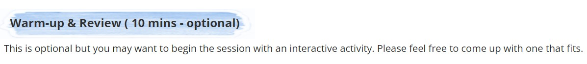
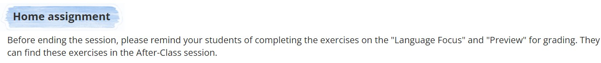
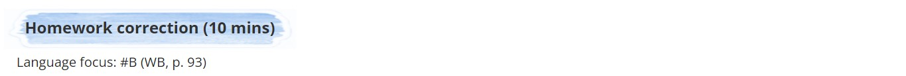

# HTML Code

## <a id="Content">**Content**</a>
| No.|  Lesson plan        |
|------|------------------ |
| 01.  |[The Real World](#The-Real-World)|
| 02.  |[Review](#Review)|
| 03.  |[Video](#Video)|
| 04.  |[Preview](#Preview)|
| 05.  |[Language Focus](#Language-Focus)|
| 06.  |[Reading](#Reading)|
| 07.  |[Writing](#Writing)|
| 08.  |[Mini project](#Mini-project)|
| 09.  |[KET oral practice](#KET-oral-practice)|
| 010.  |[Warm up & Review](#Warm-up-and-Review)|
| 011.  |[Home assignment](#Home-assignment)|
| 012.  |[Homework correction](#Homework-correction)|
## <a id="The-Real-World"></a>***1. The Real World***
<p align="center">

</p>

```
<style>
    .ol-number {margin-top: 11px !important; margin-bottom: 10px !important; margin-left: -1px !important; list-style-type: decimal !important;}
    .ul-disc {margin-top: 11px !important; margin-bottom: 10px !important; margin-left: -1px !important; list-style-type: disc !important;}
    .ul-circle {margin-top: 11px !important; margin-bottom: 10px !important; margin-left: -1px !important; list-style-type: circle !important;}
    .ul-square { margin-top: 11px !important; margin-bottom: 10px !important; margin-left: -1px !important; list-style-type: square !important;}
    .li-plan {margin: -10px 0px 5px 7px;}
    .table-plan td, th {border-left: 0px solid gray !important; border-right: 0px solid gray !important; padding: 5px 10px !important; width: auto !important;}
    .table-plan {border-collapse: collapse; margin-left: 0px !important; width: 96.7% !important;}
</style>

<div style="background: url('http://lms.vus.edu.vn/asset-v1:VUS+VF+2022+type@asset+block@Background_bar_8.png') no-repeat; background-size: 100% 100%; background-position: left; padding: 10px 25px 3px 25px; margin-bottom: 0px; margin-top: 0px; margin-left: -15px; display: inline-block;">

    <h3 style="vertical-align: text-bottom;"><b>The Real World</b> (65 mins)</h3>
</div>

<table class="table-plan">
    <tr>
        <th colspan="3" style="border: 0px solid white; border-radius: 10px 10px 0px 0px; background: rgb(255,212,231);
    background: linear-gradient(321deg, rgba(255,212,231,1) 2%, rgba(236,160,193,1) 27%, rgba(168,207,255,1) 70%, rgba(228,236,247,1) 100%);">
          
<!-- TABLE HEADER -->
          
<b style="color: black; text-shadow: 2px 2px 4px white;font-size: 17px;">Lesson Plan</b>&#160;&#160;|&#160;&#160;<span style="color: black; text-shadow: 2px 2px 4px white; font-size: 14px;"><b>Unit 1</b>&#160;<i>(SB: pp.54-55, WB: pp.80-81)</i></span>
        </th>
    </tr>
    <tr>
        <td style="background-color: #f8f0fc; width: 25% !important; border: 1px solid white;"><b>Suggested Steps</b>
        </td>
        <td style="background-color: #f8f0fc; width: 25% !important; border: 1px solid white;"><b>Objectives</b></td>
        <td style="background-color: #f8f0fc; width: 50% !important; border: 1px solid white;"><b>Detailed Notes</b>
        </td>
    </tr>

    <!-- Lead-in -->

    <tr>
        <td style="border-bottom: 1px solid silver;"><b>Lead-in: </b>
            <ul class="ul-disc">
                <li class="li-plan">SB: the photo on p.12</li>
            </ul>
        </td>
        <td style="border-bottom: 1px solid silver;">Introduce the topic / content</td>
        <td style="border-bottom: 1px solid silver;">
            <p style="margin-bottom: 10px;"><button
                    onclick="var x=document.getElementById(&quot;idUniquedBoxContent1234&quot;);&quot;none&quot;===x.style.display?	x.style.display=&quot;block&quot;:x.style.display=&quot;none&quot;;">Notes</button>
            </p>
            <div id="idUniquedBoxContent1234" style="display: none; padding-left: 5px;">
                <div>
                  
<!-- Lead-in - Note -->                  
                  
                    <b>Lead-in</b>
                    <ol class="ol-number">
                        <li class="li-plan">Have students discuss the photo.</li>
                        <li class="li-plan">Ask: <i>‘Do they know each other? Are they greeting? Do they bow?’</i></li>
                    </ol>
                </div>
            </div>
        </td>
    </tr>

    <!--Introduce the context-->

    <tr>
        <td style="border-bottom: 1px solid silver;"><b>Introduce the context: </b>
            <ul class="ul-disc">
                <li class="li-plan">PPT: slides #2-3</li>
            </ul>
        </td>
        <td style="border-bottom: 1px solid silver;">Build listening and speaking skills in a real-life context</td>
        <td style="border-bottom: 1px solid silver;">
            <p style="margin-bottom: 10px;"><button
                    onclick="var x=document.getElementById(&quot;idUniquedBoxContent2212&quot;);&quot;none&quot;===x.style.display?	x.style.display=&quot;block&quot;:x.style.display=&quot;none&quot;;">Notes</button>
            </p>
            <div id="idUniquedBoxContent2212" style="display: none; padding-left: 5px;">
                <div>
                  
<!-- Introduce the context - Note -->                  
                  
                    <b>Introduce the context:</b>
                    <ol class="ol-number">
                        <li class="li-plan">Have students compare the photos (on pp.8-10 and p.12) and say what they
                            think.
                            (PPT)</li>
                        <li class="li-plan">Elicit different ways of greetings in different cultures. Ask and mime: <i>How
                          do you greet? Do you bow? Or wave? Or shake hands? etc.</i>
                        </li>
                    </ol>
                </div>
            </div>
        </td>
    </tr>
    <tr>

        <!-- Explore -->

    <tr>
        <td style="border-bottom: 1px solid silver;">
            <b>Explore: </b>
            <ul class="ul-disc">
                <li class="li-plan">SB: #A&amp;B, p.12</li>
            </ul>
        </td>
        <td style="border-bottom: 1px solid silver;">Build listening and speaking skills in a real-life context</td>
        <td style="border-bottom: 1px solid silver;">
            <p style="margin-bottom: 10px;"><button
                    onclick="var x=document.getElementById(&quot;idUniquedBoxContent2221&quot;);&quot;none&quot;===x.style.display?	x.style.display=&quot;block&quot;:x.style.display=&quot;none&quot;;">Notes</button>
            </p>
            <div id="idUniquedBoxContent2221" style="display: none; padding-left: 5px;">
                <div>
                  
<!-- Explore - Note -->                  
                  
                    <b>Explore:</b><br />
                    <b>#A</b>
                    <ol class="ol-number">
                        <li class="li-plan">Review different ways to greet people in different situations <i>(Hello, Bye,
                          Nice to meet you! ...)</i>.</li>
                        <li class="li-plan">Play the audio and go through task #A.</li>
                        <li class="li-plan"> Have students practice with a partner.</li>
                    </ol>
                    <b>#B</b>
                    <ol class="ol-number">
                        <li class="li-plan">Have students work in pairs to do task #B.</li>
                        <li class="li-plan">Play the video and go through task #B.</li>
                    </ol>
                    <b>Practice (Optional): Say and do</b>
                    <ol class="ol-number">
                        <li class="li-plan">Have students stand up.</li>
                        <li class="li-plan">Assign 1 student as the host.</li>
                        <li class="li-plan">The host says a word learnt and others need to act out.</li>
                        <li class="li-plan">Those who cannot follow the host are eliminated.</li>
                        <div style="margin: -10px 0px 10px -8px;">Note: The host can level the difficulty by
                            saying 1 word but acting differently.</div>
                    </ol>
                </div>
            </div>
        </td>
    </tr>
    <tr>

        <!--Speaking-->

    <tr>
        <td style="border-bottom: 1px solid silver;">
            <b>Speaking: </b>
            <ul class="ul-disc">
                <li class="li-plan">Portfolio: p.10</li>
                <li class="li-plan">PPT: slide #4</li>
            </ul>
        </td>
        <td style="border-bottom: 1px solid silver;">Build listening and speaking skills in a real-life context</td>
        <td style="border-bottom: 1px solid silver;">
            <p style="margin-bottom: 10px;"><button
                    onclick="var x=document.getElementById(&quot;idUniquedBoxContent2231&quot;);&quot;none&quot;===x.style.display?	x.style.display=&quot;block&quot;:x.style.display=&quot;none&quot;;">Notes</button>
            </p>
            <div id="idUniquedBoxContent2231" style="display: none; padding-left: 5px;">
                <div>

<!-- Speaking - Note -->                  
                  
                    <b>Speaking:</b><br />
                    <b>Survey: How do you greet someone?</b>
                    <ol class="ol-number">
                      <li class="li-plan">Introduce the question: <i>‘How do you greet someone?’</i> and have students
                            practice
                            saying it in chorus.</li>
                        <li class="li-plan">Have students mingle and complete a survey with their friends. (PPT)
                            (Portfolio)
                        </li>
                    </ol>
                </div>
            </div>
        </td>
    </tr>
    <tr>

        <!-- Pronunciation -->

        <td><b>Pronunciation:</b>
            <ul class="ul-disc">
                <li class="li-plan">SB: p.13</li>
            </ul>
        </td>
        <td>Practice pronunciation</td>
        <td>
            <p style="margin-bottom: 10px;"><button
                    onclick="var x=document.getElementById(&quot;idUniquedBoxContent2512&quot;);&quot;none&quot;===x.style.display?	x.style.display=&quot;block&quot;:x.style.display=&quot;none&quot;;">Notes</button>
            </p>
            <div id="idUniquedBoxContent2512" style="display: none; padding-left: 5px;">
                <div>
                  
<!-- Pronunciation - Note -->                  
                  
                    <b>Pronunciation: Contractions</b>
                    <ol class="ol-number">
                        <li class="li-plan">Have students read the sentences</li>
                        <li class="li-plan">Play the audio and go through the task. </li>
                        <li class="li-plan">Have students practice reading the sentences with contractions.</li>
                    </ol>
                </div>
            </div>
        </td>
    </tr>

    <!--Communication-->

    <tr>
        <td><b>Communication:</b>
            <ul class="ul-disc">
                <li class="li-plan">SB: p.13</li>
                <li class="li-plan">PPT: slides #5-6</li>
            </ul>
        </td>
        <td>
            Use the vocabulary / grammar learned through speaking about the topic (Video)</td>
        <td>
            <p style="margin-bottom: 10px;"><button
                    onclick="var x=document.getElementById(&quot;idUniquedBoxContent2412&quot;);&quot;none&quot;===x.style.display?	x.style.display=&quot;block&quot;:x.style.display=&quot;none&quot;;">Notes</button>
            </p>
            <div id="idUniquedBoxContent2412" style="display: none; padding-left: 5px;">
                <div>
                  
<!-- Communication - Note -->                  
                  
                    <b>Communication</b>
                    <ol class="ol-number">
                        <li class="li-plan">Put students in pairs. Have students make a conversation with their partner.
                        </li>
                        <li class="li-plan"> Have students mingle to introduce themselves to other students and practice
                            greeting.
                            (PPT)</li>
                    </ol>
                </div>
            </div>
        </td>
    </tr>
</table>
```

<div align="right">
    <b><a href="#Content">↥ back to top</a></b>
</div>

## <a id="Review"></a>***2. Review***
<p align="center">

</p>

```
<style>
    .ol-number {margin-top: 11px !important; margin-bottom: 10px !important; margin-left: -1px !important; list-style-type: decimal !important;}
    .ul-disc {margin-top: 11px !important; margin-bottom: 10px !important; margin-left: -1px !important; list-style-type: disc !important;}
    .ul-circle {margin-top: 11px !important; margin-bottom: 10px !important; margin-left: -1px !important; list-style-type: circle !important;}
    .ul-square {margin-top: 11px !important; margin-bottom: 10px !important; margin-left: -1px !important; list-style-type: square !important;}
    .li-plan {margin: -10px 0px 5px 7px;}
    .table-plan td,
    th {border-left: 0px solid gray !important; border-right: 0px solid gray !important; padding: 5px 10px !important; width: auto !important;}
    .table-plan {border-collapse: collapse; margin-left: 0px !important; width: 96.7% !important;}
</style>

<div style="background: url('http://lms.vus.edu.vn/asset-v1:VUS+VF+2022+type@asset+block@Background_bar_8.png') no-repeat; background-size: 100% 100%; background-position: left; padding: 10px 25px 3px 25px; margin-bottom: 0px; margin-top: 0px; margin-left: -15px; display: inline-block;">
    <h3 style="vertical-align: text-bottom;"><b>
Review</b> (50 mins)</h3>
</div>

<table class="table-plan">
    <tr>
        <th colspan="3"
            style="border: 0px solid white; border-radius: 10px 10px 0px 0px; background: rgb(255,212,231);
    background: linear-gradient(321deg, rgba(255,212,231,1) 2%, rgba(236,160,193,1) 27%, rgba(168,207,255,1) 70%, rgba(228,236,247,1) 100%);">
          
<!-- TABLE HEADER -->
          
<b style="color: black; text-shadow: 2px 2px 4px white;font-size: 17px;">Lesson Plan</b>&#160;&#160;|&#160;&#160;<span style="color: black; text-shadow: 2px 2px 4px white; font-size: 14px;"><b>Unit 1</b>&#160;<i>(SB: pp.54-55, WB: pp.80-81)</i></span>
        </th>
    </tr>
    <tr>
        <td style="background-color: #f8f0fc; width: 25% !important; border: 1px solid white;"><b>Suggested Steps</b>
        </td>
        <td style="background-color: #f8f0fc; width: 25% !important; border: 1px solid white;"><b>Objectives</b></td>
        <td style="background-color: #f8f0fc; width: 50% !important; border: 1px solid white;"><b>Detailed Notes</b>
        </td>
    </tr>

    <!--Vocabulary review + SB correction-->

    <tr>
        <td style="border-bottom: 1px solid silver;"><b>Vocabulary review + SB correction: </b>
            <ul class="ul-disc">
                <li class="li-plan">SB: #A+C, p.17 &amp; #A+C, p.29</li>
                <li class="li-plan">PPT: slides #7-14 (optional)</li>
            </ul>
        </td>
        <td style="border-bottom: 1px solid silver;">Review vocab / grammar + content</td>
        <td style="border-bottom: 1px solid silver;">
            <p style="margin-bottom: 10px;"><button
                    onclick="var x=document.getElementById(&quot;idUniquedBoxContent2167&quot;);&quot;none&quot;===x.style.display?	x.style.display=&quot;block&quot;:x.style.display=&quot;none&quot;;">Notes</button>
            </p>
            <div id="idUniquedBoxContent2167" style="display: none; padding-left: 5px;">
                <div>
                  
<!-- Vocabulary review + SB correction - Note -->
                  
                    <b>Vocabulary review 1: </b>
                    <ol class="ol-number">
                        <li class="li-plan">Review the vocabulary learnt in the unit. (PPT)</li>
                        <li class="li-plan">Review the use of different parts of speech. (PPT)</li>
                    </ol>
                    <b>#A&amp;C</b>
                    <ol class="ol-number">
                        <li class="li-plan">Have students complete the task. </li>
                        <li class="li-plan">Go through the answers as a class.</li>
                    </ol>
                    <b>Vocabulary review 2: </b>
                    <ol class="ol-number">
                        <li class="li-plan">Review the vocabulary learnt in the unit.</li>
                      <li class="li-plan">Review the use of <i>‘and – but’</i>.</li>
                    </ol>
                    <b>#A&amp;C </b>
                    <ol class="ol-number">
                        <li class="li-plan">Have students complete the task. </li>
                        <li class="li-plan">Go through the answers as a class.
                        </li>
                    </ol>
                </div>
            </div>
        </td>
    </tr>

    <!-- Grammar review+ SB correction -->

    <tr>
        <td style="border-bottom: 1px solid silver;"><b>Grammar review + SB correction: </b>
            <ul class="ul-disc">
                <li class="li-plan">SB: #B, p.17 &amp; #B, p.29</li>
                <li class="li-plan">PPT: slides #15-20 (optional)</li>
            </ul>
        </td>
        <td style="border-bottom: 1px solid silver;">
            Review vocab / grammar + content</td>
        <td style="border-bottom: 1px solid silver;">
            <p style="margin-bottom: 10px;"><button
                    onclick="var x=document.getElementById(&quot;idUniquedBoxContent2245&quot;);&quot;none&quot;===x.style.display?	x.style.display=&quot;block&quot;:x.style.display=&quot;none&quot;;">Notes</button>
            </p>
            <div id="idUniquedBoxContent2245" style="display: none; padding-left: 5px;">
                <div>
                  
<!-- Grammar review+ SB correction - Note -->
                  
                    <b>Grammar review 1: Talking about favorites </b>
                    <ol class="ol-number">
                        <li class="li-plan">Go through the slides for grammar review. (PPT) </li>
                        <div style="margin: -10px 0px 10px -8px;"><b>#B</b></div>
                        <li class="li-plan">Have students go through the tasks.</li>
                    </ol>
                    <b>Grammar review 2: Describing places</b>
                    <ol class="ol-number">
                      <li class="li-plan">Review the use of <i>‘to be’</i> and adjectives.</li>
                        <div style="margin: -10px 0px 10px -8px;"><b>#B</b></div>
                        <li class="li-plan">Have students complete the task and give corrections.</li>
                    </ol>
                </div>
            </div>
        </td>
    </tr>
    <tr>

        <!-- Writing / Game / Speaking -->

    <tr>
        <td style="border-bottom: 1px solid silver;">
            <b>Writing / Game / Speaking: </b>
            <ul class="ul-disc">
                <li class="li-plan">PPT: slides #21-22 (optional)</li>
            </ul>
        </td>
        <td style="border-bottom: 1px solid silver;">Review vocab / grammar + content</td>
        <td style="border-bottom: 1px solid silver;">
            <p style="margin-bottom: 10px;"><button
                    onclick="var x=document.getElementById(&quot;idUniquedBoxContent4678&quot;);&quot;none&quot;===x.style.display?	x.style.display=&quot;block&quot;:x.style.display=&quot;none&quot;;">Notes</button>
            </p>
            <div id="idUniquedBoxContent4678" style="display: none; padding-left: 5px;">
                <div>
                  
<!-- Writing / Game / Speaking - Note -->                  
                  
                    <b>Speaking:</b>
                    <ol class="ol-number">
                        <li class="li-plan">Have students complete their card. (Portfolio)</li>
                        <li class="li-plan">Put students in pairs to ask and answer questions about the information in the card. (PPT)</li>
                    </ol>
                </div>
            </div>
        </td>
    </tr>
    <tr>
</table>
```

<div align="right">
<b><a href="#Content">↥ back to top</a></b>
</div>

## <a id="Video"></a>***3. Video***

<p align="center">

</p>

```
<style>
    .ol-number {margin-top: 11px !important; margin-bottom: 10px !important; margin-left: -1px !important; list-style-type: decimal !important;}
    .ul-disc {margin-top: 11px !important; margin-bottom: 10px !important; margin-left: -1px !important; list-style-type: disc !important;}
    .ul-circle {margin-top: 11px !important; margin-bottom: 10px !important; margin-left: -1px !important; list-style-type: circle !important;}
    .ul-square { margin-top: 11px !important; margin-bottom: 10px !important; margin-left: -1px !important; list-style-type: square !important;}
    .li-plan {margin: -10px 0px 5px 7px;}
    .table-plan td, th {border-left: 0px solid gray !important; border-right: 0px solid gray !important; padding: 5px 10px !important; width: auto !important;}
    .table-plan { border-collapse: collapse; margin-left: 0px !important; width: 96.7% !important;}
</style>

<div style="background: url('http://lms.vus.edu.vn/asset-v1:VUS+VF+2022+type@asset+block@Background_bar_8.png') no-repeat; background-size: 100% 100%; background-position: left; padding: 10px 25px 3px 25px; margin-bottom: 0px; margin-top: 0px; margin-left: -15px; display: inline-block;">
    <h3 style="vertical-align: text-bottom;"><b>
            Video</b> (100 mins)</h3>
</div>

<table class="table-plan">
    <tr>
        <th colspan="3" style="border: 0px solid white; border-radius: 10px 10px 0px 0px; background: rgb(255,212,231); background: linear-gradient(321deg, rgba(255,212,231,1) 2%, rgba(236,160,193,1) 27%, rgba(168,207,255,1) 70%, rgba(228,236,247,1) 100%);">
          
<!-- TABLE HEADER -->
          
<b style="color: black; text-shadow: 2px 2px 4px white;font-size: 17px;">Lesson Plan</b>&#160;&#160;|&#160;&#160;<span style="color: black; text-shadow: 2px 2px 4px white; font-size: 14px;"><b>Unit 1</b>&#160;<i>(SB: pp.54-55, WB: pp.80-81)</i></span>
        </th>
    </tr>
    <tr>
        <td style="background-color: #f8f0fc; width: 25% !important; border: 1px solid white;"><b>Suggested Steps</b>
        </td>
        <td style="background-color: #f8f0fc; width: 25% !important; border: 1px solid white;"><b>Objectives</b></td>
        <td style="background-color: #f8f0fc; width: 50% !important; border: 1px solid white;"><b>Detailed Notes</b>
        </td>
    </tr>

    <!--Before you watch-->

    <tr>
        <td style="border-bottom: 1px solid silver;"><b>Before you watch: </b>
            <ul class="ul-disc">
                <li class="li-plan">SB: the photo on p.76</li>
            </ul>
        </td>
        <td style="border-bottom: 1px solid silver;">Introduce the content of the video</td>
        <td style="border-bottom: 1px solid silver;">
            <p style="margin-bottom: 10px;"><button
                    onclick="var x=document.getElementById(&quot;idUniquedBoxContent2157&quot;);&quot;none&quot;===x.style.display?	x.style.display=&quot;block&quot;:x.style.display=&quot;none&quot;;">Notes</button>
            </p>
            <div id="idUniquedBoxContent2157" style="display: none; padding-left: 5px;">
                <div>
                  
<!-- Before you watch - Note -->                  
                  
                    <b>Before you watch:</b>
                    <ol class="ol-number">
                        <li class="li-plan">Have students look at the photo and ask: <i>‘Who are they? Where is their
                          school?’</i></li>
                      <li class="li-plan">Remind students about the reading <i>‘Kakenya’s dream’</i> in the previous lesson.
                        </li>
                        <li class="li-plan">Have students circle the answers for the questions in the SB.</li>
                        <li class="li-plan">Introduce that the video is about Kakenya’s school.</li>
                    </ol>
                </div>
            </div>
        </td>
    </tr>

    <!--While you watch-->

    <tr>
        <td style="border-bottom: 1px solid silver;"><b>While you watch: </b>
            <ul class="ul-disc">
                <li class="li-plan">SB: #A-B, p.76
                </li>
            </ul>
        </td>
        <td style="border-bottom: 1px solid silver;">
            Understand the content of the video
            <div style="margin-top: 5px;">Build listening skills in a real-life context</div>
        </td>
        <td style="border-bottom: 1px solid silver;">
            <p style="margin-bottom: 10px;"><button
                    onclick="var x=document.getElementById(&quot;idUniquedBoxContent2278&quot;);&quot;none&quot;===x.style.display?	x.style.display=&quot;block&quot;:x.style.display=&quot;none&quot;;">Notes</button>
            </p>
            <div id="idUniquedBoxContent2278" style="display: none; padding-left: 5px;">
                <div>
                  
<!-- While you watch - Note -->                  
                  
                    <b>While you watch:</b><br />
                    <b>#A-B</b>
                    <ol class="ol-number">
                        <li class="li-plan">Have students read the task and give explanations if any of the bold words
                            are new to them.</li>
                        <li class="li-plan">Remind students that with task #A, they can choose more than one option.</li>
                        <li class="li-plan">Have students watch the video and complete the tasks.</li>
                        <li class="li-plan">Go through the answers as a class.
                        </li>
                    </ol>
                </div>
            </div>
        </td>
    </tr>
    <tr>

        <!-- After you watch -->

    <tr>
        <td style="border-bottom: 1px solid silver;">
            <b>After you watch: </b>
            <ul class="ul-disc">
                <li class="li-plan">SB: p.76</li>
                <li class="li-plan">PPT</li>
                <li class="li-plan">Portfolio: pp.34-35</li>
                <li class="li-plan">Handout</li>
            </ul>

        </td>
        <td style="border-bottom: 1px solid silver;">Develop critical thinking and creativity by talking or writing
            about the topic of the video.</td>
        <td style="border-bottom: 1px solid silver;">
            <p style="margin-bottom: 10px;"><button
                    onclick="var x=document.getElementById(&quot;idUniquedBoxContent2229&quot;);&quot;none&quot;===x.style.display?	x.style.display=&quot;block&quot;:x.style.display=&quot;none&quot;;">Notes</button>
            </p>
            <div id="idUniquedBoxContent2229" style="display: none; padding-left: 5px;">
                <div>
                  
<!-- After you watch - Note -->                  
                  
                    <b>After you watch:</b>
                    <ol class="ol-number">
                        <li class="li-plan">Have students work in groups and discuss the statement: <i>‘Help a girl, help a
                          family.’</i></li>
                        <li class="li-plan">Give students suggestions by asking them what they know about countries in
                            Africa, especially Kenya; why a girl can help a family, etc. </li>
                        <li class="li-plan">Have students share their ideas with the class.</li>
                    </ol>
                    <b>Free production:</b>
                    <ol class="ol-number">
                        <li class="li-plan">Have students interview their friends and share their ideas with the class,
                          answering the question: <i>Are you a helpful person?</i> (PPT) (Portfolio)</li>
                        <li class="li-plan">Have students note down three things that they often do for their family or
                            friends. (PPT) (Portfolio)</li>
                        <li class="li-plan">Game: Trivia game
                            <ul class="ul-circle">
                                <li class="li-plan">Have students work in teams.</li>
                                <li class="li-plan">Give each team an answer sheet (handout) and have them fill in the
                                    required information.</li>
                                <li class="li-plan">Go through the game rules and play the game: (PPT)
                                  <ul class="ul-square">
                                    <li class="li-plan">The Trivia game has 3 parts (with 25 questions in total): Vocabulary, Grammar,
                                    Topics</li>
                                    <li class="li-plan">Students have 10s to write the answer for each question before moving to the next one.</li>
                                    <li class="li-plan">After each round, students need to submit their answer sheets to the
                                    teacher.</li>
                                <li class="li-plan">The teacher can swap the answer sheets between teams before showing
                                    the correction so students can do peer check.</li>
                                <li class="li-plan">Students earn 10 points for each correct answer.</li>
                                <li class="li-plan">After 3 rounds, which team gets more points is the winner.</li>
                                  </ul>
                                    </li>
                            </ul>
                        </li>
                    </ol>
                </div>
            </div>
        </td>
    </tr>
    <tr>
</table>
```

<div align="right">
<b><a href="#Content">↥ back to top</a></b>
</div>

## <a id="Preview"></a>***4. Preview***

<p align="center">

</p>

```
<style>
    .ol-number {margin-top: 11px !important;margin-bottom: 10px !important;margin-left: -1px !important; list-style-type: decimal!important;}
    .ul-disc {margin-top: 11px !important;margin-bottom: 10px !important;margin-left: -1px !important; list-style-type: disc !important;}  
    .ul-circle {margin-top: 11px !important; margin-bottom: 10px !important; margin-left: -1px !important; list-style-type: circle !important;}
    .ul-square {margin-top: 11px !important; margin-bottom: 10px !important; margin-left: -1px !important; list-style-type: square !important;} 
    
    .li-plan {margin: -10px 0px 5px 7px;}
    .table-plan td, th {border-left: 0px solid gray !important; border-right: 0px solid gray !important; padding: 5px 10px !important; width: auto !important;}
    .table-plan {border-collapse: collapse; margin-left: 0px !important; width: 96.7% !important;}
</style>
    
<div style="background: url('http://lms.vus.edu.vn/asset-v1:VUS+VF+2022+type@asset+block@Background_bar_8.png') no-repeat; background-size: 100% 100%; background-position: left; padding: 10px 25px 3px 25px; margin-bottom: 0px; margin-top: 0px; margin-left: -15px; display: inline-block;"><h3 style="vertical-align: text-bottom;"><b>Preview</b> (35 mins)</h3></div>
    
<table class="table-plan">
<tr>
 <th colspan="3" style = "border: 0px solid white; border-radius: 10px 10px 0px 0px; background: rgb(255,212,231); background: linear-gradient(321deg, rgba(255,212,231,1) 2%, rgba(236,160,193,1) 27%, rgba(168,207,255,1) 70%, rgba(228,236,247,1) 100%);">

<!-- TABLE HEADER --> 
            
<b style="color: black; text-shadow: 2px 2px 4px white;font-size: 17px;">Lesson Plan</b>&#160;&#160;|&#160;&#160;<span style="color: black; text-shadow: 2px 2px 4px white; font-size: 14px;"><b>Unit 1</b>&#160;<i>(SB: pp.54-55, WB: pp.80-81)</i></span></th>
</tr>
<tr>
 <td style="background-color: #f8f0fc; width: 25% !important; border: 1px solid white;"><b>Suggested Steps</b></td>
 <td style="background-color: #f8f0fc; width: 25% !important; border: 1px solid white;"><b>Objectives</b></td>
 <td style="background-color: #f8f0fc; width: 50% !important; border: 1px solid white;"><b>Detailed Notes</b></td>
</tr>
      
<!-- LEAD-IN -->  
      
<tr>  
 <td style="border-bottom: 1px solid silver;"><b>Lead-in: </b>
   <ul class="ul-disc">
     <li class="li-plan">SB: the photo on p. 8</li>
   </ul>
 </td>
 <td style="border-bottom: 1px solid silver;">Engage students and introduce the topic</td>
 <td style="border-bottom: 1px solid silver;">
   <p style="margin-bottom: 10px;"><button onclick="var x=document.getElementById(&quot;idUniquedBoxContentprelead&quot;);&quot;none&quot;===x.style.display?	x.style.display=&quot;block&quot;:x.style.display=&quot;none&quot;;">Notes</button></p>
   <div id="idUniquedBoxContentprelead" style="display: none; padding-left: 5px;">
   <div>
               
    <!-- LEAD-IN - NOTE --> 
     <b>Lead-in</b>
     <ol class="ol-number">
       <li class="li-plan">Have students look at the photo. Ask: <i>‘How many people? Where are they? What are they doing?’</i></li>           
       <li class="li-plan">Elicit the scene: <i>A Japanese woman is greeting guests with a bow, a common way of greeting in Japan</i>.</li>
       <li class="li-plan">Explain the words ‘<i>Hello</i>’ and ‘<i>bow</i>’.</li>
     </ol>
   </div></div>
 </td>
</tr>
      
<!-- LISTENING --> 
      
<tr>
  <td style="border-bottom: 1px solid silver;"><b>Listening:</b>
    <ul class="ul-disc">
      <li class="li-plan">SB: #A-B, p.8</li>
    </ul>
  </td>
  <td style="border-bottom: 1px solid silver;">Identify the vocabulary and understand the meaning</td>
  <td style="border-bottom: 1px solid silver;">
    <p style="margin-bottom: 10px;"><button onclick="var x=document.getElementById(&quot;idUniquedBoxContentprelis&quot;);&quot;none&quot;===x.style.display?	x.style.display=&quot;block&quot;:x.style.display=&quot;none&quot;;">Notes</button></p>
             <div id="idUniquedBoxContentprelis" style="display: none; padding-left: 5px;">
             <div>
               
    <!-- LISTENING - NOTE -->  
               
    <b>Listening:<br/>
     #A-B</b>  
    <ol class="ol-number">
      <li class="li-plan">Have students read the sentences in #A. Explain the word ‘<i>Mrs.</i>’.</li>
      <li class="li-plan">Ask students to guess how to pronounce the bold words.</li>
      <li class="li-plan">Explain how to do the task (listen to names only), then play the audio.</li>
      <li class="li-plan">Go through the answers as a class.</li>
      <li class="li-plan">Go through #B.</li>
    </ol>
  </div></div>
 </td>
</tr>
<tr>
         
<!-- SPEAKING -->  
         
 <td><b>Speaking: </b>
   <ul class="ul-disc">
     <li class="li-plan">SB: #C, p. 9</li>
     <li class="li-plan">PPT: slides #2-7 (optional)</li>
   </ul>
 </td>
 <td>Use the vocabulary to talk about the topic<br/></td>
 <td>
    <p style="margin-bottom: 10px;"><button onclick="var x=document.getElementById(&quot;idUniquedBoxContentprespeak&quot;);&quot;none&quot;===x.style.display?	x.style.display=&quot;block&quot;:x.style.display=&quot;none&quot;;">Notes</button></p>
    <div id="idUniquedBoxContentprespeak" style="display: none; padding-left: 5px;">
    <div>
               
    <!-- SPEAKING - NOTE --> 
    <b>Speaking:<br/>
    #C</b>
    <ol class="ol-number">
      <li class="li-plan">Introduce different ways to say ‘<i>Hello</i>’ (<i>Hi, Hey</i>), and how to ask and answer about names (<i>What’s your name? / My name’s… / I’m… / Nice to meet you.</i>). (PPT)</li>
      <li class="li-plan">Show the example in the PPT and have students practice reading the conversation. Correct their pronunciation. (PPT)</li>
      <li class="li-plan">Show students the photos on PPT, have them practice greeting using those names. (PPT)</li>
    </ol>
  </div></div>
 </td>
</tr>
<tr>
          
<!-- VOCABULARY -->       
          
 <td><b>Vocabulary (The Alphabet): </b>
   <ul class="ul-disc">
     <li class="li-plan">SB: #C-E, p. 11</li>
     <li class="li-plan">PPT: slides #8-11</li>
   </ul>
 </td>
 <td>Identify the vocabulary and understand the meaning</td>
 <td><p style="margin-bottom: 10px;"><button onclick="var x=document.getElementById(&quot;idUniquedBoxContentprevoc&quot;);&quot;none&quot;===x.style.display?	x.style.display=&quot;block&quot;:x.style.display=&quot;none&quot;;">Notes</button></p>
     <div id="idUniquedBoxContentprevoc" style="display: none; padding-left: 5px;">
     <div>
               
     <!-- VOCABULARY - NOTE --> 
               
     <b>Vocabulary:<br/>
     The Alphabet<br/>
     #C</b>
      <ol class="ol-number">
        <li class="li-plan">Have students read aloud the Alphabet, then listen to the audio.</li>
        <li class="li-plan">Have students read aloud again, try to correct themselves. Correct their pronunciation if needed.</li>
      </ol>
      <b>How do you spell your name?</b>
      <ol class="ol-number">
        <li class="li-plan">Lead students from the alphabet to the structure. </li>
        <li class="li-plan">Introduce the use of the structure. (PPT)</li>
        <li class="li-plan">Speaking practice: Have students practice in pairs. Ask and answer using the name list (PPT). </li>
      </ol>  
      <b>Capital letters:</b>
      <ol class="ol-number">
        <li class="li-plan">Draw students’ attention to the capital letter box and the example on PPT, elicit when letters should be capitalized (the first letter of a name or a new sentence).</li>
        <li class="li-plan">Show some examples on PPT, then ask students to correct the letters when needed.</li>
      </ol>   
      <b>#D</b>
      <ol class="ol-number">
        <li class="li-plan">Play the audio and go through the task.</li>
        <li class="li-plan">Go through answers as a class.</li>
      </ol>            
  </div></div>
 </td>
</tr>
</table>
```

<div align="right">
<b><a href="#Content">↥ back to top</a></b>
</div>

## <a id="Language-Focus"></a>***5. Language Focus***

<p align="center">

</p>

```
<style>
    .ol-number {margin-top: 11px !important;margin-bottom: 10px !important;margin-left: -1px !important; list-style-type: decimal!important;}
    .ul-disc {margin-top: 11px !important;margin-bottom: 10px !important;margin-left: -1px !important; list-style-type: disc !important;}  
    .ul-circle {margin-top: 11px !important; margin-bottom: 10px !important; margin-left: -1px !important; list-style-type: circle !important;}
    .ul-square {margin-top: 11px !important; margin-bottom: 10px !important; margin-left: -1px !important; list-style-type: square !important;} 
    .li-plan {margin: -10px 0px 5px 7px;}
    .table-plan td, th {border-left: 0px solid gray !important; border-right: 0px solid gray !important; padding: 5px 10px !important; width: auto !important;}
    .table-plan {border-collapse: collapse; margin-left: 0px !important; width: 96.7% !important;}
</style>
    
<div style="background: url('http://lms.vus.edu.vn/asset-v1:VUS+VF+2022+type@asset+block@Background_bar_8.png') no-repeat; background-size: 100% 100%; background-position: left; padding: 10px 25px 3px 25px; margin-bottom: 0px; margin-top: 0px; margin-left: -15px; display: inline-block;"><h3 style="vertical-align: text-bottom;"><b>Language Focus</b> (65 mins)</h3></div>
<table class="table-plan">
 <tr>
  <th colspan="3" style = "border: 0px solid white; border-radius: 10px 10px 0px 0px; background: rgb(255,212,231); background: linear-gradient(321deg, rgba(255,212,231,1) 2%, rgba(236,160,193,1) 27%, rgba(168,207,255,1) 70%, rgba(228,236,247,1) 100%);">
            
<!-- TABLE HEADER -->  
            
<b style="color: black; text-shadow: 2px 2px 4px white;font-size: 17px;">Lesson Plan</b>&#160;&#160;|&#160;&#160;<span style="color: black; text-shadow: 2px 2px 4px white; font-size: 14px;"><b>Unit 1</b>&#160;<i>(SB: pp.54-55, WB: pp.80-81)</i></span></th>
 </tr>
 <tr>
  <td style="background-color: #f8f0fc; width: 25% !important; border: 1px solid white;"><b>Suggested Steps</b></td>
  <td style="background-color: #f8f0fc; width: 25% !important; border: 1px solid white;"><b>Objectives</b></td>
  <td style="background-color: #f8f0fc; width: 50% !important; border: 1px solid white;"><b>Detailed Notes</b></td>
 </tr>
    
<!-- LANGUAGE FOCUS -->   
      
 <tr>  
  <td style="border-bottom: 1px solid silver;"><b>Language Focus:</b>
    <ul class="ul-disc">
      <li class="li-plan">SB: #A, p.10
      <li class="li-plan">PPT: slides #12-15 (optional)
    </ul>
  </td>
  <td style="border-bottom: 1px solid silver;">
   Understand the context<p style="margin-bottom: 5px;"></p>
   Understand and use the target phrase / expression in a conversation
  </td>
  <td style="border-bottom: 1px solid silver;"><p style="margin-bottom: 10px;"><button onclick="var x=document.getElementById(&quot;idUniquedBoxContentlangfo&quot;);&quot;none&quot;===x.style.display?	x.style.display=&quot;block&quot;:x.style.display=&quot;none&quot;;">Notes</button></p>
    <div id="idUniquedBoxContentlangfo" style="display: none; padding-left: 5px;">
    <div>
               
<!-- LANGUAGE IN CONTEXT - NOTE -->
               
    <b>Language in context: <br/>
    Listening: Conversation<br/>
    #A</b>  
    <ol class="ol-number">
      <li class="li-plan">Have students read the 1st part of the conversation once and underline the names. (PPT)</li>
      <li class="li-plan">Play the audio and have students read the conversation aloud.</li>
      <li class="li-plan">Have students practice the conversation in pairs.</li>
    </ol>
    <b>Real English: See you later!</b>  
    <ol class="ol-number">
      <li class="li-plan">Draw students' attention to the Real English box.</li>
      <li class="li-plan">Have students locate the expression in the conversation.</li>
      <li class="li-plan">Have students look at the photo (PPT) again. Ask: <i>Who are they? Where are they? Do they know each other?</i></li>
      <li class="li-plan">Elicit the meaning of Maya’s expression: another way to say <i>Bye. / Goodbye.</i> (PPT)</li>
      <li class="li-plan">Have students practice the phrase in different speeds and tones (<i>happy, excited, sad, tired</i> etc.).</li>
    </ol>
    <b>Speaking: Role-play</b>  
    <ol class="ol-number">
      <li class="li-plan">Have students read the name list again and choose one as their favorite name.</li>
      <li class="li-plan">Have students practice in pairs, make a conversation as in #A using that name as their ‘new’ English name.</li>
    </ol>
  </div></div>
 </td>
</tr>
    
<!-- USE & FORM -->   
      
<tr>
  <td style="border-bottom: 1px solid silver;"><b>Use &amp; Form</b>
    <ul class="ul-disc">
      <li class="li-plan">SB: #B on p.10</li>
      <li class="li-plan">PPT: slides #16-25</li>
    </ul>
  </td>
  <td style="border-bottom: 1px solid silver;">Understand the target grammar</td>
  <td style="border-bottom: 1px solid silver;"><p style="margin-bottom: 10px;"><button onclick="var x=document.getElementById(&quot;idUniquedBoxContentuseform&quot;);&quot;none&quot;===x.style.display?	x.style.display=&quot;block&quot;:x.style.display=&quot;none&quot;;">Notes</button></p>
     <div id="idUniquedBoxContentuseform" style="display: none; padding-left: 5px;">
     <div>
               
<!-- USE & FORM - NOTE -->  
               
       <b>Use and form 1: “<i>to be</i>” singular<br/>
     #B</b>  
     <ol class="ol-number">
       <li class="li-plan">Go through the slides, eliciting the usage of to be (singular) and the pronouns <i>I, you, he, she, it</i>. (PPT)</li>
       <li class="li-plan">Explain the normal forms and the contractions. Note with the students that contractions are common in spoken language.</li>
       <li class="li-plan">Have students underline the forms of to be in #A. (PPT)</li>
     </ol>
       <b>Use and form 2: Possessive adjectives and Possessive <i>'s</i><br/>
     #B</b>  
     <ol class="ol-number">
       <li class="li-plan">Show the examples on the PPT. Elicit the meaning and usage of Possessive adjectives and Possessive <i>'s</i> (PPT)</li>
       <li class="li-plan">Have students make more examples by asking and answering about their friends’ names. Note that students need to change the role of ‘<i>my-your</i>’ in their answers.</li>
       <li class="li-plan">Explain the possessive <i>‘s</i>. Note that students need to be careful with the contraction of ‘<i>is</i>’ and possessive ‘<i>s</i>’ (They might look the same but have different meanings.). (PPT)</li>
     </ol>
    </div></div>
  </td>
</tr>
     
<!-- CONTROLLED PRACTICE -->   
      
<tr>
  <td><b>Controlled practice:</b>
    <ul class="ul-disc">
      <li class="li-plan">WB: #A-B, p.80 &amp; #A, p.81</li>
    </ul>
  </td>
  <td>Use the target grammar<br/></td>
  <td><p style="margin-bottom: 10px;"><button onclick="var x=document.getElementById(&quot;idUniquedBoxContentconprac&quot;);&quot;none&quot;===x.style.display?	x.style.display=&quot;block&quot;:x.style.display=&quot;none&quot;;">Notes</button></p>
     <div id="idUniquedBoxContentconprac" style="display: none; padding-left: 5px;">
     <div>
               
<!-- CONTROLLED PRACTICE - NOTE -->  
               
       <b>Controlled practice 1 ('<i>to be</i>' singular):<br/>
     WB<br/>
     #A-B</b> 
     <ol class="ol-number">
       <li class="li-plan">Have students work in pairs.</li>
       <li class="li-plan">Ask students to roleplay and read aloud the answers and give corrections in class.</li>
     </ol>
     <br/>
       <b>Controlled practice 2 (Possessive adjectives &amp; Possessive <i>'s</i>):<br/>
     WB<br/>
     #A</b> 
     <ol class="ol-number">
       <li class="li-plan">Have students do the task.</li>
       <li class="li-plan">Ask each pair of students to read each part aloud.</li>
     </ol>
    </div></div>
  </td>
</tr>
      
<!-- FREE PRODUCTION --> 
      
<tr>
  <td><b>Free production:</b>
     <ul class="ul-disc">
       <li class="li-plan">PPT: slides #26-28</li>
       <li class="li-plan">Portfolio: pp.2-3</li>
     </ul>
  </td>
  <td>Use the target vocabulary and grammar to talk or write about the topic </td>
  <td><p style="margin-bottom: 10px;"><button onclick="var x=document.getElementById(&quot;idUniquedBoxContentfreepro&quot;);&quot;none&quot;===x.style.display?	x.style.display=&quot;block&quot;:x.style.display=&quot;none&quot;;">Notes</button></p>
      <div id="idUniquedBoxContentfreepro" style="display: none; padding-left: 5px;">
      <div>
               
<!-- FREE PRODUCTION - NOTE -->                
               
     <b>Free production: <br/>
       #Speaking: <i>My new friends list</i></b>
     <ol class="ol-number">
       <li class="li-plan">Have students stand up and mingle.</li>
       <li class="li-plan">Have students use both parts of the conversation in #A to make a complete conversation to get to know their friends.</li>
       <li class="li-plan">Have students write down their new friends’ names on the list in their portfolio.</li>
       <li class="li-plan">Have students report to the class how many new friends that they have asked.</li>
     </ol>
     <b>#Free writing: Write a conversation</b>
     <ol class="ol-number">
       <li class="li-plan">Have students write in the portfolio the conversation they have just had with their friends.</li>
     </ol>            
    </div></div>
  </td>
</tr>
</table>
```

<div align="right">
<b><a href="#Content">↥ back to top</a></b>
</div>

## <a id="Reading"></a>***6. Reading***

<p align="center">

</p>

```
<style>
    .ol-number {margin-top: 11px !important;margin-bottom: 10px !important;margin-left: -1px !important; list-style-type: decimal!important;}
    .ul-disc {margin-top: 11px !important;margin-bottom: 10px !important;margin-left: -1px !important; list-style-type: disc !important;}  
    .ul-circle {margin-top: 11px !important; margin-bottom: 10px !important; margin-left: -1px !important; list-style-type: circle !important;}
    .ul-square {margin-top: 11px !important; margin-bottom: 10px !important; margin-left: -1px !important; list-style-type: square !important;} 
    .li-plan {margin: -10px 0px 5px 7px;}
    .table-plan td, th {border-left: 0px solid gray !important; border-right: 0px solid gray !important; padding: 5px 10px !important; width: auto !important;}
    .table-plan {border-collapse: collapse; margin-left: 0px !important; width: 96.7% !important;}
</style>
    
<div style="background: url('http://lms.vus.edu.vn/asset-v1:VUS+VF+2022+type@asset+block@Background_bar_8.png') no-repeat; background-size: 100% 100%; background-position: left; padding: 10px 25px 3px 25px; margin-bottom: 0px; margin-top: 0px; margin-left: -15px; display: inline-block;"><h3 style="vertical-align: text-bottom;"><b>Reading</b> (80 mins)</h3></div>
<table class="table-plan">
 <tr>
  <th colspan="3" style = "border: 0px solid white; border-radius: 10px 10px 0px 0px; background: rgb(255,212,231); background: linear-gradient(321deg, rgba(255,212,231,1) 2%, rgba(236,160,193,1) 27%, rgba(168,207,255,1) 70%, rgba(228,236,247,1) 100%);">
            
<!-- TABLE HEADER -->  
<b style="color: black; text-shadow: 2px 2px 4px white;font-size: 17px;">Lesson Plan</b>&#160;&#160;|&#160;&#160;<span style="color: black; text-shadow: 2px 2px 4px white; font-size: 14px;"><b>Unit 1</b>&#160;<i>(SB: pp.54-55, WB: pp.80-81)</i></span></th>
 </tr>
 <tr>
   <td style="background-color: #f8f0fc; width: 25% !important; border: 1px solid white;"><b>Suggested Steps</b></td>
   <td style="background-color: #f8f0fc; width: 25% !important; border: 1px solid white;"><b>Objectives</b></td>
   <td style="background-color: #f8f0fc; width: 50% !important; border: 1px solid white;"><b>Detailed Notes</b></td>
 </tr>
    
<!-- LEAD-IN -->   
      
 <tr>  
   <td style="border-bottom: 1px solid silver;"><b>Lead-in:</b>
     <ul class="ul-disc">
       <li class="li-plan">SB: #A, p.14
     </ul>
   </td>
   <td style="border-bottom: 1px solid silver;">Introduce the topic, activate students' knowledge about the topic, and engage students</td>
   <td style="border-bottom: 1px solid silver;"><p style="margin-bottom: 10px;"><button onclick="var x=document.getElementById(&quot;idUniquedBoxContentreadlead&quot;);&quot;none&quot;===x.style.display?	x.style.display=&quot;block&quot;:x.style.display=&quot;none&quot;;">Notes</button></p>
     <div id="idUniquedBoxContentreadlead" style="display: none; padding-left: 5px;">
     <div>
               
<!-- LEAD-IN - NOTES-->
               
   <b>Lead-in:<br/>
   #A</b>  
     <ol class="ol-number">
       <li class="li-plan">Have students talk about the photo.</li>
       <li class="li-plan">Elicit the topic (about family). Ask: ‘<i>What can you see?</i>’, ‘<i>How many people are there?</i>’, ‘<i>Who are they?</i>’</li>
     </ol>
   </div></div>
  </td>
 </tr>
    
<!-- READING FLUENCY -->   
      
  <tr>  
   <td style="border-bottom: 1px solid silver;"><b>Reading fluency</b>
     <ul class="ul-disc">
       <li class="li-plan">SB: #B, p.14 &amp; Reading text p.15
     </ul>
   </td>
   <td style="border-bottom: 1px solid silver;">Read the text fluently</td>
   <td style="border-bottom: 1px solid silver;"><p style="margin-bottom: 10px;"><button onclick="var x=document.getElementById(&quot;idUniquedBoxContentreadflu&quot;);&quot;none&quot;===x.style.display?	x.style.display=&quot;block&quot;:x.style.display=&quot;none&quot;;">Notes</button></p>
       <div id="idUniquedBoxContentreadflu" style="display: none; padding-left: 5px;">
       <div>

<!-- READING FLUENCY - NOTES -->
               
       <b>Reading fluency:<br/>
       #B</b>  
       <ol class="ol-number">
         <li class="li-plan">[Books closed] Play the audio. Ask: ‘<i>Who tells the story?</i>’, ‘<i>What is it about?</i>’.</li>
         <li class="li-plan">Have students now open their books, then read and underline the names.</li>
         <li class="li-plan">Play the audio again and ask students to pay attention to how to pronounce the names as they listen.</li>
         <li class="li-plan">Have students practice reading the text aloud.</li>
       </ol>
     </div></div>
   </td>
 </tr>  
      
<!-- READING COMPREHENSION -->   
      
 <tr>
   <td style="border-bottom: 1px solid silver;"><b>Reading comprehension</b>
     <ul class="ul-disc">
       <li class="li-plan">SB (#A-B, p.15)</li>
     </ul>
   </td>
   <td style="border-bottom: 1px solid silver;">Build target reading skills</td>
   <td style="border-bottom: 1px solid silver;"><p style="margin-bottom: 10px;"><button onclick="var x=document.getElementById(&quot;idUniquedBoxContentreadcompre&quot;);&quot;none&quot;===x.style.display?	x.style.display=&quot;block&quot;:x.style.display=&quot;none&quot;;">Notes</button></p>
     <div id="idUniquedBoxContentreadcompre" style="display: none; padding-left: 5px;">
     <div>
               
<!-- READING COMPREHENSION - NOTES -->  
               
     <b>Reading Comprehension:<br/>
     #A</b>  
     <ol class="ol-number">
       <li class="li-plan">Ask students to complete the chart in #A, then compare their answers with a partner. </li>
       <li class="li-plan">Go through the task as a class.</li>
     </ol>
    </div></div>
   </td>
  </tr>
     
<!-- SPEAKING -->   
      
  <tr>
    <td><b>Speaking:</b>
      <ul class="ul-disc">
        <li class="li-plan">WB: #C, p.83</li>
        <li class="li-plan">PPT: Slides #2-3 (optional)</li>
      </ul>
    </td>
    <td>Talk about the topic<br/></td>
    <td><p style="margin-bottom: 10px;"><button onclick="var x=document.getElementById(&quot;idUniquedBoxContentreadspeak&quot;);&quot;none&quot;===x.style.display?	x.style.display=&quot;block&quot;:x.style.display=&quot;none&quot;;">Notes</button></p>
        <div id="idUniquedBoxContentreadspeak" style="display: none; padding-left: 5px;">
        <div>
               
<!-- SPEAKING - NOTES --> 
               
    <b>Speaking:<br/>
    #B</b> 
    <ol class="ol-number">
      <li class="li-plan">Review the Possessive adjectives, Possessive ‘<i>s</i>’ and structure: ‘<i>What’s your name? What’s his/her name?</i>’ (PPT)</li>
      <li class="li-plan">Have students work in pairs, then ask and answer about the people in the photo.</li>
    </ol>
   </div></div>
  </td>
 </tr>
      
<!-- VOCABULARY - FREE PRODUCTION 1 --> 
      
 <tr>
   <td><b>Vocabulary - Free production 1:</b>
     <ul class="ul-disc">
       <li class="li-plan">SB: #A (p.16)</li>
       <li class="li-plan">WB: #A (p.83)</li>
       <li class="li-plan">Portfolio: pp.2-3</li>
       <li class="li-plan">PPT: Slides #4-6 (optional) &amp; slides #7-13 (compulsory)</li>
     </ul>
   </td>
   <td>Understand the vocabulary</td>
   <td><p style="margin-bottom: 10px;"><button onclick="var x=document.getElementById(&quot;idUniquedBoxContentreadfree&quot;);&quot;none&quot;===x.style.display?	x.style.display=&quot;block&quot;:x.style.display=&quot;none&quot;;">Notes</button></p>
       <div id="idUniquedBoxContentreadfree" style="display: none; padding-left: 5px;">
       <div>
               
<!-- VOCABULARY FREE PRODUCTION 1 - NOTES -->           
               
       <b>Vocabulary 1: My family<br/>
       #A</b>
       <ol class="ol-number">
         <li class="li-plan">Elicit the meaning of the new words. (PPT) Ask students to read the text (p.15) again to guess the meaning if necessary.</li>
         <li class="li-plan">Go through task #A.</li>
         <li class="li-plan">Say each word aloud and have the students repeat. Correct their pronunciation if needed.</li>
       </ol>
       <b>#Content note</b>
       <ol class="ol-number">
         <li class="li-plan">Show students the photo of a nuclear family and an extended family. (PPT)</li>
         <li class="li-plan">Have students point out the differences between the two families.</li>
         <li class="li-plan">Introduce the 2 terms and have students refer to their families. Ask some students about the kind of family they are in.</li>
       </ol>    
       <b>WB<br/>
       #A</b>
       <ol class="ol-number">
         <li class="li-plan">Go through the task. </li>
         <li class="li-plan">Correct and have some students read aloud. </li>
       </ol>
       <b>Free production 1: Draw and write about your family.</b>
       <ol class="ol-number">
         <li class="li-plan">Show students the sample in the PPT.</li>
         <li class="li-plan">Have students think of their families. Have students draw and write about their families in the portfolio.</li>
         <div style="margin: -10px 0px 10px -8px;">Note: If students find it hard to draw a complete picture, suggest they use stick figures instead.</div>
         <li class="li-plan">Go through the checklist and common mistakes in class. (PPT)</li>
       </ol>  
     </div></div>
   </td>
 </tr>
      
<!-- VOCABULARY - FREE PRODUCTION 2 --> 
      
 <tr>
 <td><b>Vocabulary - Free production 2:</b>
   <ul class="ul-disc">
     <li class="li-plan">SB: #B (p.17)</li>
     <li class="li-plan">WB: #B (p.83)</li>
     <li class="li-plan">PPT: Slides #14-21 </li>
   </ul>
 </td>
 <td>Understand and use the vocabulary to write about the topic</td>
 <td><p style="margin-bottom: 10px;"><button onclick="var x=document.getElementById(&quot;idUniquedBoxContentreadfree2&quot;);&quot;none&quot;===x.style.display?	x.style.display=&quot;block&quot;:x.style.display=&quot;none&quot;;">Notes</button></p>
     <div id="idUniquedBoxContentreadfree2" style="display: none; padding-left: 5px;">
     <div>
               
<!-- VOCABULARY FREE PRODUCTION 2 - NOTES --> 
               
     <b>Vocabulary 2: Common objects<br/>
     #B</b>
     <ol class="ol-number">
       <li class="li-plan">Show students the picture and elicit the words. (PPT)</li>
       <li class="li-plan">Have students match the words with the silhouettes of the objects. (PPT)</li>
       <li class="li-plan">Ask students to complete task #B in the book and cross check in pairs.</li>
       <li class="li-plan">Have students practice saying the words. Correct their pronunciation if needed.</li>
     </ol>
     <b>WB<br/>
     #B</b>
     <ol class="ol-number">
       <li class="li-plan">Go through task #B.</li>
     </ol>
     <b>#Articles: a/an</b>
     <ol class="ol-number">
       <li class="li-plan">Have students look at the example (PPT) and ask students to find the difference.</li>
       <li class="li-plan">Elicit the differences between vowels and consonants.</li>
       <li class="li-plan">Show students the Alphabet (PPT) and introduce all the vowels.</li>
       <li class="li-plan">Introduce the use of ‘<i>a/an</i>’ when we mention singular nouns (1 object only).</li>
       <li class="li-plan">Check student's understanding by saying the objects again and have students choose which word goes with <i>a/an</i>.</li>
       <div style="margin: -10px 0px 10px -8px;">Note: Articles will be introduced in Unit 3 so the teacher doesn’t need to go into details here.</div>
     </ol>  
     <b>Free production 2:<br/>
     WB<br/>
     #C</b>
     <ol class="ol-number">
       <li class="li-plan">Review the lesson about Possessive adjectives and Possessive <i>'s</i></li>
       <li class="li-plan">Go through task #C and correct.</li>
       <li class="li-plan">Have students write the student's names from the PPT into their workbooks.</li>
       <li class="li-plan">Have students work in pairs, then practice point and say, using the structure: ‘<i>It’s ____.</i>’</li>
     </ol> 
     <b>Practice: Articles</b>
     <ol class="ol-number">
       <li class="li-plan">Have students work in groups of 5.</li>
       <li class="li-plan">Have students take out their objects and put it on the table.</li>
       <li class="li-plan">Have students take turns to talk about the objects on the table using both Possessive adjectives and articles (ex: “<i>It’s a pen.</i>”, “<i>It’s her book.</i>”, “<i>It’s Sarah’s eraser.</i>” etc.).</li>
     </ol> 
    </div></div>
   </td>
  </tr>  
</table>
```

<div align="right">
<b><a href="#Content">↥ back to top</a></b>
</div>


## <a id="Writing"></a>***7. Writing***

<p align="center">

</p>

```
<style>
    .ol-number {
        margin-top: 11px !important;
        margin-bottom: 10px !important;
        margin-left: -1px !important;
        list-style-type: decimal !important;
    }

    .ul-disc {
        margin-top: 11px !important;
        margin-bottom: 10px !important;
        margin-left: -1px !important;
        list-style-type: disc !important;
    }

    .ul-circle {
        margin-top: 11px !important;
        margin-bottom: 10px !important;
        margin-left: -1px !important;
        list-style-type: circle !important;
    }

    .ul-square {
        margin-top: 11px !important;
        margin-bottom: 10px !important;
        margin-left: -1px !important;
        list-style-type: square !important;
    }

    .li-plan {
        margin: -10px 0px 5px 7px;
    }

    .table-plan td,
    th {
        border-left: 0px solid gray !important;
        border-right: 0px solid gray !important;
        padding: 5px 10px !important;
        width: auto !important;
    }

    .table-plan {
        border-collapse: collapse;
        margin-left: 0px !important;
        width: 96.7% !important;
    }
</style>

<div
    style="background: url('http://lms.vus.edu.vn/asset-v1:VUS+VF+2022+type@asset+block@Background_bar_8.png') no-repeat; background-size: 100% 100%; background-position: left; padding: 10px 25px 3px 25px; margin-bottom: 0px; margin-top: 0px; margin-left: -15px; display: inline-block;">

    <h3 style="vertical-align: text-bottom;"><b>Writing </b> (80 mins)</h3>
</div>

<table class="table-plan">
    <tr>
        <th colspan="3"
            style="border: 0px solid white; border-radius: 10px 10px 0px 0px; background: rgb(255,212,231);
    background: linear-gradient(321deg, rgba(255,212,231,1) 2%, rgba(236,160,193,1) 27%, rgba(168,207,255,1) 70%, rgba(228,236,247,1) 100%);">

            <!-- TABLE HEADER -->

            <b style="color: black; text-shadow: 2px 2px 4px white;font-size: 17px;">Lesson
                Plan</b>&#160;&#160;|&#160;&#160;<span
                style="color: black; text-shadow: 2px 2px 4px white; font-size: 14px;"><b>Unit 2</b></span>
        </th>
    </tr>
    <tr>
        <td style="background-color: #f8f0fc; width: 25% !important; border: 1px solid white;"><b>Suggested Steps</b>
        </td>
        <td style="background-color: #f8f0fc; width: 25% !important; border: 1px solid white;"><b>Objectives</b></td>
        <td style="background-color: #f8f0fc; width: 50% !important; border: 1px solid white;"><b>Detailed Notes</b>
        </td>
    </tr>

    <!-- Lead-in -->

    <tr>
        <td style="border-bottom: 1px solid silver;"><b>Lead-in </b>

        </td>
        <td style="border-bottom: 1px solid silver;">Review the vocabulary / unit content, and engage students

        </td>
        <td style="border-bottom: 1px solid silver;">
            <p style="margin-bottom: 10px;"><button
                    onclick="var x=document.getElementById(&quot;idUniquedBoxContent1234&quot;);&quot;none&quot;===x.style.display?	x.style.display=&quot;block&quot;:x.style.display=&quot;none&quot;;">Notes</button>
            </p>
            <div id="idUniquedBoxContent1234" style="display: none; padding-left: 5px;">
                <div>

                    <!-- Lead-in - Note -->

                    <b>Lead-in</b>
                    <ol class="ol-number">
                        <li class="li-plan">Have students choose the descriptions, then work in pairs to talk about the
                            picture that is the most impressive to them. </li>
                    </ol>
                </div>
            </div>
        </td>
    </tr>

    <!--Brainstorming-->

    <tr>
        <td style="border-bottom: 1px solid silver;"><b>Brainstorming: </b>
            <ul class="ul-disc">
                <li class="li-plan">Portfolio: p.17</li>
            </ul>
        </td>
        <td style="border-bottom: 1px solid silver;">Develop ideas about the writing task</td>
        <td style="border-bottom: 1px solid silver;">
            <p style="margin-bottom: 10px;"><button
                    onclick="var x=document.getElementById(&quot;idUniquedBoxContent2212&quot;);&quot;none&quot;===x.style.display?	x.style.display=&quot;block&quot;:x.style.display=&quot;none&quot;;">Notes</button>
            </p>
            <div id="idUniquedBoxContent2212" style="display: none; padding-left: 5px;">
                <div>

                    <!-- Brainstorming - Note -->

                    <b>Brainstorming:</b>
                    <ol class="ol-number">
                        <li class="li-plan">Lead students into the writing topic.</li>
                        <li class="li-plan">Show examples of how to brainstorm for the topic.</li>
                        <li class="li-plan">Have students brainstorm ideas about their hero and note down the ideas in
                            the portfolio. </li>
                        <li class="li-plan">Suggest some useful language for the topic.</li>
                    </ol>
                </div>
            </div>
        </td>
    </tr>
    <tr>

        <!-- Sharing + Organizing ideas -->

    <tr>
        <td style="border-bottom: 1px solid silver;">
            <b>Sharing + Organizing ideas: </b>
            <ul class="ul-disc">
                <li class="li-plan">Portfolio: pp. 17-18 </li>
            </ul>
        </td>
        <td style="border-bottom: 1px solid silver;">Organize ideas</td>
        <td style="border-bottom: 1px solid silver;">
            <p style="margin-bottom: 10px;"><button
                    onclick="var x=document.getElementById(&quot;idUniquedBoxContent2221&quot;);&quot;none&quot;===x.style.display?	x.style.display=&quot;block&quot;:x.style.display=&quot;none&quot;;">Notes</button>
            </p>
            <div id="idUniquedBoxContent2221" style="display: none; padding-left: 5px;">
                <div>

                    <!-- Sharing + Organizing ideas - Note -->

                    <b>Sharing &amp; Organizing ideas:</b>
                    <ol class="ol-number">
                        <li class="li-plan">Give instructions and examples.</li>
                        <li class="li-plan">Have students mingle, interview their friends, and take some notes in the
                            portfolio.</li>
                        <li class="li-plan">Remind students to answer the questions using the language learned in the
                            unit.</li>
                        <li class="li-plan">Go through the organization of a blog post describing a hero.
                        </li>
                    </ol>

                </div>
            </div>
        </td>
    </tr>
    <tr>

        <!--Writing skills + Practice-->

    <tr>
        <td style="border-bottom: 1px solid silver;">
            <b>Writing skills + Practice: </b>
            <ul class="ul-disc">
                <li class="li-plan">Portfolio: p.19</li>
            </ul>
        </td>
        <td style="border-bottom: 1px solid silver;">Understand and apply the tips in students' writing</td>
        <td style="border-bottom: 1px solid silver;">
            <p style="margin-bottom: 10px;"><button
                    onclick="var x=document.getElementById(&quot;idUniquedBoxContent2231&quot;);&quot;none&quot;===x.style.display?	x.style.display=&quot;block&quot;:x.style.display=&quot;none&quot;;">Notes</button>
            </p>
            <div id="idUniquedBoxContent2231" style="display: none; padding-left: 5px;">
                <div>

                    <!-- Writing skills + Practice- Note -->

                    <b>Writing skills & Practice:</b>
                    <ol class="ol-number">
                        <li class="li-plan">Go through the Writing tips about giving examples. </li>
                        <li class="li-plan">Give students some writing practice on phrases used to give examples.
                        </li>
                    </ol>
                </div>
            </div>
        </td>
    </tr>
    <tr>

        <!-- Writing -->

        <td><b>Writing:</b>
            <ul class="ul-disc">
                <li class="li-plan">Portfolio: p.20</li>
            </ul>
        </td>
        <td>Develop writing skills</td>
        <td>
            <p style="margin-bottom: 10px;"><button
                    onclick="var x=document.getElementById(&quot;idUniquedBoxContent2512&quot;);&quot;none&quot;===x.style.display?	x.style.display=&quot;block&quot;:x.style.display=&quot;none&quot;;">Notes</button>
            </p>
            <div id="idUniquedBoxContent2512" style="display: none; padding-left: 5px;">
                <div>

                    <!-- Writing - Note -->

                    <b>Writing:</b>
                    <ol class="ol-number">
                        <li class="li-plan">Show the question again and the sample writing. Remind students again of the
                            organization of the blog post they need to write. (PPT)</li>
                        <li class="li-plan">Have students fill in their outline and do the writing task. (Portfolio)
                        </li>
                        <li class="li-plan">Circulate and provide necessary language support.
                        </li>
                    </ol>
                </div>
            </div>
        </td>
    </tr>

    <!--Assessment-->

    <tr>
        <td><b>Assessment:</b>
            <ul class="ul-disc">
                <li class="li-plan">Portfolio: p.20</li>
            </ul>
        </td>
        <td>Improve writing skills</td>
        <td>
            <p style="margin-bottom: 10px;"><button
                    onclick="var x=document.getElementById(&quot;idUniquedBoxContent2412&quot;);&quot;none&quot;===x.style.display?	x.style.display=&quot;block&quot;:x.style.display=&quot;none&quot;;">Notes</button>
            </p>
            <div id="idUniquedBoxContent2412" style="display: none; padding-left: 5px;">
                <div>

                    <!-- Assessment - Note -->

                    <b>Assessment:</b>
                    <ol class="ol-number">
                        <li class="li-plan">Have students do self-assessment and peer correction.</li>
                        <li class="li-plan">Collect students’ writing for correction.</li>
                    </ol>
                </div>
            </div>
        </td>
    </tr>
</table>
```

<div align="right">
<b><a href="#Content">↥ back to top</a></b>
</div>


## <a id="Mini-project"></a>***8. Mini project***

<p align="center">

</p>

```
<style>
    .ol-number {margin-top: 11px !important; margin-bottom: 10px !important; margin-left: -1px !important; list-style-type: decimal !important;}
    .ul-disc {margin-top: 11px !important; margin-bottom: 10px !important; margin-left: -1px !important; list-style-type: disc !important;}
    .ul-circle {margin-top: 11px !important; margin-bottom: 10px !important; margin-left: -1px !important; list-style-type: circle !important;}
    .ul-square { margin-top: 11px !important; margin-bottom: 10px !important; margin-left: -1px !important; list-style-type: square !important;}
    .li-plan {margin: -10px 0px 5px 7px;}
    .table-plan td, th {border-left: 0px solid gray !important; border-right: 0px solid gray !important; padding: 5px 10px !important; width: auto !important;}
    .table-plan {border-collapse: collapse; margin-left: 0px !important; width: 96.7% !important;}
</style>

<div style="background: url('http://lms.vus.edu.vn/asset-v1:VUS+VF+2022+type@asset+block@Background_bar_8.png') no-repeat; background-size: 100% 100%; background-position: left; padding: 10px 25px 3px 25px; margin-bottom: 0px; margin-top: 0px; margin-left: -15px; display: inline-block;">

    <h3 style="vertical-align: text-bottom;"><b>Mini-project</b> (50 mins)</h3>
</div>

<table class="table-plan">
    <tr>
        <th colspan="3" style="border: 0px solid white; border-radius: 10px 10px 0px 0px; background: rgb(255,212,231);
    background: linear-gradient(321deg, rgba(255,212,231,1) 2%, rgba(236,160,193,1) 27%, rgba(168,207,255,1) 70%, rgba(228,236,247,1) 100%);">
          
<!-- TABLE HEADER -->
          
<b style="color: black; text-shadow: 2px 2px 4px white;font-size: 17px;">Lesson Plan</b>&#160;&#160;|&#160;&#160;<span style="color: black; text-shadow: 2px 2px 4px white; font-size: 14px;"><b>Unit 4</b></span>
        </th>
    </tr>
    <tr>
        <td style="background-color: #f8f0fc; width: 25% !important; border: 1px solid white;"><b>Suggested Steps</b>
        </td>
        <td style="background-color: #f8f0fc; width: 25% !important; border: 1px solid white;"><b>Objectives</b></td>
        <td style="background-color: #f8f0fc; width: 50% !important; border: 1px solid white;"><b>Detailed Notes</b>
        </td>
    </tr>

    <!-- Engage -->

    <tr>
        <td style="border-bottom: 1px solid silver;"><b>Engage </b>
        </td>
        <td style="border-bottom: 1px solid silver;">Develop speaking skills through discussing, making and presenting a product.</td>
        <td style="border-bottom: 1px solid silver;">
            <p style="margin-bottom: 10px;"><button
                    onclick="var x=document.getElementById(&quot;idUniquedBoxContent7234&quot;);&quot;none&quot;===x.style.display?	x.style.display=&quot;block&quot;:x.style.display=&quot;none&quot;;">Notes</button>
            </p>
            <div id="idUniquedBoxContent7234" style="display: none; padding-left: 5px;">
                <div>
                  
<!-- Lead-in - Note -->                  
                  
                    <b>Engage</b>
                    <ol class="ol-number">
                      <li class="li-plan">Have students play the game <i>“The secret animal”</i>.</li>
                    </ol>
                </div>
            </div>
        </td>
    </tr>

    <!-- Develop -->

    <tr>
        <td style="border-bottom: 1px solid silver;"><b>Develop</b>
        </td>
        <td style="border-bottom: 1px solid silver;">Develop speaking skills through discussing, making and presenting a product.</td>
        <td style="border-bottom: 1px solid silver;">
            <p style="margin-bottom: 10px;"><button
                    onclick="var x=document.getElementById(&quot;idUniquedBoxContent2012&quot;);&quot;none&quot;===x.style.display?	x.style.display=&quot;block&quot;:x.style.display=&quot;none&quot;;">Notes</button>
            </p>
            <div id="idUniquedBoxContent2012" style="display: none; padding-left: 5px;">
                <div>
                  
<!-- Develop - Note -->                  
                  
                    <b>Develop</b>
                    <ol class="ol-number">
                        <li class="li-plan">Have students guess the names of the animals and discuss where they live.</li>
                        <li class="li-plan">Have students discuss the animal that can rule the animal kingdom.
                        </li>
                    </ol>
                </div>
            </div>
        </td>
    </tr>
    <tr>

        <!-- Prepare -->

    <tr>
        <td style="border-bottom: 1px solid silver;">
            <b>Prepare</b>
        </td>
        <td style="border-bottom: 1px solid silver;">Develop speaking skills through discussing, making and presenting a product.</td>
        <td style="border-bottom: 1px solid silver;">
            <p style="margin-bottom: 10px;"><button
                    onclick="var x=document.getElementById(&quot;idUniquedBoxContent2921&quot;);&quot;none&quot;===x.style.display?	x.style.display=&quot;block&quot;:x.style.display=&quot;none&quot;;">Notes</button>
            </p>
            <div id="idUniquedBoxContent2921" style="display: none; padding-left: 5px;">
                <div>
                  
<!-- Prepare - Note -->                  
                  
                    <b>Prepare</b>
                    <ol class="ol-number">
                        <li class="li-plan">Have students draw 3 animals and brainstorm some key words to explain why they should be chosen to rule the animal kingdom.</li>
                        <li class="li-plan">Suggest that students can sketch and / or draw stick figures. Provide support if needed.</li>
                    </ol>
                </div>
            </div>
        </td>
    </tr>
    <tr>

        <!-- Share -->

    <tr>
        <td style="border-bottom: 1px solid silver;">
            <b>Share</b>
        </td>
        <td style="border-bottom: 1px solid silver;">Develop speaking skills through discussing, making and presenting a product.</td>
        <td style="border-bottom: 1px solid silver;">
            <p style="margin-bottom: 10px;"><button
                    onclick="var x=document.getElementById(&quot;idUniquedBoxContent3231&quot;);&quot;none&quot;===x.style.display?	x.style.display=&quot;block&quot;:x.style.display=&quot;none&quot;;">Notes</button>
            </p>
            <div id="idUniquedBoxContent3231" style="display: none; padding-left: 5px;">
                <div>

<!-- Share - Note -->                  
                  
                    <b>Share</b>
                    <ol class="ol-number">
                      <li class="li-plan">Practice: Have students share their work and present about it.</li>
                    </ol>
                </div>
            </div>
        </td>
    </tr>
    <tr>

        <!-- Wrap-up -->

        <td><b>Wrap-up</b>
        </td>
        <td>Develop speaking skills through discussing, making and presenting a product.</td>
        <td>
            <p style="margin-bottom: 10px;"><button
                    onclick="var x=document.getElementById(&quot;idUniquedBoxContent2612&quot;);&quot;none&quot;===x.style.display?	x.style.display=&quot;block&quot;:x.style.display=&quot;none&quot;;">Notes</button>
            </p>
            <div id="idUniquedBoxContent2612" style="display: none; padding-left: 5px;">
                <div>
                  
<!-- Wrap-up - Note -->                  
                  
                    <b>Wrap-up</b>
                    <ol class="ol-number">
                        <li class="li-plan">Teacher’s feedback</li>
                    </ol>
                </div>
            </div>
        </td>
    </tr>
</table>
```

<div align="right">
<b><a href="#Content">↥ back to top</a></b>
</div>


## <a id="KET-oral-practice"></a>***9. KET oral practice***

<p align="center">

</p>

```
<style>
    .ol-number {margin-top: 11px !important; margin-bottom: 10px !important; margin-left: -1px !important; list-style-type: decimal !important;}
    .ul-disc {margin-top: 11px !important; margin-bottom: 10px !important; margin-left: -1px !important; list-style-type: disc !important;}
    .ul-circle {margin-top: 11px !important; margin-bottom: 10px !important; margin-left: -1px !important; list-style-type: circle !important;}
    .ul-square { margin-top: 11px !important; margin-bottom: 10px !important; margin-left: -1px !important; list-style-type: square !important;}
    .li-plan {margin: -10px 0px 5px 7px;}
    .table-plan td, th {border-left: 0px solid gray !important; border-right: 0px solid gray !important; padding: 5px 10px !important; width: auto !important;}
    .table-plan { border-collapse: collapse; margin-left: 0px !important; width: 96.7% !important;}
</style>

<div style="background: url('http://lms.vus.edu.vn/asset-v1:VUS+VF+2022+type@asset+block@Background_bar_8.png') no-repeat; background-size: 100% 100%; background-position: left; padding: 10px 25px 3px 25px; margin-bottom: 0px; margin-top: 0px; margin-left: -15px; display: inline-block;">
    <h3 style="vertical-align: text-bottom;"><b>
            KET oral practice</b> (15 mins)</h3>
</div>

<table class="table-plan">
    <tr>
        <th colspan="3" style="border: 0px solid white; border-radius: 10px 10px 0px 0px; background: rgb(255,212,231); background: linear-gradient(321deg, rgba(255,212,231,1) 2%, rgba(236,160,193,1) 27%, rgba(168,207,255,1) 70%, rgba(228,236,247,1) 100%);">
          
<!-- TABLE HEADER -->
          
<b style="color: black; text-shadow: 2px 2px 4px white;font-size: 17px;">Lesson Plan</b>&#160;&#160;|&#160;&#160;<span style="color: black; text-shadow: 2px 2px 4px white; font-size: 14px;"><b>Unit 4</b></span>
        </th>
    </tr>
    <tr>
        <td style="background-color: #f8f0fc; width: 25% !important; border: 1px solid white;"><b>Suggested Steps</b>
        </td>
        <td style="background-color: #f8f0fc; width: 25% !important; border: 1px solid white;"><b>Objectives</b></td>
        <td style="background-color: #f8f0fc; width: 50% !important; border: 1px solid white;"><b>Detailed Notes</b>
        </td>
    </tr>

    <!-- KET oral practice -->

    <tr>
        <td style="border-bottom: 1px solid silver;"><b>KET oral practice</b>
            <ul class="ul-disc">
                <li class="li-plan">PPT: slides #16-18</li>
            </ul>
        </td>
        <td style="border-bottom: 1px solid silver;">Practice speaking skills
          <p style="margin-bottom: 5px;"></p>
			Familiarize students with the KET oral test</td>
        <td style="border-bottom: 1px solid silver;">
            <p style="margin-bottom: 10px;"><button
                    onclick="var x=document.getElementById(&quot;idUniquedBoxContent2657&quot;);&quot;none&quot;===x.style.display?	x.style.display=&quot;block&quot;:x.style.display=&quot;none&quot;;">Notes</button>
            </p>
            <div id="idUniquedBoxContent2657" style="display: none; padding-left: 5px;">
                <div>
                  
<!-- KET oral practice - Note -->                  

                  <b>KET oral practice</b>
                      <ol class="ol-number">
                        <li class="li-plan">Explain the tasks and model the answers. Then have students practice in pairs. Monitor students and provide support.</li>
                      <li class="li-plan">Provide feedback at the end of all activities.</li>
                    </ol>
                </div>
            </div>
        </td>
    </tr>
</table>
```

<div align="right">
<b><a href="#Content">↥ back to top</a></b>
</div>


## <a id="Warm-up-and-Review"></a>***10. Warm up & Review***

<p align="center">

</p>

```
<div style="background: url('http://lms.vus.edu.vn/asset-v1:VUS+VF+2022+type@asset+block@Background_bar_8.png') no-repeat; background-size: 100% 100%; background-position: left; padding: 10px 25px 3px 25px; margin-bottom: 0px; margin-top: 0px; margin-left: -15px; display: inline-block;"><h3 style="vertical-align: text-bottom;"><b>Warm-up &amp; Review ( 10 mins - optional)</b></h3></div>
<p style="margin-bottom: 5px"></p>
This is optional but you may want to begin the session with an interactive activity. Please feel free to come up with one that fits. 

```

<div align="right">
<b><a href="#Content">↥ back to top</a></b>
</div>


## <a id="Home-assignment"></a>***11. Home assignment***

<p align="center">

</p>

```
<div style="background: url('http://lms.vus.edu.vn/asset-v1:VUS+VF+2022+type@asset+block@Background_bar_8.png') no-repeat; background-size: 100% 100%; background-position: left; padding: 10px 25px 3px 25px; margin-bottom: 0px; margin-top: 0px; margin-left: -15px; display: inline-block;"><h3 style="vertical-align: text-bottom;"><b>Home assignment</b></h3></div>
<p style="margin-bottom: 5px"></p>Before ending the session, please remind your students of completing the exercises on the "Language Focus" and "Preview" for grading. They can find these exercises in the After-Class session.
```

<div align="right">
<b><a href="#Content">↥ back to top</a></b>
</div>


## <a id="Homework-correction"></a>***12. Homework correction***

<p align="center">

</p>

```
<div style="background: url('http://lms.vus.edu.vn/asset-v1:VUS+VF+2022+type@asset+block@Background_bar_8.png') no-repeat; background-size: 100% 100%; background-position: left; padding: 10px 25px 3px 25px; margin-bottom: 0px; margin-top: 0px; margin-left: -15px; display: inline-block;"><h3 style="vertical-align: text-bottom;"><b>Homework correction (10 mins)</b></h3></div>
<p style="margin-bottom: 5px"></p>
Language focus: #B (WB, p. 93)
```

<div align="right">
<b><a href="#Content">↥ back to top</a></b>
</div>
